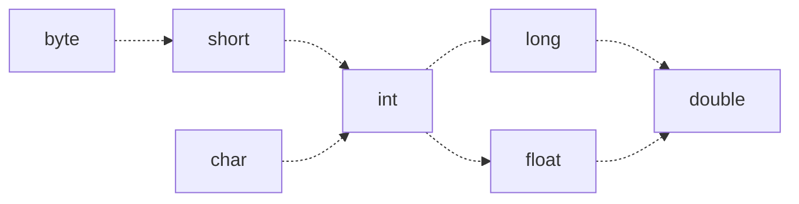
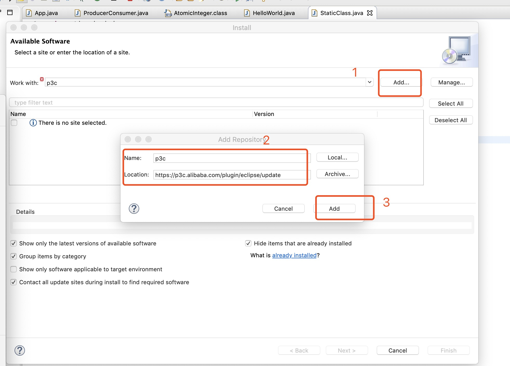
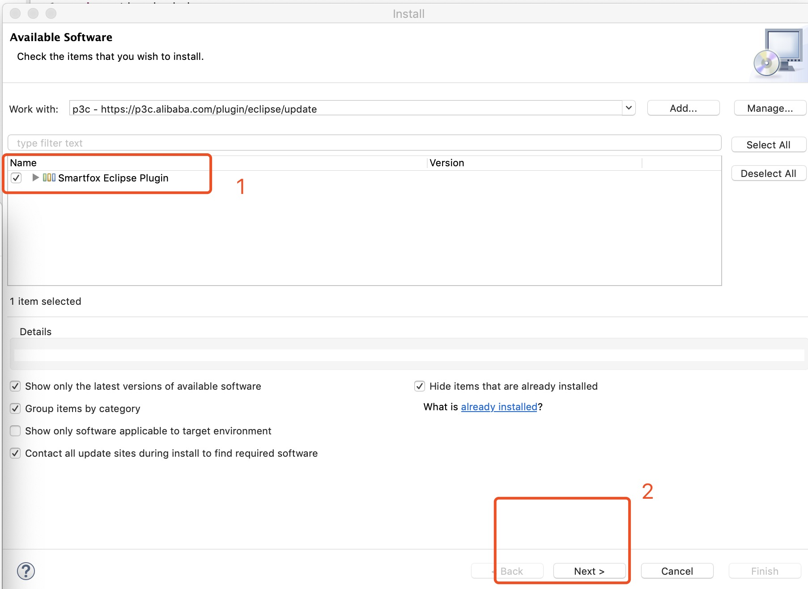
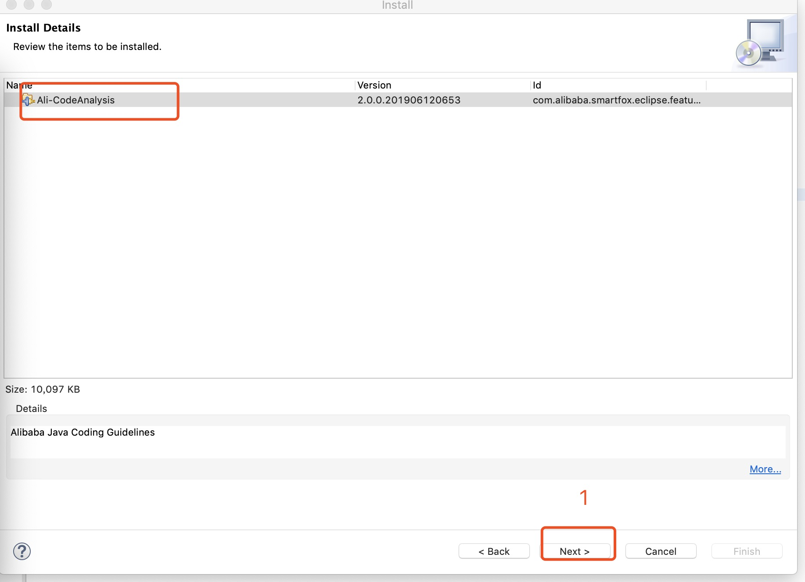
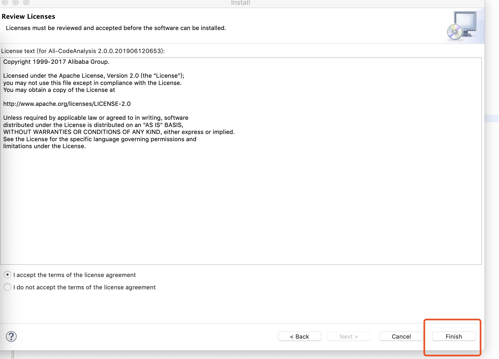
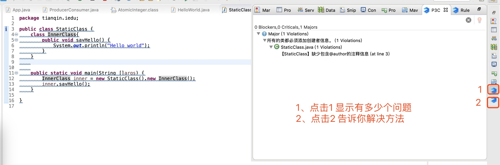
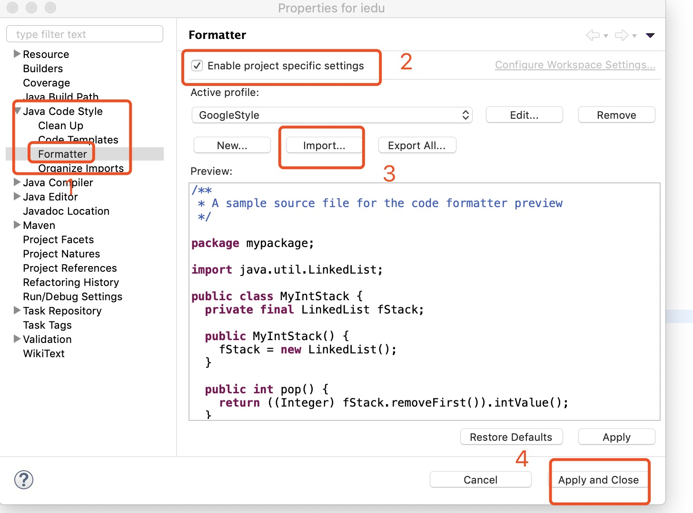

# Java基础语法

## 1.1 举个例子

题目：计算0～1 到100 之内能够被3整除自然数的个数。

```java
package tianqin.edu;

/**
 * Hello world!
 *
 */
public class App 
{
	public void sum(int start, int end, int d) {
		/**由于除数不能为0，做参数判断**/
		if(d == 0) {
			return ;
		}
		
		int sum = 0;
		for(int i = start; i <= end; i++) {
			if((i % d) == 0) {
				/**判断能够整除d**/
				sum = sum + 1;
			}
		}
		System.out.println("Sum:" + sum);
	}
    public static void main( String[] args )
    {
        System.out.println( "Hello World!" );
        /**app 是类型App的变量**/
        App app = new App();
        app.sum(1, 100, 3);
    }
}
```

**代码说明：**

上面的代码，我们用到了Java的一些基本语法：

* 包
* 类
* 函数
* 数据类型（基本类型）
* 循环与流程控制
* 表达式
* 系统调用
* Java修饰符
* 注释

## 1.2 包

由于Java 编译器为每个类生成一个字节码文件，且文件名与类名一样，在这种情况下，就有可能产生冲突（尤其在多人合作的实践中，或者依赖第三方Jar包）。为了解决这个问题，Java 提供包来管理类名空间，实际上提供了一种**命名机制**和**可见性限制**机制。

包的命名规则：

  包由一组类(class)和接口(interface)组成，它是管理大型名字空间，避免名字冲突的工具。按照一般的习惯，其格式如下：

| 1 组织名称            | 2 公司名称 | 3 部门 | 4 项目组 |
| --------------------- | ---------- | ------ | -------- |
| com<br />org<br />net | tencent    |        |          |

比如 笔者在A公司B部门C项目组，写了个类D，那么包的格式，建议：`package com.a.b.c` 。

**友情提示：** 包名通常都习惯使用小写表示。


## 1.3 类

类是Java程序的基本单位，类的实例化是对象，或者说对象是类定义的**数据类型**的变量。建立类之后，就可以用它来创建许多程序需要的对象。Java 把每一个可执行的部分拆成**各种功能**的类。

那么什么是类，类具有如下的范式：

```java
public class YourClassName{
  private int member;
  public void method(int a){
    
  }
}
```

**类和源文件的规则**

* 类的名字通常都使用首字母大写的英文单词表示。
* 如果在源程序中包含公共类的定义（比如 `YourClassName`），那么该源文件必须是YourClassName.java。不然编译会出错。
* 在一个源文件中，不能多于1个公共类。
* 如果在源文件中，没有定义公共类，可以定义多个**非公共类**，则源文件名可以随便取，在编译时将为每个类生成一个.class 文件。

### 1.3.1 类的组成

| 名称     | 作用     | 访问限制                                     |
| -------- | -------- | -------------------------------------------- |
| 成员变量 | 类的属性 | 1、public <br />2、protected<br />3、private |
| 成员函数 | 类的方法 | 1、public <br />2、protected<br />3、private |

比如：

```java
public class Pepole{
  private int age;
  protected int money;
  public String name;
  private int getAge(){ return age;}
  protected int getMoney(){ return money;}
  public String getName(){ return name;}
}
```

**控制范围**

| 控制范围             | private | protected 成员 | public 成员 | 默认成员 |
| -------------------- | ------- | -------------- | ----------- | -------- |
| 同一类中可见         | Y       | Y              | Y           | Y        |
| 同一包中对子类可见   | N       | Y              | Y           | Y        |
| 同一包中对非子类可见 | N       | Y              | Y           | Y        |
| 不同包中对子类可见   | N       | Y              | Y           | N        |
| 不同包中对非子类可见 | N       | N              | Y           | N        |

**访问控制符可修饰列表**

| 修饰符       | 类   | 成员变量 | 成员方法 |
| ------------ | ---- | -------- | -------- |
| public       | Y    | Y        | Y        |
| 默认无修饰符 | Y    | Y        | Y        |
| private      | X    | Y        | Y        |
| protected    | X    | Y        | Y        |

**类的可见性**

* 如果用public 修饰，则该类在任何地方可见。
* 如果用默认访问控制符（无public修饰），则该类仅在同一包中可见。

### 1.3.2 类的成员变量

变量是类和对象的成员属性，定义域的操作就是说明变量或创建对象的操作。类的成员属性包含：

| 类型     | 修饰符 | 作用                                                         |
| -------- | ------ | ------------------------------------------------------------ |
| 静态变量 | static | 类的静态变量，静态变量是类中每个对象共享的变量，<br />它们是类的变量，不属于类的任何一个具体对象，是一个公共<br />的存储单元，其值对该类的所有对象都是相同的。 |
| 变量     | 无     | 类对象的属性变量，其生命周期依赖与类对象的生命周期。<br />该类的不同对象，其值一般不一样。 |

### 1.3.3 类的方法

方法是类的动态属性，标志了类所具有的**功能和操作**。小括号是方法的标志。

| 类型     | 修饰符    | 作用                                                         |
| -------- | --------- | ------------------------------------------------------------ |
| 抽象方法 | \abstract | 抽象方法是没有具体的方法体和操作实现的方法。<br />所有的抽象方法，都必须在抽象类中，必须在其子类实现。<br />至于抽象类的作用在**面向对象**章节讲。 |
| 静态方法 | \static   | 是属于整个类的类方法，调用该类方法，必须使用类名作为前缀。<br />比如：`Abc.function()` |
| 成员方法 | 无        | 对象或实例的方法，调用必须用该类实例化的对象来，比如<br />`app.sum(1,100,3)`。 |


## 1.4 Java 变量

> 程序 = 数据 + 算法

变量是数据的载体，变量是数据的内存存在。变量就是在内存中预分配了一个区域，这个区域被用来存储不同的数据。


**Java变量** = 变量类型 + 变量名称

### 1.4.1 定义变量

```java
String name;
int age;
float a;
double b;
long c;
```

**变量的命名规则**：

* 变量名可以 有字母、数字和标点组成。
* 变量名必须由 字母、"$"、"_"开头。
* 变量名不能与Java的保留字重名。

**变量命名最佳实践**：

* 代码中的命名不建议以下划线、美元符号开始，也不能以下划线和美元符号结束。

   反例：_name\/, $name; name\_, name\$ 

* 代码中的命名严禁使用拼音与英文混合的方式，更不能直接使用中文的方式。

   正例：beijing，youku 等国际通用的名称，可视为英文。

   反例：int 某变量 = 10

* 方法名、参数名、成员变量、局部变量建议采用lowCamelCase风格，遵循驼峰方式。

   正例： money,   getAge(); 

* 常量命名全部大写，单词间用下划线隔开。

   正例：MAX_STOCK_COUNT。

### 1.4.2 Java 保留关键字

Java关键字是指被Java本身使用的字母组合，在程序中有特殊的意义，所以不能用来做变量名。Java语言中有51个保留关键字，其中const 和goto 虽然没有被保留但未被使用。这51个保留关键字分为8大类：

* 访问控制
* 类、方法和变量修饰符
* 程序控制语句
* 错误处理
* 包相关
* 基本类型
* 变量引用
* 保留字

### 1.4.3 变量赋值及作用域

**变量赋值的方法**

* （1） 简单赋值  **变量名**=值
* （2）定义赋值  **变量类型 变量名** = 值
* （3）推荐方式 定义赋值

------

```java
int a = 0; /**定义赋值**/
int b;     /**声明变量**/
b = 10;    /**简单赋值**/
```


**变量的作用域**

变量的作用域表示变量影响的范围。根据影响范围，变量分为：

* 局部变量 （作为方法或语句块的变量存在，存在于方法的参数列表和方法定义中）
* 成员变量（对象的成员变量，直接存在于类中，分为实例变量和静态变量）

---

```java
public class Example{
  /**类的静态成员变量, 不需要实例化，就可以访问**/
  private static int maxMembers = 100;
  /**类的成员变量，需要类的实例化，才存在**/
  private int number = 0;
  public setNum(int num){
    /**num: 是局部变量，存在于setNum**/
    number = num;
  }
  
  public int getNum(){
    return number;
  }
  
  public static void main(String args[]){
    /**num 是 main 函数的局部变量，作用在该函数中**/
    int num = 0;
    /**n 是局部变量，作用 for 循环语块中**/
    for(int n = 0; n < Example.maxMembers; n++){
       Example e = new Example();
       e.setNum(n);
       num ++;
    }
    
    /**这个语句是错的，n 已经超出它的作用域**/
    // System.out.println("Number:" + n);
    System.out.println("Number:" + num);
  }
}
```


**变量隐藏**

变量隐藏，是指同名、同类型的变量，在某个作用域类，被隐藏。变量的隐藏规则：作用域小的隐藏作用域大的。

```java
public class App{
  private int number = 10;
  public void printNumber() {
    /**类的成员变量number 被局部变量number 隐藏**/
		int number = 12;
		System.out.println("Number 1:" + number);
    /**反隐藏**/
		this.number = number;
		System.out.println("Number 2:" + this.number);
	}
	
    public static void main( String[] args )
    {
        System.out.println( "Hello World!" );
        App app = new App(); 
        app.printNumber();
    }
}
```

 **输出结果**

Number 1:12

Number 2:12

### 1.4.4 Java数据类型

Java 语言是一种**严格类型** 的语言，其类型分为两大类数据类型：

* 基本数据类型：整数(byte，short，int，long)、浮点数类型（float，double）、字符类型(char)、布尔类型(boolean)。
* 对象数据类型

**常识：**

Java 最小数据类型的**1字节数**，一个字节**8位(bits)**。

**基本类型**

| 类型     | 位数 | 字节数 | 取值范围                         | 举例           |
| -------- | ---- | ------ | -------------------------------- | -------------- |
| \byte    | 8    | 1      | $[-2^7 , (2^7 -1))$ 的整数       | -128,127       |
| \short   | 16   | 2      | $[-2^{15} , (2^{15} -1))$ 的整数 | -32768,32767   |
| \int     | 32   | 4      | $[-2^{31} , (2^{31} -1))$ 的整数 | 0,100          |
| \long    | 64   | 8      | $[-2^{61}, (2^{61} -1))$ 的整数  | 100            |
| \float   | 32   | 4      | $[-2^{31} , (2^{31} -1))$ 的实数 | 1.00， 100.789 |
| \double  | 64   | 8      | $[-2^{61}, (2^{61} -1))$ 的实数  | 1.00， 100.789 |
| \char    | 18   | 2      | $[-2^{15} , (2^{15} -1))$ 的整数 | 200，'A'，'Z'  |
| \boolean | 8    | 1      | \true, false                     | \true          |


**字符char**

字符是Java中的文本，分为可打印的字符或者不可打印的字符（打印出来类似乱码）。

```java
char c = 'A'; // 大写字母A
char b = '\b'; // 退格
char a = 100;  // 编码100的字符
char d = '\u005c';// 通过换码序列来表示特殊字符
```

有些特殊字符是通过\

| 名称   | 字符  | 换码序列 |
| ------ | ----- | -------- |
| 退格   | '\b'  | '\u0008' |
| Tab 键 | '\t'  | '\u0009' |
| 换行   | '\n'  | '\u000a' |
| 硬回车 | '\r'  | '\u000d' |
| 双引号 | '\" ' | '\u0022' |
| 单引号 | '\'’  | '\u0027' |
| 反斜杠 | '\\\' | '\u005c' |


**类型可赋值路径**




**基本类型后缀**

| \float    | \double    | \long    |
| --------- | ---------- | -------- |
| 0.10**F** | 0.100**D** | 100**L** |


**进制**

* 十进制： 0，1，2，3，4，5，6，7，8，9
* 八进制：0，1，2，3，4，5，6，7
* 十六进制：0，1，2，3，4，5，6，7，8，9，A（10），B（11），C（12），D（13），E（14），F（15）


**进制举例**

* 十进制： 10，11

* 八进制：012，013， 以0开头

* 十六进制：0x123，以0x开头。

**对象数据类型**

Java 是面向对象的程序设计语言，因此Java的数据类型包含了对象数据类型。常见的对象类型：String（字符串）、Date对象（日期）、数组对象、对象数据类型。

**基本类型与对象数据类型的关系**

| 基本类型 | \byte | \short | \int    | \long | \float | \double | \char     | \boolean |
| -------- | ----- | ------ | ------- | ----- | ------ | ------- | --------- | -------- |
| 对象类型 | Byte  | Short  | Integer | Long  | Float  | Double  | Character | Boolean  |

**引用数据类型**

Java 中的所有对象类型都要通过**对象引用**访问。对象引用是指向对象存储所在**堆中**堆某个内存区域的指针（指针是long型的整数指）。

```java
int a = 0; // 基本数据类型，a的指0
Integer b = new Integer(0); // 对象引用，b的值是一个long值，指向一个地址，该地址存储 0
Integer c = b;// 对象引用，c指向的内存地址和b指向的内存地址一样。
```


### 1.4.5 溢出

溢出是指给某种数值数据类型赋值，超过其取值范围，而导致数据反转溢出。

```java
byte b = 127;
b = b + 1;// 反转，变成-128
b = b + 1;// -128 + 1,-127
b = 0;
for(; b <= 200; b++){
  //死循环
}
```


### 1.4.6 数组数据类型

Java 数组是动态创建的索引对象，这点和类有点类似。

数组声明模式： T[] array = new T[N].

声明类型为T，个数为N的数组，其有效的访问下标0（第一个元素），1，…，N-1。>=N 或者 < 0，会发生越界异常（ArrayIndexOutOfBoundsException）

```java
/**数组声明**/
int []myIntarr = new int[10];
/**数组赋值**/
for(int i = 0; i < myIntarr.length; i++){
  myIntarr[i] = i;// 这里可以根据实际赋给实际的值。
}
/**数组访问**/
myIntarr[9] = 10;
int []barray = new int[]{1,3,4,5}; // 声明一个具有4个元素，并初始化的数组
```


## 1.5 Java 运算符

Java 运算符包含5种运算符：

* 算术运算符：+、-、*、/、%。
* 赋值运算符：=、+=、-=、*=、/=、%=。
* 自增/减： ++、—。
* 关系运算符：==、>=、>、<=、<、！=。
* 逻辑运算符：&&、||、！、^。

### 1.5.1 算术运算符

| 运算符 | 说明     | 例子                     |
| ------ | -------- | ------------------------ |
| +      | 数学的加 | 6+4 (10)                 |
| -      | 数学的-  | 7-5（2）                 |
| %      | 数学求余 | 9%2 （1）                |
| /      | 数学的除 | 8/4 （2）<br />9/4 （2） |
| *      | 数学的乘 | 3*4（12）                |


### 1.5.2 算术赋值运算

| 运算符 | 示例                  | 说明                                                         |
| ------ | --------------------- | ------------------------------------------------------------ |
| +=     | x+=3                  | 等价于 x=x+3                                                 |
| -=     | x-=3                  | 等价于x=x-3                                                  |
| *=     | x*=3                  | 等价于x=x*3                                                  |
| /=     | x/=3                  | 等价于x=x/3                                                  |
| %=     | x%=3                  | 等价于x=x%3                                                  |
| ++     | (1) x++<br />(2) ++x  | (1)等价于 x =x + 1，当前表达式返回的旧值。<br />(2)等价于 x =x + 1，当前表达式返回x的新值 |
| --     |(1) x--<br />(2) —x   | (1) 等价于 x =x -1，当前表达式返回的旧值。<br />(2)等价于 x =x - 1，当前表达式返回x的新值 |

### 1.5.3 关系运算符

| 运算符 | 返回值                   | 示例                                |
| ------ | ------------------------ | ----------------------------------- |
| ==     | \boolean  true 或者false | (1)3==3 true<br />(2) 3 == 4 false  |
| >      | \boolean  true 或者false | (1)3 > 2 true<br />(2) 3 > 4 false  |
| <      | \boolean  true 或者false | (1)3 < 4 true<br />(2) 3 < 2 false  |
| \>=    | \boolean  true 或者false | (1)3 >=3 true<br />(2) 3 >= 4 false |
| <=     | \boolean  true 或者false | (1)3<=2 false<br />(2) 3 <= 4 true  |

### 1.5.4 逻辑运算符

**X&&Y**

| &&         | \true  | \false |
| ---------- | ------ | ------ |
| **\true**  | \true  | \false |
| **\flase** | \false | \false |

**X||Y**

| \|\|       | \true | \false |
| ---------- | ----- | ------ |
| **\true**  | \true | \true  |
| **\false** | \true | \false |

**!X**

| X      | !X     |
| ------ | ------ |
| \true  | \false |
| \false | \true  |

**^运算**

| ^          | \true  | \false |
| ---------- | ------ | ------ |
| **\true**  | \false | \true  |
| **\false** | \true  | \false |

### 1.5.5 运算符优先级

| 运算符                | 级别 |
| --------------------- | ---- |
| [], ()                | 1    |
| ++, —,!               | 2    |
| *,/,%                 | 3    |
| +,-                   | 4    |
| <，<=, >, >=          | 5    |
| ==，！=               | 6    |
| &&，\|\|，！，^       | 7    |
| =，+=，-=，*=，/=，%= | 8    |

**同级别：按照从左到右**

## 1.6 循环与流程控制

本节介绍5种控制语句：

* \if 条件语句
* \switch 分支语句
* \for 循环控制语句
* \while 和\do …. \while 循环控制语句
* \break、continue、label 和return

### 1.6.1 if 条件语句

**表达式：**一行代码语句，并与;结束，比如: a == b; 

范式：

```java
if(条件表达式 == true) 语句;
if(条件表达式 == true){
  代码块；（大于一个表达式）
}else if(条件表达式 == true){
   代码块；（大于一个表达式）
}else{
   代码块；（大于一个表达式）
}
```

```java
int a = xxx;
if(a > 0){
  System.out.println("a > 0");
}else if(a == 0){
  System.out.println("a == 0");
}else{
  System.out.println("a < 0");
}
```

### 1.6.2 switch 分支

在有些情况下下，if ...else if …else if …. else 可以转为switch 分支。比如 int (char) 【整数型】的变量a 可能取多个值，比如1、2、3、4、5、6、7，。。。。，其中前4个值有不同的操作，其他的默认处理。

```java
switch(a){
  case 1:
    ...;
    break;
  case 2:
    ...;
    break;
  case 3:
    ...;
    break;
  case 4:
    ...;
    break;
  default:
    ...;
    break;
}
```

### 1.6.3 for 循环

\for 语句是一种将一条或者多条语句按一定的条件执行多次的编程结构。

```java
for(初始化条件语句; 条件语句; 控制语句){
  ...;
}// for 结束

/**比如：计算以内的数的和**/
int sum = 0;
for(int i = 0; i < 10; i++){
  sum += i;
}
/**计算10以内的奇数和**/
sum = 0;
for(int i = 1; i < 10; i+=2){
  sum = sum + i;
}
/**计算10以内的偶数和**/
sum = 0;
for(int i = 2; i < 10;){
  sum = sum + i;
  //控制语句也可以写在这里
  i = i + 2;
}
```


### 1.6.4 while 循环

\while 循环跟for循环类似，其代码格式：

```java
while(条件控制语句){
  
}
// 比如 计算 10 以内的和
int sum = 0;
int t = 0;
while( t < 10){
  sum = sum + t;
  t++;
}
```


### 1.6.7 do {} while

\do {} while( 条件控制语句)； 跟while循环类似，但是它至少会执行一次，因为它是先执行语句块，再执行条件检测。

```java
do{
  
}while(条件控制语句);
// 比如计算10之内和
int sum = 0;
int t = 0;
do{
  sum = sum + t;
  t++;
}while(t < 10);
```


### 1.6.8 break 和continue

* break 是跳出循环语句，终结循环。
* continue 是跳出本次语句执行，继续下一次。

例子： 执行100次循环，获取当前时间（毫秒），取最后两位数，如果是49则停止循环，如果位数是偶数则停止本次循环，继续下一次，否则累计当前值，直到100次。

```java
int t = 0;
// 也可以用for 循环
int sum = 0;
while( t < 100) {
	int s = (int)(System.currentTimeMillis()%100);
	if(s == 49) {
		break;
	}		
	if((s % 2) == 0) {
			continue;
	}		
	sum = sum + s;
}
```


### 1.6.9 \return

\return 是在函数的语句块中，由于某个条件，导致在当前的代码段执行之后，返回，跳出该函数其他的语句块执行。

```java
class A{
  public static void func(){
    if(条件语句){
      return ;
    }// if 
    
  }// func
}
```


### 1.6.10 label:

**\label:**  类似goto 语句， 在写代码中比较少用。


## 1.7 编码规范与样式

每个软件开发人员必须养成良好的编程规范，这里参考实际实践以及阿里巴巴编程规范整理的规范与样式，包含命令规范、文件的命名、包的命名、类的命名、变量的命名、常量的命名、数组的命名、方法的命名、

### 1.7.1 命名风格

1、**[强制]**：代码中的命名均不能以下划线或美元符号开始，也不能以下划线或美元符号结束。 

​      反例:_name / __name / $name / name_ / name$ / name__ 

2、**[强制]**：代码中的命名禁止使用拼音和英文混合的方式，更不能直接用中文的方式，但是比如一些国际通用的名称可以视为英文。

​     正例：hangzhou、alibaba、taobao、youku、beijing。

​     反例：DaZhePromotion [打折] / getPingfenByName() [评分] / int 某变量 = 3  

3、**[强制]**：类名使用 UpperCamelCase 风格，但以下情形例外:DO / BO / DTO / VO / AO / PO / UID等  

​     正例： MarcoPolo / UserDO / XmlService / TcpUdpDeal / TaPromotion。

​     反例：macroPolo / UserDo / XMLService / TCPUDPDeal / TAPromotion。

4、**[强制]**：方法名、参数名、成员变量、局部变量都统一使用 lowerCamelCase 风格，必须遵从 驼峰形式。  

​     正例： localValue / getHttpMessage() / inputUserId 

5、**[强制]**：常量命名全部大写，单词间用下划线隔开，力求语义表达完整清楚，不要嫌名字长。

​    正例：MAX_STOCK_COUNT  

​    反例：MAX_COUNT  

6、**[强制]**：抽象类命名使用 Abstract 或 Base 开头;异常类命名使用 Exception 结尾;测试类命名以它要测试的类的名称开始，以 Test 结尾。

7、**[强制]**：类型与中括号紧挨相连来表示数组。 

​     正例：定义整形数组 int[] arrayDemo;  

​     反例：在 main 参数中，使用 String args[]来定义。  

8、**[强制]**：POJO 类中布尔类型的变量，都不要加 is 前缀，否则部分框架解析会引起序列化错误。 
     反例：定义为基本数据类型Boolean isDeleted的属性，它的方法也是isDeleted()，RPC框架在反向解析的时
                候，“误以为”对应的属性名称是 deleted，导致属性获取不到，进而抛出异常。 

9、**[强制]**：包名统一使用小写，点分隔符之间有且仅有一个自然语义的英语单词。包名统一使用 单数形式，
               但是类名如果有复数含义，类名可以使用复数形式。  

​     正例：应用工具类包名为 com.alibaba.ai.util、类名为 MessageUtils(此规则参考 spring 的框架结构 。

10、**[强制]**：杜绝完全不规范的缩写，避免望文不知义。
     反例：AbstractClass“缩写”命名成 AbsClass;condition“缩写”命名成 condi，此类随意缩写严重降低了代码的可阅读性。	

### 1.7.2 常量定义

1、**[强制]**：不允许任何魔法值(即未经预先定义的常量)直接出现在代码中。

​    反例：String key = "Id#taobao_" + tradeId;

2、**[强制]**：在 long 或者 Long 赋值时，数值后使用大写的 L，不能是小写的 l，小写容易跟数字 1 混淆，造成误解。

​    正例： Long money = 30L; 

​    反例： Long money = 30l; (看起来是30还是301)？

3、**[推荐]**: 常量的复用层次有五层:跨应用共享常量、应用内共享常量、子工程内共享常量、包 内共享常量、类内. 共享常量。 

​      1) 跨应用共享常量:放置在二方库中，通常是client.jar中的constant目录下。

​      2) 应用内共享常量:放置在一方库中，通常是子模块中的constant目录下。 

​          反例:易懂变量也要统一定义成应用内共享常量，两位攻城师在两个类中分别定义了表示 “是”的变量: 

​             类A中:public static final String YES = "yes"; 

​             类B中:public static final String YES = "y"; 

​             A.YES.equals(B.YES)，预期是 true，但实际返回为 false，导致线上问题。 

​     3) 子工程内部共享常量:即在当前子工程的constant目录下。

​     4) 包内共享常量:即在当前包下单独的constant目录下。
​     5) 类内共享常量:直接在类内部private static final定义。  

  ### 1.7.3 代码格式

1. 【强制】大括号的使用约定。如果是大括号内为空，则简洁地写成{}即可，不需要换行;如果 是非空代码块则: 

   1) 左大括号前不换行。
    2) 左大括号后换行。
    3) 右大括号前换行。
    4) 右大括号后还有else等代码则不换行;表示终止的右大括号后必须换行。 

2. 【强制】左小括号和字符之间不出现空格;同样，右小括号和字符之间也不出现空格;而左大 括号前需要空格。详见第 5 条下方正例提示。
    反例:if (空格a == b空格) 

3. 【强制】if/for/while/switch/do 等保留字与括号之间都必须加空格。 

4. 【强制】任何二目、三目运算符的左右两边都需要加一个空格。 

   说明:运算符包括赋值运算符=、逻辑运算符&&、加减乘除符号等。 

5. 【强制】采用 4 个空格缩进，禁止使用 tab 字符。
    说明:如果使用 tab 缩进，必须设置 1 个 tab 为 4 个空格。IDEA 设置 tab 为 4 个空格时， 请勿勾选Use tab character；而在 eclipse 中，必须勾选insert spaces for tabs 。`

   涉及1～5的代码示例：

   ```java
   public static main(String []args){ // 左大括号的规则
       // 缩进 4 个空格
       String say = "hello";
       // 运算符的左右必须有一个空格
       int flag = 0;
       // 关键词 if 与括号之间必须有一个空格，括号内的 f 与左括号，0 与右括号不需要空格 
       if (flag == 0) {
            System.out.println(say);
       }
       // 左大括号前加空格且不换行;左大括号后换行 
       if (flag == 1) {
           System.out.println("world");
           // 右大括号前换行，右大括号后有 else，不用换行 
       } else {
          System.out.println("ok");
          // 在右大括号后直接结束，则必须换行
   }// 右大括号的规则
   ```

   6. 【强制】注释的双斜线与注释内容之间有且仅有一个空格。

       正例: 

       

      ```java
          // 这是示例注释，请注意在双斜线之后有一个空格 
          String ygb = new String();
      ```

      

   7. 【强制】单行字符数限制不超过 120 个，超出需要换行，换行时遵循如下原则: 

        1) 第二行相对第一行缩进 4 个空格，从第三行开始，不再继续缩进，参考示例。 

   ​         2) 运算符与下文一起换行。
   ​         3) 方法调用的点符号与下文一起换行
   ​         4) 方法调用中的多个参数需要换行时，在逗号后进行。 

   ​        5) 在括号前不要换行，见反例。

   ​        正例：

   ​        

   ```java
       StringBuffer sb = new StringBuffer();
       // 超过 120 个字符的情况下，换行缩进 4 个空格，点号和方法名称一起换行   
       sb.append("zi").append("xin")...
          .append("huang")...
          .append("huang")...
          .append("huang");
   
   ```

     	反例：

   ​     

   ```java
       StringBuffer sb = new StringBuffer();
       // 超过 120 个字符的情况下，不要在括号前换行 
       sb.append("zi").append("xin")...append
       ("huang");
       // 参数很多的方法调用可能超过 120 个字符，不要在逗号前换行 
       method(args1, args2, args3, ...
       , argsX);
   ```

   
   8. 【强制】方法参数在定义和传入时，多个参数逗号后边必须加空格。 

   ​      正例:下例中实参的 args1，后边必须要有一个空格。 method(args1, args2, args3); 

   9.【强制】IDE的text file encoding设置为UTF-8; IDE中文件的换行符使用Unix格式， 不要使用 Windows 格式。 

   10. 【推荐】单个方法的总行数不超过 80 行。 说明:包括方法签名、结束右大括号、方法内代码、注释、空行、回车及任何不可见字符的总 行数不超过 80 行。 

       正例: 代码逻辑分清红花和绿叶，个性和共性，绿叶逻辑单独出来成为额外方法，使主干代码 更加清晰;共性逻辑抽取成为共性方法，便于复用和维护。 

   11. 【推荐】没有必要增加若干空格来使某一行的字符与上一行对应位置的字符对齐。 
   
       正例: 
   

​       

```java
       int one = 1;
       long two = 2L;
       float three = 3F;
       StringBuffer sb = new StringBuffer(); 
```

    **说明**: 增加 sb 这个变量，如果需要对齐，则给 a、b、c 都要增加几个空格，在变量比较多的 情况下，是非常.

   ​           累赘的事情。 

   12. 【推荐】不同逻辑、不同语义、不同业务的代码之间插入一个空行分隔开来以提升可读性。 说明:任何情形，没有必要插入多个空行进行隔开。 					 						 					  	  			 			 		

 ### 1.7.4 OOP规约

1. 【强制】避免通过一个类的对象引用访问此类的静态变量或静态方法，无谓增加编译器解析成 

   ```
      本，直接用类名来访问即可。
   ```

2. 【强制】所有的覆写方法，必须加@Override 注解。
    说明:getObject()与 get0bject()的问题。一个是字母的 O，一个是数字的 0，加@Override 可以准确判断是否覆盖成功。另外，如果在抽象类中对方法签名进行修改，其实现类会马上编 译报错。 

3. 【强制】相同参数类型，相同业务含义，才可以使用 Java 的可变参数，避免使用 Object。 说明:可变参数必须放置在参数列表的最后。(提倡同学们尽量不用可变参数编程) 正例:public List<User> listUsers(String type, Long... ids) {...} 

4. 【强制】外部正在调用或者二方库依赖的接口，不允许修改方法签名，避免对接口调用方产生 影响。接口过时必须加@Deprecated 注解，并清晰地说明采用的新接口或者新服务是什么。 

5. 【强制】不能使用过时的类或方法。
    说明:java.net.URLDecoder 中的方法 decode(String encodeStr) 这个方法已经过时，应 
    该使用双参数 decode(String source, String encode)。接口提供方既然明确是过时接口， 那么有义务同时提供新的接口;作为调用方来说，有义务去考证过时方法的新实现是什么。 

6. 【强制】Object 的 equals 方法容易抛空指针异常，应使用常量或确定有值的对象来调用 equals。 

​         正例:"test".equals(object);
​         反例:object.equals("test");
​        说明:   推荐使用 java.util.Objects#equals(JDK7 引入的工具类) 

7. 【强制】所有的相同类型的包装类对象之间值的比较，全部使用 equals 方法比较。 

      说明:对于 Integer var = ? 在-128 至 127 范围内的赋值，Integer 对象是在 IntegerCache.cache 产生，会复 

      用已有对象，这个区间内的 Integer 值可以直接使用==进行 判断，但是这个区间之外的所有数据，都会在堆 

      上产生，并不会复用已有对象，这是一个大坑， 推荐使用 equals 方法进行判断。 

8. 关于基本数据类型与包装数据类型的使用标准如下:
    1) 【强制】所有的POJO类属性必须使用包装数据类型。
    2) 【强制】RPC方法的返回值和参数必须使用包装数据类型。
    3) 【推荐】所有的局部变量使用基本数据类型。
    说明: POJO 类属性没有初值是提醒使用者在需要使用时，必须自己显式地进行赋值，任何NPE 问题，或者入  库检查，都由使用者来保证。
   正例:

      数据库的查询结果可能是 null，因为自动拆箱，用基本数据类型接收有 NPE 风险。

   反例:

      比如显示成交总额涨跌情况，即正负 x%，x 为基本数据类型，调用的 RPC 服务，调用 

​         不成功时，返回的是默认值，页面显示为 0%，这是不合理的，应该显示成中划线。所以包装 数据类型的  

​          null 值，能够表示额外的信息，如:远程调用失败，异常退出。 

9. 【强制】定义 DO/DTO/VO 等 POJO 类时，不要设定任何属性默认值。
      反例:

     POJO 类的 gmtCreate 默认值为 new Date()，但是这个属性在数据提取时并没有置入具 体值，在更新其它字  

     段时又附带更新了此字段，导致创建时间被修改成当前时间。 

10. 【强制】序列化类新增属性时，请不要修改 serialVersionUID 字段，避免反序列失败;如 果完全不兼容升级，   避免反序列化混乱，那么请修改 serialVersionUID 值。
     说明:注意 serialVersionUID 不一致会抛出序列化运行时异常。 

11. 【强制】构造方法里面禁止加入任何业务逻辑，如果有初始化逻辑，请放在 init 方法中。 

12. 【强制】POJO 类必须写 toString 方法。使用 IDE 中的工具:source> generate toString 时，如果继承了另一个 POJO 类，注意在前面加一下 super.toString。 说明:在方法执行抛出异常时，可以直接调用 POJO 的 toString()方法打印其属性值，便于排 查问题。 
13. 【强制】禁止在 POJO 类中，同时存在对应属性 xxx 的 isXxx()和 getXxx()方法。 

​       说明:框架在调用属性 xxx 的提取方法时，并不能确定哪个方法一定是被优先调用到。 

14. 【推荐】使用索引访问用 String 的 split 方法得到的数组时，需做最后一个分隔符后有无 

​          内容的检查，否则会有抛 IndexOutOfBoundsException 的风险。 

​         说明: 

​         String str = "a,b,c,,";
​         String[] ary = str.split(","); // 预期大于 3，结果是 3 System.out.println(ary.length); 

15. 【推荐】当一个类有多个构造方法，或者多个同名方法，这些方法应该按顺序放置在一起， 便于阅读，此条规则优先于第 16 条规则。 

16. 【推荐】 类内方法定义的顺序依次是:公有方法或保护方法 > 私有方法 > getter/setter 方法。 

​         说明:公有方法是类的调用者和维护者最关心的方法，首屏展示最好;保护方法虽然只是子类 关心，也可能  

​         是“模板设计模式”下的核心方法;而私有方法外部一般不需要特别关心，是一个 黑盒实现;因为承载的信息价值

​         较低，所有 Service 和 DAO 的 getter/setter 方法放在类体 最后。 

17. 【推荐】setter 方法中，参数名称与类成员变量名称一致，this.成员名 = 参数名。在 getter/setter 方法中，不要增加业务逻辑，增加排查问题的难度。 

反例: 

```java
public Integer getData() { 
    if (condition) {
        return this.data + 100; 
    } else { 
        return this.data - 100; 
    } 
} 
```


18. 【推荐】循环体内，字符串的连接方式，使用 StringBuilder 的 append 方法进行扩展。 说明:下例中，反编译出的字节码文件显示每次循环都会 new 出一个 StringBuilder 对象， 然后进行 append 操作，最后通过 toString 方法返回 String 对象，造成内存资源浪费。

     反例: 

    ```java
        String str = "start";
        for (int i = 0; i < 100; i++) { 
            str = str + "hello"; 
        } 
    ```

    

19. 【推荐】final 可以声明类、成员变量、方法、以及本地变量，下列情况使用 final 关键字: 1) 不允许被继承的类，如:String 类。
     2) 不允许修改引用的域对象。
     3) 不允许被重写的方法，如:POJO 类的 setter 方法。 

​        4) 不允许运行过程中重新赋值的局部变量。 

​       5) 避免上下文重复使用一个变量，使用 final 描述可以强制重新定义一个变量，方便更好 地进行重构。 

20. 【推荐】慎用 Object 的 clone 方法来拷贝对象。
     说明:对象的 clone 方法默认是浅拷贝，若想实现深拷贝需要重写 clone 方法实现域对象的 深度遍历式拷贝。 

21. 【推荐】类成员与方法访问控制从严:
     1) 如果不允许外部直接通过new来创建对象，那么构造方法必须是private。 2) 工具类不允许有public或default构造方法。
     3) 类非static成员变量并且与子类共享，必须是protected。
     4) 类非static成员变量并且仅在本类使用，必须是private。
     5) 类static成员变量如果仅在本类使用，必须是private。
     6) 若是static成员变量，考虑是否为final。
     7) 类成员方法只供类内部调用，必须是private。
     8) 类成员方法只对继承类公开，那么限制为protected。 

说明:任何类、方法、参数、变量，严控访问范围。过于宽泛的访问范围，不利于模块解耦。 思考:如果是一个 private 的方法，想删除就删除，可是一个 public 的 service 成员方法或 成员变量，删除一下，不得手心冒点汗吗?变量像自己的小孩，尽量在自己的视线内，变量作 用域太大，无限制的到处跑，那么你会担心的。 

### 1.7.5 控制语句

1. 【强制】在一个 switch 块内，每个 case 要么通过 break/return 等来终止，要么注释说明程 序将继续执行到  

      哪一个 case 为止;在一个 switch 块内，都必须包含一个 default 语句并且 放在最后，即使空代码。 

2. 【强制】在 if/else/for/while/do 语句中必须使用大括号。即使只有一行代码，避免采用 单行的编码方式:if (condition) statements; 

3. 【强制】在高并发场景中，避免使用”等于”判断作为中断或退出的条件。

   说明:  如果并发控制没有处理好，容易产生等值判断被“击穿”的情况，使用大于或小于的区间 判断条件来代替。

   反例:

   判断剩余奖品数量等于 0 时，终止发放奖品，但因为并发处理错误导致奖品数量瞬间变 成了负数，这样的话，活动无法终止。

4.  【推荐】表达异常的分支时，少用 if-else 方式，这种方式可以改写成：

    

   ```java
       if (condition) { 
           ...
           return obj; 
       }
       // 接着写 else 的业务逻辑代码;
   ```

   说明:如果非得使用 if()...else if()...else...方式表达逻辑，【强制】避免后续代码维护困难，请勿超过 3 层。

   **超过3层**的正例： 

   ```java
   public void today() { 
       if (isBusy()) {
            System.out.println(“change time.”); return;
       }
       if (isFree()) {
            System.out.println(“go to travel.”);
            return; 
       }
     
       System.out.println(“stay at home to learn Alibaba Java Coding Guidelines.”);
       return; 
   }
   ```

   

5. 【推荐】除常用方法(如 getXxx/isXxx)等外，不要在条件判断中执行其它复杂的语句，将
     复杂逻辑判断的结果赋值给一个有意义的布尔变量名，以提高可读性。
     说明:很多 if 语句内的逻辑相当复杂，阅读者需要分析条件表达式的最终结果，才能明确什么
     样的条件执行什么样的语句，那么，如果阅读者分析逻辑表达式错误呢?

    正例：

   ```java
       // 伪代码如下
       final boolean existed = (file.open(fileName, "w") != null) && (...) || (...); 
       if (existed) {
           ... 
       }
   ```

   反例：

   ```java
       if ((file.open(fileName, "w") != null) && (...) || (...)) { 
           ...
       }
   ```

   

6. 【推荐】循环体中的语句要考量性能，以下操作尽量移至循环体外处理，如定义对象、变量、 

   ​               获取数据库连接，进行不必要的 try-catch 操作(这个 try-catch 是否可以移至循环体外)。 

   ```java
       // 正例：
       try{
         for(int i = 0; i < 100; i++){
            // 不建议定义对象、变量
            // 不建议获取数据库连接
         }
       }catch(...){
           ...
       }
   ```

   

7. 【推荐】避免采用取反逻辑运算符。 说明:取反逻辑不利于快速理解，并且取反逻辑写法必然存在对应的正向逻辑写法。 

   ```java
   //正例:使用 < 来表达 x 小于 628。
   if (x < 628) 
   //反例:使用取反来表达 x 小于 628。
   if (!(x >= 628)) 
   ```

8. 【参考】下列情形，需要进行参数校验:
    1) 调用频次低的方法。
    2) 执行时间开销很大的方法。此情形中，参数校验时间几乎可以忽略不计，但如果因为参数错误导致中间执

   ​      行回退，或者错误，那得不偿失。
    3) 需要极高稳定性和可用性的方法。
    4) 对外提供的开放接口，不管是RPC/API/HTTP接口。 5) 敏感权限入口。 

9. 【参考】下列情形，不需要进行参数校验:
    1) 极有可能被循环调用的方法。但在方法说明里必须注明外部参数检查要求。
    2) 底层调用频度比较高的方法。毕竟是像纯净水过滤的最后一道，参数错误不太可能到底 

   ​     层才会暴露问题。一般 DAO 层与 Service 层都在同一个应用中，部署在同一台服务器中，所 以 DAO 的参.  

   ​     数校验，可以省略。 

   3) 被声明成private只会被自己代码所调用的方法，如果能够确定调用方法的代码传入参 数已经做过检查或者 

   ​    肯定不会有问题，此时可以不校验参数。

### 1.7.6 注视规约

1. 【强制】类、类属性、类方法的注释必须使用 Javadoc 规范，使用/**内容*/格式，不得使用 // xxx方式。
    说明:在 IDE 编辑窗口中，Javadoc 方式会提示相关注释，生成 Javadoc 可以正确输出相应注 释;在 IDE 中，工程调用方法时，不进入方法即可悬浮提示方法、参数、返回值的意义，提高 阅读效率。 

2. 【强制】所有的抽象方法(包括接口中的方法)必须要用 Javadoc 注释、除了返回值、参数、 异常说明外，还必须指出该方法做什么事情，实现什么功能。 说明:对子类的实现要求，或者调用注意事项，请一并说明。 

3. 【强制】所有的类都必须添加创建者和创建日期。 

4. 【强制】方法内部单行注释，在被注释语句上方另起一行，使用//注释。方法内部多行注释 

   使用/* */注释，注意与代码对齐。 

5. 【强制】所有的枚举类型字段必须要有注释，说明每个数据项的用途。 

6. 【推荐】与其“半吊子”英文来注释，不如用中文注释把问题说清楚。专有名词与关键字保持 英文原文即可。
    反例:“TCP 连接超时”解释成“传输控制协议连接超时”，理解反而费脑筋。 

7. 【推荐】代码修改的同时，注释也要进行相应的修改，尤其是参数、返回值、异常、核心逻辑 等的修改。 

   说明:代码与注释更新不同步，就像路网与导航软件更新不同步一样，如果导航软件严重滞后， 就失去了导航的意义。 

### 1.7.7 其他

1. 【强制】在使用正则表达式时，利用好其预编译功能，可以有效加快正则匹配速度。 

   说明:不要在方法体内定义:Pattern pattern = Pattern.compile(“规则”); 

2. 【强制】velocity 调用 POJO 类的属性时，建议直接使用属性名取值即可，模板引擎会自动按 规范调用 POJO 的 getXxx()，如果是 boolean 基本数据类型变量(boolean 命名不需要加 is 前缀)，会自动调用 isXxx()方法。
    说明:注意如果是 Boolean 包装类对象，优先调用 getXxx()的方法。 

3. 【强制】后台输送给页面的变量必须加$!{var}$——中间的感叹号。 说明:如果 var 等于 null 或者不存在，那么${var}$会直接显示在页面上。 

4. 【强制】注意 Math.random() 这个方法返回是 double 类型，注意取值的范围 0≤x<1(能够 取到零值，注意除零异常)，如果想获取整数类型的随机数，不要将 x 放大 10 的若干倍然后 取整，直接使用 Random 对象的 nextInt 或者 nextLong 方法。 

5. 【强制】获取当前毫秒数 System.currentTimeMillis(); 而不是 new Date().getTime(); 说明:如果想获取更加精确的纳秒级时间值，使用 System.nanoTime()的方式。在 JDK8 中， 针对统计时间等场景，推荐使用 Instant 类。 

6. 【推荐】不要在视图模板中加入任何复杂的逻辑。
    说明:根据 MVC 理论，视图的职责是展示，不要抢模型和控制器的活。 

7. 【推荐】任何数据结构的构造或初始化，都应指定大小，避免数据结构无限增长吃光内存。 

8. 【推荐】及时清理不再使用的代码段或配置信息。 说明:对于垃圾代码或过时配置，坚决清理干净，避免程序过度臃肿，代码冗余。 正例:对于暂时被注释掉，后续可能恢复使用的代码片断，在注释代码上方，统一规定使用三 个斜杠(///)来说明注释掉代码的理由。 


### 1.7.8 如何使用规范模版模版

​		**Eclipse**下安装阿里巴巴p3c

​        1、通过Help >> Install New Software插件安装菜单，在安装插件的地址栏中输入：

​              https://p3c.alibaba.com/plugin/eclipse/update

​             

​       2、选择安装软件

​      

​      

 

3、安装完成后需重启eclipse，重启完成后，我们可以看到eclipse任务栏中多了两个小图标

​    打开代码，右键、选择用阿里编码规约扫描，显示：

  

 **问题解决**：

```java
package tianqin.iedu;

/**
 * StaticClass
 * 
 * @author gorging
 * @date 2019/07/26
 */
public class StaticClass {
    /**
	* InnerClass
	* 
	* @author gorging
	* @date 2019/07/26
	*/
	class InnerClass{
		public void sayHello() {
			System.out.println("Hello world");
		}
	}
	public static void main(String []args) {
		InnerClass inner = new StaticClass().new InnerClass();
		inner.sayHello();
	}

}

```

  ### 1.7.9 Eclipse 代码格式化配置



在第三步导入：eclipse-codestyle.xml

可以到这里：https://github.com/google/styleguide 下载 eclipse-java-google-style.xml。

可以到这里：https://github.com/alibaba/p3c/blob/master/p3c-formatter/eclipse-codestyle.xml 下载p3c 代码格式。

**使用**：

​      选中代码—>右键—> source—>Format

## 1.8 练习题目

**题目：** 统计10000 以内 偶数的个数， 累计素数的和。

题目解说：

* 偶数： 被2整除的整数。
* 素数：> 1，且除了 1 和自身之外，没有其他因数的自然数。


 