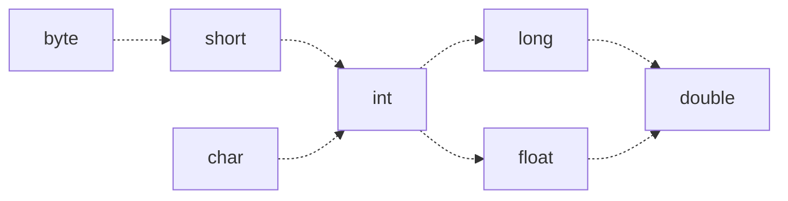

# Java基础语法

## 1.1 举个例子

题目：计算0～1 到100 之内能够被3整除自然数的个数。

```java
package tianqin.edu;

/**
 * Hello world!
 *
 */
public class App 
{
	public void sum(int start, int end, int d) {
		/**由于除数不能为0，做参数判断**/
		if(d == 0) {
			return ;
		}
		
		int sum = 0;
		for(int i = start; i <= end; i++) {
			if((i % d) == 0) {
				/**判断能够整除d**/
				sum = sum + 1;
			}
		}
		System.out.println("Sum:" + sum);
	}
    public static void main( String[] args )
    {
        System.out.println( "Hello World!" );
        /**app 是类型App的变量**/
        App app = new App();
        app.sum(1, 100, 3);
    }
}
```

**代码说明：**

上面的代码，我们用到了Java的一些基本语法：

* 包
* 类
* 函数
* 数据类型（基本类型）
* 循环与流程控制
* 表达式
* 系统调用
* Java修饰符
* 注释

## 1.2 包

由于Java 编译器为每个类生成一个字节码文件，且文件名与类名一样，在这种情况下，就有可能产生冲突（尤其在多人合作的实践中，或者依赖第三方Jar包）。为了解决这个问题，Java 提供包来管理类名空间，实际上提供了一种**命名机制**和**可见性限制**机制。

包的命名规则：

  包由一组类(class)和接口(interface)组成，它是管理大型名字空间，避免名字冲突的工具。按照一般的习惯，其格式如下：

| 1 组织名称            | 2 公司名称 | 3 部门 | 4 项目组 |
| --------------------- | ---------- | ------ | -------- |
| com<br />org<br />net | tencent    |        |          |

比如 笔者在A公司B部门C项目组，写了个类D，那么包的格式，建议：`package com.a.b.c` 。

**友情提示：** 包名通常都习惯使用小写表示。


## 1.3 类

类是Java程序的基本单位，类的实例化是对象，或者说对象是类定义的**数据类型**的变量。建立类之后，就可以用它来创建许多程序需要的对象。Java 把每一个可执行的部分拆成**各种功能**的类。

那么什么是类，类具有如下的范式：

```java
public class YourClassName{
  private int member;
  public void method(int a){
    
  }
}
```

**类和源文件的规则**

* 类的名字通常都使用首字母大写的英文单词表示。
* 如果在源程序中包含公共类的定义（比如 `YourClassName`），那么该源文件必须是YourClassName.java。不然编译会出错。
* 在一个源文件中，不能多于1个公共类。
* 如果在源文件中，没有定义公共类，可以定义多个**非公共类**，则源文件名可以随便取，在编译时将为每个类生成一个.class 文件。

### 1.3.1 类的组成

| 名称     | 作用     | 访问限制                                     |
| -------- | -------- | -------------------------------------------- |
| 成员变量 | 类的属性 | 1、public <br />2、protected<br />3、private |
| 成员函数 | 类的方法 | 1、public <br />2、protected<br />3、private |

比如：

```java
public class Pepole{
  private int age;
  protected int money;
  public String name;
  private int getAge(){ return age;}
  protected int getMoney(){ return money;}
  public String getName(){ return name;}
}
```

**控制范围**

| 控制范围             | private | protected 成员 | public 成员 | 默认成员 |
| -------------------- | ------- | -------------- | ----------- | -------- |
| 同一类中可见         | Y       | Y              | Y           | Y        |
| 同一包中对子类可见   | N       | Y              | Y           | Y        |
| 同一包中对非子类可见 | N       | Y              | Y           | Y        |
| 不同包中对子类可见   | N       | Y              | Y           | N        |
| 不同包中对非子类可见 | N       | N              | Y           | N        |

**访问控制符可修饰列表**

| 修饰符       | 类   | 成员变量 | 成员方法 |
| ------------ | ---- | -------- | -------- |
| public       | Y    | Y        | Y        |
| 默认无修饰符 | Y    | Y        | Y        |
| private      | X    | Y        | Y        |
| protected    | X    | Y        | Y        |

**类的可见性**

* 如果用public 修饰，则该类在任何地方可见。
* 如果用默认访问控制符（无public修饰），则该类仅在同一包中可见。

### 1.3.2 类的成员变量

变量是类和对象的成员属性，定义域的操作就是说明变量或创建对象的操作。类的成员属性包含：

| 类型     | 修饰符 | 作用                                                         |
| -------- | ------ | ------------------------------------------------------------ |
| 静态变量 | static | 类的静态变量，静态变量是类中每个对象共享的变量，<br />它们是类的变量，不属于类的任何一个具体对象，是一个公共<br />的存储单元，其值对该类的所有对象都是相同的。 |
| 变量     | 无     | 类对象的属性变量，其生命周期依赖与类对象的生命周期。<br />该类的不同对象，其值一般不一样。 |

### 1.3.3 类的方法

方法是类的动态属性，标志了类所具有的**功能和操作**。小括号是方法的标志。

| 类型     | 修饰符    | 作用                                                         |
| -------- | --------- | ------------------------------------------------------------ |
| 抽象方法 | \abstract | 抽象方法是没有具体的方法体和操作实现的方法。<br />所有的抽象方法，都必须在抽象类中，必须在其子类实现。<br />至于抽象类的作用在**面向对象**章节讲。 |
| 静态方法 | \static   | 是属于整个类的类方法，调用该类方法，必须使用类名作为前缀。<br />比如：`Abc.function()` |
| 成员方法 | 无        | 对象或实例的方法，调用必须用该类实例化的对象来，比如<br />`app.sum(1,100,3)`。 |


## 1.4 Java 变量

> 程序 = 数据 + 算法

变量是数据的载体，变量是数据的内存存在。变量就是在内存中预分配了一个区域，这个区域被用来存储不同的数据。


**Java变量** = 变量类型 + 变量名称

### 1.4.1 定义变量

```java
String name;
int age;
float a;
double b;
long c;
```

**变量的命名规则**：

* 变量名可以 有字母、数字和标点组成。
* 变量名必须由 字母、"$"、"_"开头。
* 变量名不能与Java的保留字重名。

**变量命名最佳实践**：

* 代码中的命名不建议以下划线、美元符号开始，也不能以下划线和美元符号结束。

   反例：_name\/, $name; name\_, name\$ 

* 代码中的命名严禁使用拼音与英文混合的方式，更不能直接使用中文的方式。

   正例：beijing，youku 等国际通用的名称，可视为英文。

   反例：int 某变量 = 10

* 方法名、参数名、成员变量、局部变量建议采用lowCamelCase风格，遵循驼峰方式。

   正例： money,   getAge(); 

* 常量命名全部大写，单词间用下划线隔开。

   正例：MAX_STOCK_COUNT。

### 1.4.2 Java 保留关键字

Java关键字是指被Java本身使用的字母组合，在程序中有特殊的意义，所以不能用来做变量名。Java语言中有51个保留关键字，其中const 和goto 虽然没有被保留但未被使用。这51个保留关键字分为8大类：

* 访问控制
* 类、方法和变量修饰符
* 程序控制语句
* 错误处理
* 包相关
* 基本类型
* 变量引用
* 保留字

### 1.4.3 变量赋值及作用域

**变量赋值的方法**

* （1） 简单赋值  **变量名**=值
* （2）定义赋值  **变量类型 变量名** = 值
* （3）推荐方式 定义赋值

------

```java
int a = 0; /**定义赋值**/
int b;     /**声明变量**/
b = 10;    /**简单赋值**/
```


**变量的作用域**

变量的作用域表示变量影响的范围。根据影响范围，变量分为：

* 局部变量 （作为方法或语句块的变量存在，存在于方法的参数列表和方法定义中）
* 成员变量（对象的成员变量，直接存在于类中，分为实例变量和静态变量）

---

```java
public class Example{
  /**类的静态成员变量, 不需要实例化，就可以访问**/
  private static int maxMembers = 100;
  /**类的成员变量，需要类的实例化，才存在**/
  private int number = 0;
  public setNum(int num){
    /**num: 是局部变量，存在于setNum**/
    number = num;
  }
  
  public int getNum(){
    return number;
  }
  
  public static void main(String args[]){
    /**num 是 main 函数的局部变量，作用在该函数中**/
    int num = 0;
    /**n 是局部变量，作用 for 循环语块中**/
    for(int n = 0; n < Example.maxMembers; n++){
       Example e = new Example();
       e.setNum(n);
       num ++;
    }
    
    /**这个语句是错的，n 已经超出它的作用域**/
    // System.out.println("Number:" + n);
    System.out.println("Number:" + num);
  }
}
```


**变量隐藏**

变量隐藏，是指同名、同类型的变量，在某个作用域类，被隐藏。变量的隐藏规则：作用域小的隐藏作用域大的。

```java
public class App{
  private int number = 10;
  public void printNumber() {
    /**类的成员变量number 被局部变量number 隐藏**/
		int number = 12;
		System.out.println("Number 1:" + number);
    /**反隐藏**/
		this.number = number;
		System.out.println("Number 2:" + this.number);
	}
	
    public static void main( String[] args )
    {
        System.out.println( "Hello World!" );
        App app = new App(); 
        app.printNumber();
    }
}
```

 **输出结果**

Number 1:12

Number 2:12

### 1.4.4 Java数据类型

Java 语言是一种**严格类型** 的语言，其类型分为两大类数据类型：

* 基本数据类型：整数(byte，short，int，long)、浮点数类型（float，double）、字符类型(char)、布尔类型(boolean)。
* 对象数据类型

**常识：**

Java 最小数据类型的**1字节数**，一个字节**8位(bits)**。

**基本类型**

| 类型     | 位数 | 字节数 | 取值范围                         | 举例           |
| -------- | ---- | ------ | -------------------------------- | -------------- |
| \byte    | 8    | 1      | $[-2^7 , (2^7 -1))$ 的整数       | -128,127       |
| \short   | 16   | 2      | $[-2^{15} , (2^{15} -1))$ 的整数 | -32768,32767   |
| \int     | 32   | 4      | $[-2^{31} , (2^{31} -1))$ 的整数 | 0,100          |
| \long    | 64   | 8      | $[-2^{61}, (2^{61} -1))$ 的整数  | 100            |
| \float   | 32   | 4      | $[-2^{31} , (2^{31} -1))$ 的实数 | 1.00， 100.789 |
| \double  | 64   | 8      | $[-2^{61}, (2^{61} -1))$ 的实数  | 1.00， 100.789 |
| \char    | 18   | 2      | $[-2^{15} , (2^{15} -1))$ 的整数 | 200，'A'，'Z'  |
| \boolean | 8    | 1      | \true, false                     | \true          |


**字符char**

字符是Java中的文本，分为可打印的字符或者不可打印的字符（打印出来类似乱码）。

```java
char c = 'A'; // 大写字母A
char b = '\b'; // 退格
char a = 100;  // 编码100的字符
char d = '\u005c';// 通过换码序列来表示特殊字符
```

有些特殊字符是通过\

| 名称   | 字符  | 换码序列 |
| ------ | ----- | -------- |
| 退格   | '\b'  | '\u0008' |
| Tab 键 | '\t'  | '\u0009' |
| 换行   | '\n'  | '\u000a' |
| 硬回车 | '\r'  | '\u000d' |
| 双引号 | '\" ' | '\u0022' |
| 单引号 | '\'’  | '\u0027' |
| 反斜杠 | '\\\' | '\u005c' |


**类型可赋值路径**




**基本类型后缀**

| \float    | \double    | \long    |
| --------- | ---------- | -------- |
| 0.10**F** | 0.100**D** | 100**L** |


**进制**

* 十进制： 0，1，2，3，4，5，6，7，8，9
* 八进制：0，1，2，3，4，5，6，7
* 十六进制：0，1，2，3，4，5，6，7，8，9，A（10），B（11），C（12），D（13），E（14），F（15）


**进制举例**

* 十进制： 10，11

* 八进制：012，013， 以0开头

* 十六进制：0x123，以0x开头。

**对象数据类型**

Java 是面向对象的程序设计语言，因此Java的数据类型包含了对象数据类型。常见的对象类型：String（字符串）、Date对象（日期）、数组对象、对象数据类型。

**基本类型与对象数据类型的关系**

| 基本类型 | \byte | \short | \int    | \long | \float | \double | \char     | \boolean |
| -------- | ----- | ------ | ------- | ----- | ------ | ------- | --------- | -------- |
| 对象类型 | Byte  | Short  | Integer | Long  | Float  | Double  | Character | Boolean  |

**引用数据类型**

Java 中的所有对象类型都要通过**对象引用**访问。对象引用是指向对象存储所在**堆中**堆某个内存区域的指针（指针是long型的整数指）。

```java
int a = 0; // 基本数据类型，a的指0
Integer b = new Integer(0); // 对象引用，b的值是一个long值，指向一个地址，该地址存储 0
Integer c = b;// 对象引用，c指向的内存地址和b指向的内存地址一样。
```


### 1.4.5 溢出

溢出是指给某种数值数据类型赋值，超过其取值范围，而导致数据反转溢出。

```java
byte b = 127;
b = b + 1;// 反转，变成-128
b = b + 1;// -128 + 1,-127
b = 0;
for(; b <= 200; b++){
  //死循环
}
```


### 1.4.6 数组数据类型

Java 数组是动态创建的索引对象，这点和类有点类似。

数组声明模式： T[] array = new T[N].

声明类型为T，个数为N的数组，其有效的访问下标0（第一个元素），1，…，N-1。>=N 或者 < 0，会发生越界异常（ArrayIndexOutOfBoundsException）

```java
/**数组声明**/
int []myIntarr = new int[10];
/**数组赋值**/
for(int i = 0; i < myIntarr.length; i++){
  myIntarr[i] = i;// 这里可以根据实际赋给实际的值。
}
/**数组访问**/
myIntarr[9] = 10;
int []barray = new int[]{1,3,4,5}; // 声明一个具有4个元素，并初始化的数组
```


## 1.5 Java 运算符

Java 运算符包含5种运算符：

* 算术运算符：+、-、*、/、%。
* 赋值运算符：=、+=、-=、*=、/=、%=。
* 自增/减： ++、—。
* 关系运算符：==、>=、>、<=、<、！=。
* 逻辑运算符：&&、||、！、^。

### 1.5.1 算术运算符

| 运算符 | 说明     | 例子                     |
| ------ | -------- | ------------------------ |
| +      | 数学的加 | 6+4 (10)                 |
| -      | 数学的-  | 7-5（2）                 |
| %      | 数学求余 | 9%2 （1）                |
| /      | 数学的除 | 8/4 （2）<br />9/4 （2） |
| *      | 数学的乘 | 3*4（12）                |


### 1.5.2 算术赋值运算

| 运算符 | 示例                  | 说明                                                         |
| ------ | --------------------- | ------------------------------------------------------------ |
| +=     | x+=3                  | 等价于 x=x+3                                                 |
| -=     | x-=3                  | 等价于x=x-3                                                  |
| *=     | x*=3                  | 等价于x=x*3                                                  |
| /=     | x/=3                  | 等价于x=x/3                                                  |
| %=     | x%=3                  | 等价于x=x%3                                                  |
| ++     | (1) x++<br />(2) ++x  | (1)等价于 x =x + 1，当前表达式返回的旧值。<br />(2)等价于 x =x + 1，当前表达式返回x的新值 |
| --     |(1) x--<br />(2) —x   | (1) 等价于 x =x -1，当前表达式返回的旧值。<br />(2)等价于 x =x - 1，当前表达式返回x的新值 |

### 1.5.3 关系运算符

| 运算符 | 返回值                   | 示例                                |
| ------ | ------------------------ | ----------------------------------- |
| ==     | \boolean  true 或者false | (1)3==3 true<br />(2) 3 == 4 false  |
| >      | \boolean  true 或者false | (1)3 > 2 true<br />(2) 3 > 4 false  |
| <      | \boolean  true 或者false | (1)3 < 4 true<br />(2) 3 < 2 false  |
| \>=    | \boolean  true 或者false | (1)3 >=3 true<br />(2) 3 >= 4 false |
| <=     | \boolean  true 或者false | (1)3<=2 false<br />(2) 3 <= 4 true  |

### 1.5.4 逻辑运算符

**X&&Y**

| &&         | \true  | \false |
| ---------- | ------ | ------ |
| **\true**  | \true  | \false |
| **\flase** | \false | \false |

**X||Y**

| \|\|       | \true | \false |
| ---------- | ----- | ------ |
| **\true**  | \true | \true  |
| **\false** | \true | \false |

**!X**

| X      | !X     |
| ------ | ------ |
| \true  | \false |
| \false | \true  |

**^运算**

| ^          | \true  | \false |
| ---------- | ------ | ------ |
| **\true**  | \false | \true  |
| **\false** | \true  | \false |

### 1.5.5 运算符优先级

| 运算符                | 级别 |
| --------------------- | ---- |
| [], ()                | 1    |
| ++, —,!               | 2    |
| *,/,%                 | 3    |
| +,-                   | 4    |
| <，<=, >, >=          | 5    |
| ==，！=               | 6    |
| &&，\|\|，！，^       | 7    |
| =，+=，-=，*=，/=，%= | 8    |

**同级别：按照从左到右**

## 1.6 循环与流程控制

本节介绍5种控制语句：

* \if 条件语句
* \switch 分支语句
* \for 循环控制语句
* \while 和\do …. \while 循环控制语句
* \break、continue、label 和return

### 1.6.1 if 条件语句

**表达式：**一行代码语句，并与;结束，比如: a == b; 

范式：

```java
if(条件表达式 == true) 语句;
if(条件表达式 == true){
  代码块；（大于一个表达式）
}else if(条件表达式 == true){
   代码块；（大于一个表达式）
}else{
   代码块；（大于一个表达式）
}
```

```java
int a = xxx;
if(a > 0){
  System.out.println("a > 0");
}else if(a == 0){
  System.out.println("a == 0");
}else{
  System.out.println("a < 0");
}
```

### 1.6.2 switch 分支

在有些情况下下，if ...else if …else if …. else 可以转为switch 分支。比如 int (char) 【整数型】的变量a 可能取多个值，比如1、2、3、4、5、6、7，。。。。，其中前4个值有不同的操作，其他的默认处理。

```java
switch(a){
  case 1:
    ...;
    break;
  case 2:
    ...;
    break;
  case 3:
    ...;
    break;
  case 4:
    ...;
    break;
  default:
    ...;
    break;
}
```

### 1.6.3 for 循环

\for 语句是一种将一条或者多条语句按一定的条件执行多次的编程结构。

```java
for(初始化条件语句; 条件语句; 控制语句){
  ...;
}// for 结束

/**比如：计算以内的数的和**/
int sum = 0;
for(int i = 0; i < 10; i++){
  sum += i;
}
/**计算10以内的奇数和**/
sum = 0;
for(int i = 1; i < 10; i+=2){
  sum = sum + i;
}
/**计算10以内的偶数和**/
sum = 0;
for(int i = 2; i < 10;){
  sum = sum + i;
  //控制语句也可以写在这里
  i = i + 2;
}
```


### 1.6.4 while 循环

\while 循环跟for循环类似，其代码格式：

```java
while(条件控制语句){
  
}
// 比如 计算 10 以内的和
int sum = 0;
int t = 0;
while( t < 10){
  sum = sum + t;
  t++;
}
```


### 1.6.7 do {} while

\do {} while( 条件控制语句)； 跟while循环类似，但是它至少会执行一次，因为它是先执行语句块，再执行条件检测。

```java
do{
  
}while(条件控制语句);
// 比如计算10之内和
int sum = 0;
int t = 0;
do{
  sum = sum + t;
  t++;
}while(t < 10);
```


### 1.6.8 break 和continue

* break 是跳出循环语句，终结循环。
* continue 是跳出本次语句执行，继续下一次。

例子： 执行100次循环，获取当前时间（毫秒），取最后两位数，如果是49则停止循环，如果位数是偶数则停止本次循环，继续下一次，否则累计当前值，直到100次。

```java
int t = 0;
// 也可以用for 循环
int sum = 0;
while( t < 100) {
	int s = (int)(System.currentTimeMillis()%100);
	if(s == 49) {
		break;
	}		
	if((s % 2) == 0) {
			continue;
	}		
	sum = sum + s;
}
```


### 1.6.9 \return

\return 是在函数的语句块中，由于某个条件，导致在当前的代码段执行之后，返回，跳出该函数其他的语句块执行。

```java
class A{
  public static void func(){
    if(条件语句){
      return ;
    }// if 
    
  }// func
}
```


### 1.6.10 label:

**\label:**  类似goto 语句， 在写代码中比较少用。


## 1.7 练习题目

**题目：** 统计10000 以内 偶数的个数， 累计素数的和。

题目解说：

* 偶数： 被2整除的整数。
* 素数：> 1，且除了 1 和自身之外，没有其他因数的自然数。


 