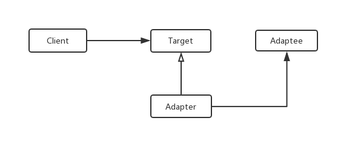
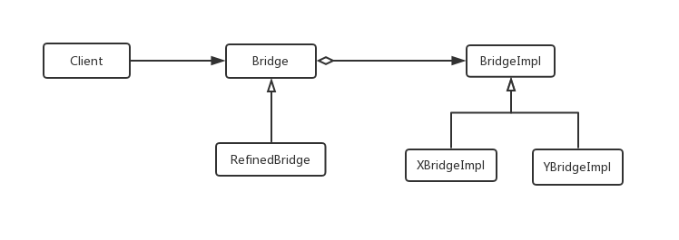

# 第三章 Java面向对象-UML 与设计模式

##  1 UML简介

### 3.1.1 UML 

   在线工具：[https://www.processon.com](https://www.processon.com/)

​    UML要介绍可以写成一本书，涉及的内容很多。这里，我们简单介绍一些实际工作中经常用到的UML图。

​    **什么是UML？**

> UML 是一种统一建模语言，是一种标准的图形表示发。

   **比较常用的图**：

* 类图——用于描述类与类之间的关系
* 用例图
* 时序图
* 组件图
* 部署图
* 状态机图
* 活动图

### 3.1.2 什么是面向对象分析和设计

**什么是分析**

> 分析强调的是对问题和需求的调查研究，而不是解决方案。例如，如果需要一个新的在线电商系统，那么应该分析如何使用它，它应该具有哪些功能？

 **什么是设计**

> 强调的是满足需求的概念上的解决方案（在软件方面和硬件方面），而不是其实现。

有益的分析和设计 可以概括为： 做**正确的事情**（分析） 和 **正确地做事**（设计）。

**什么是面向对象分析和设计**

> 在面向对象分析中，强调的是在问题领域内发现和描述对象（概念）。例如，在电商领域系统内包含商品、订单、购物车、奖励、卡券等概念。

**什么是面向对象设计**

> 在面向对象设计中，强调的是定义软件对象以及它们如何协作以实现需求。 例如，软件对象订单包含商品、信息、使用卡券。

### 3.1.3 面向对象分析和设计一般步骤

* 定义用例

​      需求分析可能包括人们如何使用应用的情节或场景，这些情节或场景可以被编写成用例。用例不是面向对象制品，而只是对情节的记录。

* 定义领域模型

​       面向对象分析关注从对象的角度创建领域描述。面向对象分析需要鉴别重要的**概念**、**属性**和**关联**。

​       面向对象分析的结构可以表示为**领域模型**，在领域模型中展示重要的领域或对象。

* 定义交互图

​       面向对象设计关注软件对象的定义——他们的职责和协作。 时序图是描述协作的常见表示方法。它展示软件对象之间的**消息流**和消息引起的**方法调用**。

* 定义设计类图

  有效地表示类定义的静态视图。

### 3.1.4 用例

   用例图包含三种元素： 参与者、场景。

* **参与者**：是某些具体行为的事物，可以是人（由角色标识）、计算机系统或者组织。
* **场景**：是参与者和系统之间的一系列特定的活动和交互，也称为用例实例。场景是使用系统的一个特定情节或者用例的一条执行路径，例如第三方支付 用户转账、扫码支付、反扫支付。

**用例内容**

| 用例的不同部分   | 注释                                 |
| ---------------- | ------------------------------------ |
| 用例名称         | 以动词开始                           |
| 范围             | 要设计的系统                         |
| 级别             | 用户目标 或者是 子功能               |
| 主要参与者       | 调用系统，使之交付服务               |
| 涉众及其关注点   | 关注该用例的人，及其需要             |
| 前置条件         | 开始必须为真的条件                   |
| 成功保证         | 成功完成必须满足的条件               |
| 主成功场景       | 典型的、无条件的、理想方式的成功场景 |
| 扩展             | 成功或者失败的替代场景               |
| 特殊需求         | 相关的非功能性需求                   |
| 技术和数据变元表 | 不同的I/O方法和数据格式              |

**用例图**

用例图是一种优秀的系统语境图，也就是说，用例图能够展示系统边界、位于边界之外的事物以及系统如何被使用。

### 3.1.5 领域模型——类图

**什么是领域模型：**

 是对领域内的**概念类**或现实世界中**对象的**可视化表示，也称为**概念模型**。应用UML表示法，领域模型被描述为一组没有定义操作的**类图**。它提供了**概念透视图**，展示为：

* 领域对象或者概念类
* 概念类之间的关联
* 概念类的属性

**准则：如何创建领域模型**

* 寻找概念类
* 将其绘制为UML类图中的类
* 添加关联和属性

类图是一种静态结构图，是领域模型的组成部分，概念类之间的关联关系包含：泛化、实现、关联、组合（聚合）、依赖。

比如，我们在2.4节提到的实践题目，英雄联盟简要领域模型图：

**关系说明**

| 关系 | 说明                                                         |
| ---- | ------------------------------------------------------------ |
| 泛化 | 一种继承关系，表示一般与特殊的关系 抽象类与子类的关系。 |
| 实现 | 一种类与接口的关系，表示类是接口所有特征和行为的实现         |
| 关联 | 一种拥有关系，它使一个类知道另一个类的属性和方法。 关联有双向和单向，双向可以有两个箭头或者无，单向有一个箭头。 |
| 聚合 | 整体和部分的关系，且部分可以离开整体而单独存在。 聚合关系是关联关系的一种，是强的关联关系。 带空白菱形的实线，菱形指向整体。 |
| 组合 | 整体和部分的关系，且部分不能离开整体而单独存在。 带实心菱形的实线，菱形指向整体。 |
| 依赖 | 是一种使用的关系，即一个类的实现需要另一个类的协助，所以要尽量不使用双向的互相依赖.  代码表现：局部变量、方法的参数或者对静态方法的引用。 带箭头的虚线，指向被使用者 |

### 3.1.6 时序图

时序图是交互图的一种，强调时间顺序。

**注：该图引用微信支付免密支付流程**

* 实线箭头：表示调用方 对被调用方的调用，箭头指向被调用方。
* 虚线箭头：表示返回，箭头指向调用方。
* 长条：表示时间

### 3.1.7 组件图

**注：这只是一个简易的组件图（线框）**

* 箭头：表示依赖

###  3.1.8 部署图

**注**

* 该图是引用他人的图。
* 部署图描述组件的物理部署关系。

### 3.1.9 状态图

**注：**

* 该图描述了Java 线程状态变化。
* 箭头方向指向下一个状态。

### 3.1.10 活动图

**说明**：

* 该图是描述架构定义的活动
* 箭头指向下一个活动。
* 虚线箭头：表示该活动阶段产出物，一般没有这个。

## 2 设计模式

设计模式是解决设计可复用的问题。设计模式是对问题解决经验的总结、汇总。一般设计模式有4个基本要素：

* 模型名称：用来描述模式的问题、解决方案和效果。
* 问题：描述了应该在何时使用模式。
* 解决方案：描述了设计的组成成分，他们之间的相互关系以及各自的职责和协作方式。
* 效果：描述了模式应用的效果以及使用模式应权衡的问题。

**设计模式的组织编目**

|      |      | 创建型                                                      | 结构型                                                       | 行为型                                                       |
| ---- | ---- | ----------------------------------------------------------- | ------------------------------------------------------------ | ------------------------------------------------------------ |
| 范围 | 类   | Factory Method                                              | Adapter                                                      | Interpreter Template Method                             |
|      | 对象 | Abstract Factory Builder Prototype Singleton | Adapter Bridge Composite Decorator Facade Flyweight Proxy | Chain of Responsibility Command Iterator Mediator Memento Observer State Strategy Visitor |

总共23种设计模式，为了让大家更容易掌握后续的Java，这里主要讲一些常用的设计模式。

### 3.2.1 创建者模型

#### 3.2.1.1 抽象工厂

1. 意图：提供一个创建一系列相关或相互依赖对象的接口，而无需指定他们具体的类。
2. 别名： Kit
3. 动机：仅与抽象类定义的接口交互，而不是用特定的具体类的接口（依赖于抽象，不依赖于实现）。
4. 适用性：
   * 一个系统要独立于它的产品的创建、组合和表示时。
   * 一个系统要由多个产品系列中的一个来配置时。
   * 当你提供一个产品类库，只想显示它们的接口，而不是实现。
5. 结构：
6. 参考代码:https://github.com/tqzz-edu/edu/tree/master/src/main/java/tianqin/iedu/facatory
7. 优点和缺点
   * 分离了具体的类，使得客户（使用方）与类的实现分离，不用关注，从而容易交换产品实现，易于扩展。
   * 难于支持新种类的产品。

#### 3.2.1.2 生成器

1. 意图：将一个复杂对象的构建与它的表示分离，使得同样的构建过程可以创建不同的表示。
2. 动机：简化复杂对象的构建过程。
3. 适用性：
   * 当创建复杂对象的**算法应该独立于**该对象的组成部分以及它们的装配方式时。
   * 当构造过程必须允许**被构造的对象有不同**的表示时。
4. 结构：

​      

5. 参考代码

   https://github.com/tqzz-edu/edu/tree/master/src/main/java/tianqin/iedu/facatory

6. 优点和缺点：将复杂创建方式和对象的组成部分分离出来。

#### 3.2.1.3 工厂方法

1. 意图：定义一个用于创建对象的接口，让子类决定实例化哪一个类。工厂方法使一个类的实例化延迟到其子类。

2. 别名：虚构造器

3. 动机：框架使用抽象类定义和维护对象之间的关系。

4. 适用性：

   * 当一个类不知道它所必须创建的对象的类的时候。

5. 结构

   

6. 参考代码：

   https://github.com/tqzz-edu/edu/tree/master/src/main/java/tianqin/iedu/facatory

#### 3.2.1.4 原型（克隆）

1. 意图：用原型实例指定创建对象的种类，并且通过拷贝这些原型创建新的对象。

2. 适用性：

   * 当要实例化的类是在运行时刻指定时，例如：通过动态加载
   * 为了避免创建一个与产品类层次平行的工厂类层次。

3. 结构：

   

4. 参考代码：https://github.com/tqzz-edu/edu/tree/master/src/main/java/tianqin/iedu/facatory

#### 3.2.1.5 单体

1. 意图：保证一个类仅有一个实例，并提供一个访问它的全局访问点。

2. 动机：对一些类，**只有一个实例**是很重要的，比如抽象工厂、工厂方法或者全局资源分配类。

3. 参考代码：https://github.com/tqzz-edu/edu/tree/master/src/main/java/tianqin/iedu/facatory

#### 3.2.1.6 实践建议

* 抽象工厂、工厂方法 建议实现成单体，大家可以参考代码自己实现。
* 遇到多个构造器参数时，需要考虑用构建器（Builder 模式，参考代码 factory 中的NutritionFacts）

### 3.2.2 结构型

  结构型的设计模式，这里主要介绍了Java 常见的模式：适配器模式、桥接模式、组合模式、装饰模式、Facade(外观)、代理模式。

#### 3.2.2.1 适配器(Adapter)

1. 意图：将一个类的接口转换成客户希望的另外一个接口。Adapter 模式使得原本由于接口不兼容而不能一起工作的那些类可以一起工作。

2. 别名：包装器(Wrapper)。

3. 动机：兼容，对同一个功能，不同实现，提供统一的对外接口。

4. 适用性：

   * 想使用一个已经存在的类，而它的接口不符合你的需求。
   * 想创建一个可复用的类，该类可以与其他不相关的类或不可预见的类一起工作。
   * 想使用一些已经存在的子类，但是不可能对每一个都进行子类化以匹配它们的接口。

5. 结构图：

   

6. 参考代码：https://github.com/tqzz-edu/edu/tree/master/src/main/java/tianqin/iedu/struct

适配器的思想，在实际工作中的使用例子：在支付业务中，在内部的调用参数基本都一样，但是对接到不同的渠道，比如支付宝、微信支付，由于各个渠道参数不同，在这种情况下就可以使用适配器的思想。

#### 3.2.2.2 桥接(Bridge)

1. 意图：将抽象部分与它的实现部分分离，使它们都可以独立地变化。

2. 别名：Handle/Body

3. 动机：将抽象部分和实现部分分离，从而易于独立地进行修改、扩充和重用。

4. 结构图：

   

5. 参考代码：https://github.com/tqzz-edu/edu/tree/master/src/main/java/tianqin/iedu/struct

#### 3.2.2.3 组合模式(Composite)

1. 意图： 将对象组合树形结构以表示"部分-整体"的层次结构。Composite 使得用户对单个对象和组合对象的使用具有一致性。

2. 动机：抽象类，即可以表示单一对象，又可以表示为对象容器。在规则引擎中，一般会利用。一个规则，里面包含很多小规则，在这种情况下，就可以利用到Composite模式。

3. 结构：

   

4. 参考代码：https://github.com/tqzz-edu/edu/tree/master/src/main/java/tianqin/iedu/struct

   