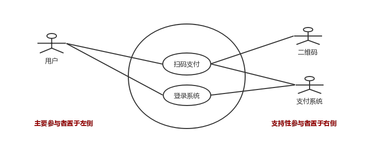

第三章 Java面向对象-UML 与设计模式

##  1 UML简介

### 3.1.1 UML 

   在线工具：[https://www.processon.com](https://www.processon.com/)

​    UML要介绍可以写成一本书，涉及的内容很多。这里，我们简单介绍一些实际工作中经常用到的UML图。

​    **什么是UML？**

> UML 是一种统一建模语言，是一种标准的图形表示发。

   **比较常用的图**：

* 类图——用于描述类与类之间的关系
* 用例图
* 时序图
* 组件图
* 部署图
* 状态机图
* 活动图

### 3.1.2 什么是面向对象分析和设计

**什么是分析**

> 分析强调的是对问题和需求的调查研究，而不是解决方案。例如，如果需要一个新的在线电商系统，那么应该分析如何使用它，它应该具有哪些功能？

 **什么是设计**

> 强调的是满足需求的概念上的解决方案（在软件方面和硬件方面），而不是其实现。

有益的分析和设计 可以概括为： 做**正确的事情**（分析） 和 **正确地做事**（设计）。

**什么是面向对象分析和设计**

> 在面向对象分析中，强调的是在问题领域内发现和描述对象（概念）。例如，在电商领域系统内包含商品、订单、购物车、奖励、卡券等概念。

**什么是面向对象设计**

> 在面向对象设计中，强调的是定义软件对象以及它们如何协作以实现需求。 例如，软件对象订单包含商品、信息、使用卡券。

### 3.1.3 面向对象分析和设计一般步骤

* 定义用例

​      需求分析可能包括人们如何使用应用的情节或场景，这些情节或场景可以被编写成用例。用例不是面向对象制品，而只是对情节的记录。

* 定义领域模型

​       面向对象分析关注从对象的角度创建领域描述。面向对象分析需要鉴别重要的**概念**、**属性**和**关联**。

​       面向对象分析的结构可以表示为**领域模型**，在领域模型中展示重要的领域或对象。

* 定义交互图

​       面向对象设计关注软件对象的定义——他们的职责和协作。 时序图是描述协作的常见表示方法。它展示软件对象之间的**消息流**和消息引起的**方法调用**。

* 定义设计类图

  有效地表示类定义的静态视图。

### 3.1.4 用例

   用例图包含三种元素： 参与者、场景。

* **参与者**：是某些具体行为的事物，可以是人（由角色标识）、计算机系统或者组织。
* **场景**：是参与者和系统之间的一系列特定的活动和交互，也称为用例实例。场景是使用系统的一个特定情节或者用例的一条执行路径，例如第三方支付 用户转账、扫码支付、反扫支付。

**用例内容**

| 用例的不同部分   | 注释                                 |
| ---------------- | ------------------------------------ |
| 用例名称         | 以动词开始                           |
| 范围             | 要设计的系统                         |
| 级别             | 用户目标 或者是 子功能               |
| 主要参与者       | 调用系统，使之交付服务               |
| 涉众及其关注点   | 关注该用例的人，及其需要             |
| 前置条件         | 开始必须为真的条件                   |
| 成功保证         | 成功完成必须满足的条件               |
| 主成功场景       | 典型的、无条件的、理想方式的成功场景 |
| 扩展             | 成功或者失败的替代场景               |
| 特殊需求         | 相关的非功能性需求                   |
| 技术和数据变元表 | 不同的I/O方法和数据格式              |

**用例图**

用例图是一种优秀的系统语境图，也就是说，用例图能够展示系统边界、位于边界之外的事物以及系统如何被使用。

### 3.1.5 领域模型——类图

**什么是领域模型：**

 是对领域内的**概念类**或现实世界中**对象的**可视化表示，也称为**概念模型**。应用UML表示法，领域模型被描述为一组没有定义操作的**类图**。它提供了**概念透视图**，展示为：

* 领域对象或者概念类
* 概念类之间的关联
* 概念类的属性

**准则：如何创建领域模型**

* 寻找概念类
* 将其绘制为UML类图中的类
* 添加关联和属性

类图是一种静态结构图，是领域模型的组成部分，概念类之间的关联关系包含：泛化、实现、关联、组合（聚合）、依赖。

比如，我们在2.4节提到的实践题目，英雄联盟简要领域模型图：

**关系说明**

| 关系 | 说明                                                         |
| ---- | ------------------------------------------------------------ |
| 泛化 | 一种继承关系，表示一般与特殊的关系 抽象类与子类的关系。 |
| 实现 | 一种类与接口的关系，表示类是接口所有特征和行为的实现         |
| 关联 | 一种拥有关系，它使一个类知道另一个类的属性和方法。 关联有双向和单向，双向可以有两个箭头或者无，单向有一个箭头。 |
| 聚合 | 整体和部分的关系，且部分可以离开整体而单独存在。 聚合关系是关联关系的一种，是强的关联关系。 带空白菱形的实线，菱形指向整体。 |
| 组合 | 整体和部分的关系，且部分不能离开整体而单独存在。 带实心菱形的实线，菱形指向整体。 |
| 依赖 | 是一种使用的关系，即一个类的实现需要另一个类的协助，所以要尽量不使用双向的互相依赖.  代码表现：局部变量、方法的参数或者对静态方法的引用。 带箭头的虚线，指向被使用者 |

### 3.1.6 时序图

时序图是交互图的一种，强调时间顺序。

**注：该图引用微信支付免密支付流程**

* 实线箭头：表示调用方 对被调用方的调用，箭头指向被调用方。
* 虚线箭头：表示返回，箭头指向调用方。
* 长条：表示时间

### 3.1.7 组件图

**注：这只是一个简易的组件图（线框）**

* 箭头：表示依赖

###  3.1.8 部署图

**注**

* 该图是引用他人的图。
* 部署图描述组件的物理部署关系。

### 3.1.9 状态图

**注：**

* 该图描述了Java 线程状态变化。
* 箭头方向指向下一个状态。

### 3.1.10 活动图

**说明**：

* 该图是描述架构定义的活动
* 箭头指向下一个活动。
* 虚线箭头：表示该活动阶段产出物，一般没有这个。

