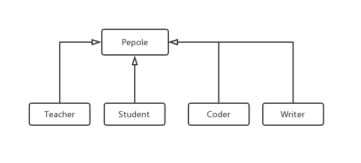
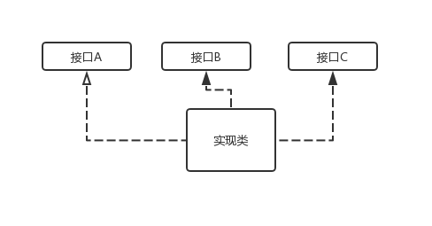
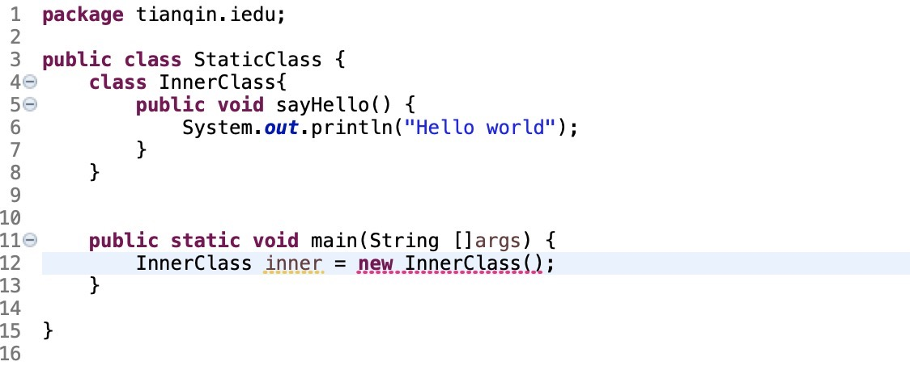
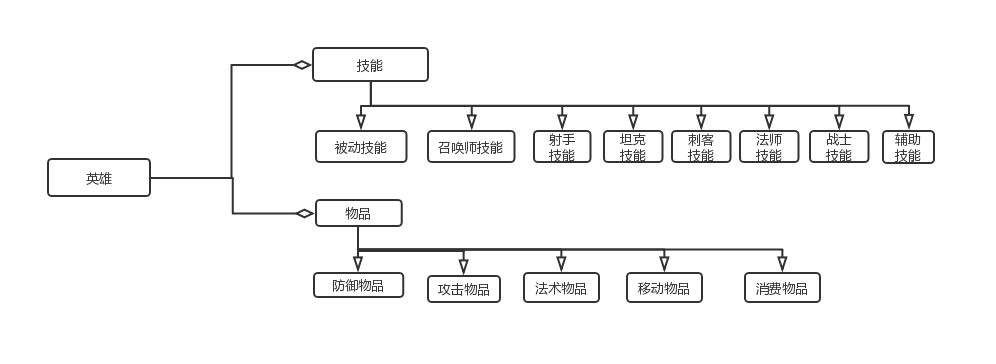

# 第二章  Java面向对象

## 2.1 面向对象及其特征

  Java 是面向对象编程语言，对象是Java程序的基本组成部分。那什么是面向对象呢？面向对象编程按照现实世界的特点来管理复杂的事物，把他们抽象为对象，使其具有自己的状态（成员变量）和行为（成员方法）。

面向对象编程具有如下的三大特征：

* 封装：通过Java 类来对数据和操作方法进行封装，外界可以将Java类当作一个黑盒子，只需要调用该黑盒子提供的方法即可以完成预期的操作。
* 继承：通过类的继承，做到通用性和个性化的分离。通用性实现集中在父类中，个性化的需求在子类中实现。这样提高代码的**重用**和可维护性，有利于灵活**扩展（变化）**。
* 多态：通过**重载**，**重写与覆盖**，实现不同类的不同形态特征。


Java的这三大特征，通过**类**、**抽象类**与**接口**来体现的。


## 2.2 类-封装

类是Java 程序的基本组成。它通过对相关的状态和方法的内聚，抽象成一个类。比如，我们会对现实世界的人进行抽象，那么人这个对象具有什么样相关的状态和方法呢？比如 年龄、姓名、走、工作、住址。

```java
class Pepole{
  private int age;
  private String name;
  private String job;
  private String address;
  private String company;
  // 默认构造函数
  public Pepole(){
    age = 0;
  }
  // 带参数的构造函数
  public Pepole(int age, String name, String job, String address, String company){
     this.age = age;
     this.name = name;
     this.job = job;
     this.address = address;
     this.company = company;
  }
  
  // 通过方法来访问类的成员变量
  public int getAge(){
    return age;
  }
}
```


**封装**的特点：

* 隐藏事物的内部实现细节。
* 对外提供**一致**的公共接口——间接操作、访问隐藏数据。
* 可维护性

### 2.2.1 对象的生产

封装的类不是对象，要使用该封装类进行操作，必须先生成该类的一个实例——对象。

对象的生成包括：声明（类型）、实例化、初始化。实例化需要对象的构造函数。

**构造函数：**

* 方法名跟**类名一样**的**非晶态**方法，该方法**没有**任何的返回类型。
* 构造函数的作用起到对类**非静态成员**进行初始化。

```java
Pepole pepole1 = new Pepole();// 采用默认构造函数
Pepole pepole2 = new Pepole(15,"Chen xiao ming", "Student", "XXX", "YYYY");//参数构造函数

```

**Tips：**

* 声明：声明某一个变量的类型，比如例子Pepole pepole1 声明了变量pepole1的类型是Pepole。
* 实例化：运算符new 为对象分配**内存空间**，new 调用对象的构造方法，返回对该对象的一个引用（即改对象所在的内存地址，该值是一个long类型的值）。
* 初始化：执行完类相应的构造函数之后，返回一个引用，并将该引用赋值给变量。

### 2.2.2 对象的引用

类对象的变量值是对象的引用（执行一块内存地址），这样可以对对象的变量、成员进行访问和操作。

```java
class Pepole{
  ;
  public static void main(String args[]){
    Pepole p1 = new Pepole();
    System.out.println("age:" + p1.getAge());
    System.out.println("age:" + new Pepole().getAge());
  }
}
```


## 2.3 继承

继承从字面上来说A类继承了另外一个类B的功能（状态、行为），换句话拥有了该类的功能。那么类A被称为**子类**，即：subclass。 类B称为**超类（父类）**，即：superclass。

**java.lang.Object** 默认是所有Java类的超类。

**类的继承**：可以在原来的基础上增加功能（新的数据和新的方法）。继承一个类的范式：

```java
class SubClass extends SuperClass{
  ;
}
```


举个例子例子，我们对Pepole 对象进行继承，增加了子类学生、教师、码农、作家。



对于这四个不同的子类：

* 教师：除了的常用方法，可以有教龄、擅长课程的功能。
* 学生：除了Pepole的常用方法，可以有做作业、成绩的功能。
* 码农：除了Pepole的常用方法，可以有擅长编程语言的功能。
* 作家：除了Pepole的常用方法，可以有擅长写什么作品的功能。

```java
class Coder extends Pepole{
   private String codeLanguage;
   public Coder(String l){
     // 调用超类的构造函数
     super();
     codeLanguage = l;
   }
  
   public String getCodeLanguage(){
      return codeLanguage;
   }
}
```


**Tips**

* Java 不支持多超类的继承。

### 2.3.1 访问限制

| 父类       | 子类可访问 |
| ---------- | ---------- |
| \private   | 不可访问   |
| \protected | 可访问     |
| \public    | 可访问     |

### 2.3.2 父类和子类的相互转换

**Tips:**

* 子类对象可以直接给父类类型变量赋值。
* 父类对象要给子类类型变量赋值，必须类型转换。
* 子类类型对象同时必然是父类类型变量，反之不一定。
* 子类拥有父类的功能，子类对象引用可以访问父类**可访问**成员。
* 父类不一定拥有子类的功能，父类对象引用不能访问子类**新增**的功能。

```java
Pepole p = new Coder();
// 必须类型转换
Coder c  = (Coder)p;
Pepole p2 = new Tearcher();
// 这个会抛异常
Coder c1 = (Coder)p2;
```


### 2.3.3 this\super

| 关键字 | 描述                                                         |
| ------ | ------------------------------------------------------------ |
| \this  | 1、引用当前类的变量或者方法，this.变量，this.成员函数(实参)<br />2、调用当前类的构造函数，this(实参) |
| \super | 1、引用当前对象的直接父类**可访问**的变量或者方法，super.变量，super.成员函数(实参)。<br />2、调用直接父类的构造函数，super(实参) |

```java
class A{
  private int b;
  protectd int a;
  public A(int b, int a){
    this.b = b;
    this.a = a;
  }
  public int getB(){
    return b;
  }
}

class B extends A{
  private int c;
  public C(){
    c = 0;
    super(10, 20);
  }
  
  public void print(){
    System.out.println("a:%d b:%d, c:%d", this.c, super.getB(), super.a);
  }
}


```


### 2.3.4 多态——重载、重写(覆盖)

| 多态 | 描述                                                         |
| ---- | ------------------------------------------------------------ |
| 重载 | 重载(overloading) 是在一个类里面，方法名字相同，而参数不同。<br />返回类型可以相同也可以不同。每个重载的方法（或者构造函数）<br />都必须有一个独一无二的参数类型列表。 |
| 重写 | 重写是子类对父类的允许访问的方法的实现过程进行重新编写, <br />返回值和形参都不能改变。**即外壳不变，核心重写！** |


**重载与重写的区别：**

| 区别点   | 重载     | 重写                                           |
| -------- | -------- | ---------------------------------------------- |
| 参数列表 | 必须修改 | 一定不能修改                                   |
| 返回类型 | 可以修改 | 一定不能修改                                   |
| 异常     | 可以修改 | 可以减少或删除，一定不能抛出新的或者更广的异常 |
| 访问     | 可以修改 | 一定不能做更严格的限制（可以降低限制）         |

```java
	class Pepole{
		public int work(String c) {
			System.out.println("Pepole do:" + c);
			return 0;
		}
	}
	
	class Coder extends Pepole{
		// 重写
		public int work(String c) {
			super.work(c);
			System.out.println("Coder do:" + c);
			return 0;
		}
		// 重载
		public int work(int c) {
			return 0;
		}
	}
```


### 2.3.5 抽象类—必须被继承

抽象类的用途是：在实际设计过程中，我们会实现一系列的类，这些类是相关的，他们有共同的状态、行为，也有的特性。从**通用** 和**特性**分离的设计理念来看，对这种设计采用抽象类，是最合适的。

```java
abstract class CommanClass{
  /**修饰符 可以public\protected**/
  public abstract void doSomething();
  public void doComman(){}
}
```


**Tips**

* 抽象类的抽象方法，其修饰符不能private。

* 抽象类必须通过继承才能使用，抽象方法只有函数定义部分，没有函数实现体。

* 抽象类的继承，用关键字**extends**

  

在现实中，比如人，不管什么人，都有其通用的状态、行为：

* 年龄
* 眼睛
* 性别
* 住址

但是不同职业的人，其工作方式、工作内容是不同的。

从**通用** 和**特性**分离的设计理念来看，用抽象类最合适的。参考代码如下：

```java
abstract class Pepole{
  public abstract void work();
  public void age(){}
  public void sex(){}
  public void home(){}
}

class Teacher extends Pepole{
  public void work(){}
}

class Coder extends Pepole{
  public void work(){}
}

/**引用**/
Pepole c = new Coder();
c.work();

// 注意：这里会错误，提示不能实例化
Pepole p = new Pepole();
```


### 2.3.6 final 关键字

| 修饰            | 作用                                                         |
| --------------- | ------------------------------------------------------------ |
| \final 类       | final 类不能被继承，没有子类，final 类的方法默认是final。    |
| \final 方法     | 1、final 方法不能被子类的方法重写，但可以被继承。<br />2、private 方法默认是final。 可以思考下为什么？ |
| \final 成员     | final 成员变量表示常量，只能被赋值一次，赋值之后不再被改变。 |
| \final 构造函数 | 这是 **绝对不行的**                                          |

```java
// 最终类
final class A{}
// 最终方法
class B{
  // final 方法
  private final int m = 10;
  // 必须在构造函数里初始化
  private final int c;
  public B(){ c = 20;}
  private void doB(){}
  public final void doC(){}
}
```


### 2.3.7 接口类

在Java 中只支持单一继承，大大地降低了复杂度，但是也可以通过接口实现多重继承，它使多个不相关的类可以具有相同的方法。



**接口的定义**

* 接口是一种类结构，有特定的语法。
* 一种逻辑抽象。

**接口声明**

```java
public interface A{
  public void func1();
  int func2();
  int func3(int arg);
}

public interface B extends A{
  public void func4();
}

public class Aimpl implements A{
  public void func1(){}
  public int func2(){ return 0; }
  public int func3(int arg) {return 0; }
}
```

**接口特性**

* 接口中的方法是一个标准的函数声明（有参数列表和返回类型），但不能有实现体。
* 接口中可以包含**字段**（成员变量），但会被隐式地声明为static 和 final。
* 接口中的成员变量只是被存储在该接口的**静态区域**，而不属于该接口。
* 接口中的可以被声明为**public** 或者不声明，但都被当作**public** 类型处理。
* 实现接口，需要将被定义的方法声明**public**，否则为默认访问类型。
* 如果没有实现所有的接口，那么创建的仍然是一个接口。
* 如果需要接口进行扩展形成新的接口，则采用**extends**，实现则用**implements**
* Java 接口的方法只能是抽象的和公开的，不能有**构造函数**。


### 2.3.8 接口和抽象类的区别

| 区别                 | 接口                          | 抽象类       |
| -------------------- | ----------------------------- | ------------ |
| 是否可以提供实现方法 | 不可以                        | 可以         |
| 多继承               | 可以实现多个接口              | 只能继承一个 |
| 成员变量             | 被隐式地声明为 static 和final | 类的成员变量 |


### 2.3.9 最佳实践

OOP面向对象的编程为了提高程序的复用率、可维护性、可扩展性，一般是面向接口的编程、面向抽象的编程，正确地使用接口、抽象类。

在Java语言中，API用了这种模式：abstract + 类名，比如buffer。

```java
public abstract class Buffer{
  public abstract Object array();
  public abstract int arrayOffset();
  ......
}

public Class IntBuffer extends Buffer implements Comparable<IntBuffer>{

}
```

通过上述的**最佳实践**：

* 接口用于无状态的抽象，如果抽象的实体具有状态（成员变量），那么用抽象类比较合适，比如对象的Comparable接口。
* 不建议用具体类去进程另一个具体类。
* 建议多阅读Java API手册。

举例子，Java中的java.nio.channels，

[异步IO]: https://docs.oracle.com/javase/8/docs/api/


* 所有的Channel 都是I/O类，所以必须**可关闭**，否则会造成资源泄漏，所以继承了Closeable。
* Channel 是I/O相关的，IO的特性：异步（同步），读、写、网络、是否可中断，所以根据这四个特性继承了第三层的类。

## 2.4 面向对象扩展

静态类、内部类和匿名类为 我们提供了出色的工具，这些工具包含：

* 静态类：静态方法（类的共享方法）、静态变量（类的共享变量）、静态代码块、静态内部类。
* 匿名类：一般用于便捷实现某个接口，常用于Lambada、事件监听。
* 内部类：类的内部类。

### 2.4.1 静态类

**静态类**的含义：定义了**静态方法**、**静态变量**、**静态代码块**的类，或者**内部静态类**，这些静态方法、静态变量**不需要实例化**即可以直接引用，而静态代码块则是用在系统初始化时。

```java
package tianqin.iedu;
import java.util.Random;
public class HelloWorld {
	/**静态变量：一般用于该类所有对象的共享变量，或者为其他类提供常量**/
	private static int RAND_SEQ;	
	static {
		/**静态代码块，一般用于系统初始化，进行叫复杂的初始化**/
		Random rand = new Random();
		RAND_SEQ = rand.nextInt();
	}	
	/**静态方法：一般提供工具方法**/
	public static void sayHello() {
		System.out.println("Hello world:" + RAND_SEQ);
	}
	/**静态方法：这个函数Java 程序的入口，告诉Java执行器该函数是入口。**/
	public static void main(String [] args) {
		HelloWorld.sayHello();
	}
}
```

**输出：**

* Hello world:-1409510551

**说明：**

* 静态方法、静态变量，无需实例化类对象，直接通过**类名.方法**或者**类名.静态变量**访问。
* 静态方法**一般用于提供一些工具方法**。
* 静态代码块：是在系统执行初始化的时候执行。

### 2.4.2 内部类

内部类是声明在一个类内部的类，内部类可以声明在类的任何地方，比如方法块内，或者不在方法块内。内部类也**包含匿名类**。Java 语言规范允许定义以下几种内部类：

* 在另一个类或者一个接口声明一个**类**。
* 在另一个接口或者一个类中声明一个**接口**。
* 在一个方法中声明一个**类**。
* 类和接口声明可嵌套任意深度。

**内部类的可视范围**：内部类的可视范围是它的直接外嵌类，也就是说内部类可以直接引用外嵌类中的任何成员。因为**内部类**与**外部类**的**实例**相关。

**内部类的好处**：封装性好，直接通过操作得到内部类内容。你可以将只与某个类对象相关的实现为内部类。

**内部类有如下特性**：

* 一般用在**定义它的类**或者**语句块中**，外部引用时必须给出**完整的名称**。
* **可以使用包含它的类的静态和实例成员变量，也可以使用它所在方法的局部变量**。
* 可以定义为**abstract**。
* 可以声明为**private** 或者 **protected**，访问权限参考**1.3.2章节控制范围**。
* 若被声明为**static**，就变成了顶层类，不能再使用局部变量。
* 若想在Inner Class 中声明任何**static** 成员，则该**Inner Class** 必须声明为static。

**内部类的使用**

* 事件处理程序，比如GUI、监听。
* 某些初始化复杂的类的构造类。
* 容器的迭代器。


下面我们用Java库中的ArrayList来介绍内部类、静态类的使用：

```java
package java.util;

import java.util.function.Consumer;
import java.util.function.Predicate;
import java.util.function.UnaryOperator;
import sun.misc.SharedSecrets;
public class ArrayList<E> extends AbstractList<E>
        implements List<E>, RandomAccess, Cloneable, java.io.Serializable
{
    /**静态常量成员：表明该类的唯一ID，用于序列化**/
    private static final long serialVersionUID = 8683452581122892189L;
    /**
     * 静态常量成员：用于表明所有ArrayList对象的初始化容量.
     */
    private static final int DEFAULT_CAPACITY = 10;
    /**
     * 静态常量成员：用于初始化空的数组.
     */
    private static final Object[] EMPTY_ELEMENTDATA = {};

    /**
     * Shared empty array instance used for default sized empty instances. We
     * distinguish this from EMPTY_ELEMENTDATA to know how much to inflate when
     * first element is added.
     */
    private static final Object[] DEFAULTCAPACITY_EMPTY_ELEMENTDATA = {};

    /**
     * 成员变量：是数组
     */
    transient Object[] elementData; // non-private to simplify nested class access

    /**
     * The size of the ArrayList (the number of elements it contains).
     * @serial
     */
    private int size;

    /**
     * Constructs an empty list with the specified initial capacity.
     *
     * @param  initialCapacity  the initial capacity of the list
     * @throws IllegalArgumentException if the specified initial capacity
     *         is negative
     */
    public ArrayList(int initialCapacity) {
        if (initialCapacity > 0) {
            this.elementData = new Object[initialCapacity];
        } else if (initialCapacity == 0) {
            this.elementData = EMPTY_ELEMENTDATA;
        } else {
            throw new IllegalArgumentException("Illegal Capacity: "+
                                               initialCapacity);
        }
    }

    /**
     * Constructs an empty list with an initial capacity of ten.
     */
    public ArrayList() {
        this.elementData = DEFAULTCAPACITY_EMPTY_ELEMENTDATA;
    }

    /**
     * Constructs a list containing the elements of the specified
     * collection, in the order they are returned by the collection's
     * iterator.
     *
     * @param c the collection whose elements are to be placed into this list
     * @throws NullPointerException if the specified collection is null
     */
    public ArrayList(Collection<? extends E> c) {
        elementData = c.toArray();
        if ((size = elementData.length) != 0) {
            // c.toArray might (incorrectly) not return Object[] (see 6260652)
            if (elementData.getClass() != Object[].class)
                elementData = Arrays.copyOf(elementData, size, Object[].class);
        } else {
            // replace with empty array.
            this.elementData = EMPTY_ELEMENTDATA;
        }
    }

    /**
     * Trims the capacity of this <tt>ArrayList</tt> instance to be the
     * list's current size.  An application can use this operation to minimize
     * the storage of an <tt>ArrayList</tt> instance.
     */
    public void trimToSize() {
        modCount++;
        if (size < elementData.length) {
            elementData = (size == 0)
              ? EMPTY_ELEMENTDATA
              : Arrays.copyOf(elementData, size);
        }
    }

    /**
     * Increases the capacity of this <tt>ArrayList</tt> instance, if
     * necessary, to ensure that it can hold at least the number of elements
     * specified by the minimum capacity argument.
     *
     * @param   minCapacity   the desired minimum capacity
     */
    public void ensureCapacity(int minCapacity) {
        int minExpand = (elementData != DEFAULTCAPACITY_EMPTY_ELEMENTDATA)
            // any size if not default element table
            ? 0
            // larger than default for default empty table. It's already
            // supposed to be at default size.
            : DEFAULT_CAPACITY;

        if (minCapacity > minExpand) {
            ensureExplicitCapacity(minCapacity);
        }
    }

    private static int calculateCapacity(Object[] elementData, int minCapacity) {
        if (elementData == DEFAULTCAPACITY_EMPTY_ELEMENTDATA) {
            return Math.max(DEFAULT_CAPACITY, minCapacity);
        }
        return minCapacity;
    }

    private void ensureCapacityInternal(int minCapacity) {
        ensureExplicitCapacity(calculateCapacity(elementData, minCapacity));
    }

    private void ensureExplicitCapacity(int minCapacity) {
        modCount++;

        // overflow-conscious code
        if (minCapacity - elementData.length > 0)
            grow(minCapacity);
    }

    /**
     * The maximum size of array to allocate.
     * Some VMs reserve some header words in an array.
     * Attempts to allocate larger arrays may result in
     * OutOfMemoryError: Requested array size exceeds VM limit
     */
    private static final int MAX_ARRAY_SIZE = Integer.MAX_VALUE - 8;

    /**
     * Increases the capacity to ensure that it can hold at least the
     * number of elements specified by the minimum capacity argument.
     *
     * @param minCapacity the desired minimum capacity
     */
    private void grow(int minCapacity) {
        // overflow-conscious code
        int oldCapacity = elementData.length;
        int newCapacity = oldCapacity + (oldCapacity >> 1);
        if (newCapacity - minCapacity < 0)
            newCapacity = minCapacity;
        if (newCapacity - MAX_ARRAY_SIZE > 0)
            newCapacity = hugeCapacity(minCapacity);
        // minCapacity is usually close to size, so this is a win:
        elementData = Arrays.copyOf(elementData, newCapacity);
    }

    private static int hugeCapacity(int minCapacity) {
        if (minCapacity < 0) // overflow
            throw new OutOfMemoryError();
        return (minCapacity > MAX_ARRAY_SIZE) ?
            Integer.MAX_VALUE :
            MAX_ARRAY_SIZE;
    }

    /**
     * Returns the number of elements in this list.
     *
     * @return the number of elements in this list
     */
    public int size() {
        return size;
    }

    /**
     * Returns <tt>true</tt> if this list contains no elements.
     *
     * @return <tt>true</tt> if this list contains no elements
     */
    public boolean isEmpty() {
        return size == 0;
    }

    /**
     * 判断是否有指定的对象
     */
    public boolean contains(Object o) {
        return indexOf(o) >= 0;
    }

    /**
     * 寻找指定对象的位置
     */
    public int indexOf(Object o) {
        if (o == null) {
            for (int i = 0; i < size; i++)
                if (elementData[i]==null)
                    return i;
        } else {
            for (int i = 0; i < size; i++)
                if (o.equals(elementData[i]))
                    return i;
        }
        return -1;
    }

    /**
     * 寻找指定对象的最后位置
     */
    public int lastIndexOf(Object o) {
        if (o == null) {
            for (int i = size-1; i >= 0; i--)
                if (elementData[i]==null)
                    return i;
        } else {
            for (int i = size-1; i >= 0; i--)
                if (o.equals(elementData[i]))
                    return i;
        }
        return -1;
    }

    /**
     * Returns a shallow copy of this <tt>ArrayList</tt> instance.  (The
     * elements themselves are not copied.)
     *
     * @return a clone of this <tt>ArrayList</tt> instance
     */
    public Object clone() {
        try {
            ArrayList<?> v = (ArrayList<?>) super.clone();
            v.elementData = Arrays.copyOf(elementData, size);
            v.modCount = 0;
            return v;
        } catch (CloneNotSupportedException e) {
            // this shouldn't happen, since we are Cloneable
            throw new InternalError(e);
        }
    }

    /**
     * 获取内部成员elementData的一份拷贝
     */
    public Object[] toArray() {
        return Arrays.copyOf(elementData, size);
    }

    /**
     * 获取内部成员elementData的一份拷贝
     */
    @SuppressWarnings("unchecked")
    public <T> T[] toArray(T[] a) {
        if (a.length < size)
            // Make a new array of a's runtime type, but my contents:
            return (T[]) Arrays.copyOf(elementData, size, a.getClass());
        System.arraycopy(elementData, 0, a, 0, size);
        if (a.length > size)
            a[size] = null;
        return a;
    }

    // Positional Access Operations
    @SuppressWarnings("unchecked")
    E elementData(int index) {
        return (E) elementData[index];
    }

    /**
     * get
     */
    public E get(int index) {
        rangeCheck(index);
        return elementData(index);
    }

    /**
     * 替换
     */
    public E set(int index, E element) {
        rangeCheck(index);

        E oldValue = elementData(index);
        elementData[index] = element;
        return oldValue;
    }

    /**
     * 追加在后面
     */
    public boolean add(E e) {
        ensureCapacityInternal(size + 1);  // Increments modCount!!
        elementData[size++] = e;
        return true;
    }

    /**
     * 添加在index 位置
     */
    public void add(int index, E element) {
        rangeCheckForAdd(index);

        ensureCapacityInternal(size + 1);  // Increments modCount!!
        System.arraycopy(elementData, index, elementData, index + 1,
                         size - index);
        elementData[index] = element;
        size++;
    }

    /**
     * 删除，并返回
     */
    public E remove(int index) {
        rangeCheck(index);

        modCount++;
        E oldValue = elementData(index);

        int numMoved = size - index - 1;
        if (numMoved > 0)
            System.arraycopy(elementData, index+1, elementData, index,
                             numMoved);
        elementData[--size] = null; // clear to let GC do its work

        return oldValue;
    }

    /**
     * 删除指定的对象
     */
    public boolean remove(Object o) {
        if (o == null) {
            for (int index = 0; index < size; index++)
                if (elementData[index] == null) {
                    fastRemove(index);
                    return true;
                }
        } else {
            for (int index = 0; index < size; index++)
                if (o.equals(elementData[index])) {
                    fastRemove(index);
                    return true;
                }
        }
        return false;
    }

    /*
     * Private remove method that skips bounds checking and does not
     * return the value removed.
     */
    private void fastRemove(int index) {
        modCount++;
        int numMoved = size - index - 1;
        if (numMoved > 0)
            System.arraycopy(elementData, index+1, elementData, index,
                             numMoved);
        elementData[--size] = null; // clear to let GC do its work
    }

    /**
     * Removes all of the elements from this list.  The list will
     * be empty after this call returns.
     */
    public void clear() {
        modCount++;

        // clear to let GC do its work
        for (int i = 0; i < size; i++)
            elementData[i] = null;

        size = 0;
    }

    /**
     * 添加一个集合
     */
    public boolean addAll(Collection<? extends E> c) {
        Object[] a = c.toArray();
        int numNew = a.length;
        ensureCapacityInternal(size + numNew);  // Increments modCount
        System.arraycopy(a, 0, elementData, size, numNew);
        size += numNew;
        return numNew != 0;
    }

    /**
     * 在指定位置添加一个集合
     */
    public boolean addAll(int index, Collection<? extends E> c) {
        rangeCheckForAdd(index);

        Object[] a = c.toArray();
        int numNew = a.length;
        ensureCapacityInternal(size + numNew);  // Increments modCount

        int numMoved = size - index;
        if (numMoved > 0)
            System.arraycopy(elementData, index, elementData, index + numNew,
                             numMoved);

        System.arraycopy(a, 0, elementData, index, numNew);
        size += numNew;
        return numNew != 0;
    }

    /**
     * 删除指定的区间
     */
    protected void removeRange(int fromIndex, int toIndex) {
        modCount++;
        int numMoved = size - toIndex;
        System.arraycopy(elementData, toIndex, elementData, fromIndex,
                         numMoved);

        // clear to let GC do its work
        int newSize = size - (toIndex-fromIndex);
        for (int i = newSize; i < size; i++) {
            elementData[i] = null;
        }
        size = newSize;
    }

    /**
     * 检查是否越界
     */
    private void rangeCheck(int index) {
        if (index >= size)
            throw new IndexOutOfBoundsException(outOfBoundsMsg(index));
    }

    /**
     * A version of rangeCheck used by add and addAll.
     */
     /**其实这个方法，应该是静态方法，它是工具方法**/
    private void rangeCheckForAdd(int index) {
        if (index > size || index < 0)
            throw new IndexOutOfBoundsException(outOfBoundsMsg(index));
    }
    
    /**其实这个方法，应该是静态方法，它是工具方法**/
    private String outOfBoundsMsg(int index) {
        return "Index: "+index+", Size: "+size;
    }

    /**
     * 批量删除
     */
    public boolean removeAll(Collection<?> c) {
        Objects.requireNonNull(c);
        return batchRemove(c, false);
    }

    /**
     * 批量删除
     */
    public boolean retainAll(Collection<?> c) {
        Objects.requireNonNull(c);
        return batchRemove(c, true);
    }

    private boolean batchRemove(Collection<?> c, boolean complement) {
        final Object[] elementData = this.elementData;
        int r = 0, w = 0;
        boolean modified = false;
        try {
            for (; r < size; r++)
                if (c.contains(elementData[r]) == complement)
                    elementData[w++] = elementData[r];
        } finally {
            // Preserve behavioral compatibility with AbstractCollection,
            // even if c.contains() throws.
            if (r != size) {
                System.arraycopy(elementData, r,
                                 elementData, w,
                                 size - r);
                w += size - r;
            }
            if (w != size) {
                // clear to let GC do its work
                for (int i = w; i < size; i++)
                    elementData[i] = null;
                modCount += size - w;
                size = w;
                modified = true;
            }
        }
        return modified;
    }

    /**
     * 对象序列化：用于持久化、传输。
     */
    private void writeObject(java.io.ObjectOutputStream s)
        throws java.io.IOException{
        // Write out element count, and any hidden stuff
        int expectedModCount = modCount;
        s.defaultWriteObject();

        // Write out size as capacity for behavioural compatibility with clone()
        s.writeInt(size);

        // Write out all elements in the proper order.
        for (int i=0; i<size; i++) {
            s.writeObject(elementData[i]);
        }

        if (modCount != expectedModCount) {
            throw new ConcurrentModificationException();
        }
    }

    /**
     * 对象反序列化
     */
    private void readObject(java.io.ObjectInputStream s)
        throws java.io.IOException, ClassNotFoundException {
        elementData = EMPTY_ELEMENTDATA;

        // Read in size, and any hidden stuff
        s.defaultReadObject();

        // Read in capacity
        s.readInt(); // ignored

        if (size > 0) {
            // be like clone(), allocate array based upon size not capacity
            int capacity = calculateCapacity(elementData, size);
            SharedSecrets.getJavaOISAccess().checkArray(s, Object[].class, capacity);
            ensureCapacityInternal(size);

            Object[] a = elementData;
            // Read in all elements in the proper order.
            for (int i=0; i<size; i++) {
                a[i] = s.readObject();
            }
        }
    }

    /**
     * 获取指定位置的对象游标（迭代器）
     */
    public ListIterator<E> listIterator(int index) {
        if (index < 0 || index > size)
            throw new IndexOutOfBoundsException("Index: "+index);
        return new ListItr(index);
    }

    /**
     * 获取对象的迭代器：迭代器用于访问内部数组
     */
    public ListIterator<E> listIterator() {
        return new ListItr(0);
    }

    /**
     * Returns an iterator over the elements in this list in proper sequence.
     *
     * <p>The returned iterator is <a href="#fail-fast"><i>fail-fast</i></a>.
     *
     * @return an iterator over the elements in this list in proper sequence
     */
    public Iterator<E> iterator() {
        return new Itr();
    }

    /**
     * 内部类：用于实现ArrayList 的迭代器
     */
    private class Itr implements Iterator<E> {
        int cursor;       // index of next element to return
        int lastRet = -1; // index of last element returned; -1 if no such
        int expectedModCount = modCount;

        Itr() {}

        public boolean hasNext() {
            return cursor != size;
        }

        @SuppressWarnings("unchecked")
        public E next() {
            checkForComodification();
            int i = cursor;
            if (i >= size)
                throw new NoSuchElementException();
            /**直接访问ArrayList的私有成员**/
            Object[] elementData = ArrayList.this.elementData;
            if (i >= elementData.length)
                throw new ConcurrentModificationException();
            cursor = i + 1;
            return (E) elementData[lastRet = i];
        }

        public void remove() {
            if (lastRet < 0)
                throw new IllegalStateException();
            checkForComodification();

            try {
                ArrayList.this.remove(lastRet);
                cursor = lastRet;
                lastRet = -1;
                expectedModCount = modCount;
            } catch (IndexOutOfBoundsException ex) {
                throw new ConcurrentModificationException();
            }
        }

        @Override
        @SuppressWarnings("unchecked")
        public void forEachRemaining(Consumer<? super E> consumer) {
            Objects.requireNonNull(consumer);
            final int size = ArrayList.this.size;
            int i = cursor;
            if (i >= size) {
                return;
            }
            final Object[] elementData = ArrayList.this.elementData;
            if (i >= elementData.length) {
                throw new ConcurrentModificationException();
            }
            while (i != size && modCount == expectedModCount) {
                consumer.accept((E) elementData[i++]);
            }
            // update once at end of iteration to reduce heap write traffic
            cursor = i;
            lastRet = i - 1;
            checkForComodification();
        }

        final void checkForComodification() {
            if (modCount != expectedModCount)
                throw new ConcurrentModificationException();
        }
    }

    /**
     * An optimized version of AbstractList.ListItr
     */
    private class ListItr extends Itr implements ListIterator<E> {
        ListItr(int index) {
            super();
            cursor = index;
        }

        public boolean hasPrevious() {
            return cursor != 0;
        }

        public int nextIndex() {
            return cursor;
        }

        public int previousIndex() {
            return cursor - 1;
        }

        @SuppressWarnings("unchecked")
        public E previous() {
            checkForComodification();
            int i = cursor - 1;
            if (i < 0)
                throw new NoSuchElementException();
            Object[] elementData = ArrayList.this.elementData;
            if (i >= elementData.length)
                throw new ConcurrentModificationException();
            cursor = i;
            return (E) elementData[lastRet = i];
        }

        public void set(E e) {
            if (lastRet < 0)
                throw new IllegalStateException();
            checkForComodification();

            try {
                ArrayList.this.set(lastRet, e);
            } catch (IndexOutOfBoundsException ex) {
                throw new ConcurrentModificationException();
            }
        }

        public void add(E e) {
            checkForComodification();

            try {
                int i = cursor;
                ArrayList.this.add(i, e);
                cursor = i + 1;
                lastRet = -1;
                expectedModCount = modCount;
            } catch (IndexOutOfBoundsException ex) {
                throw new ConcurrentModificationException();
            }
        }
    }

    /**
     * 获取指定区间的链表，该链表是当前链表的一个部分，操作该链表的内容，会影响到当前链表。
     */
    public List<E> subList(int fromIndex, int toIndex) {
        subListRangeCheck(fromIndex, toIndex, size);
        return new SubList(this, 0, fromIndex, toIndex);
    }

    /**静态内部方法：工具方法**/
    static void subListRangeCheck(int fromIndex, int toIndex, int size) {
        if (fromIndex < 0)
            throw new IndexOutOfBoundsException("fromIndex = " + fromIndex);
        if (toIndex > size)
            throw new IndexOutOfBoundsException("toIndex = " + toIndex);
        if (fromIndex > toIndex)
            throw new IllegalArgumentException("fromIndex(" + fromIndex +
                                               ") > toIndex(" + toIndex + ")");
    }

    /**内部类：用于实现subList的逻辑**/
    private class SubList extends AbstractList<E> implements RandomAccess {
        private final AbstractList<E> parent;
        private final int parentOffset;
        private final int offset;
        int size;

        SubList(AbstractList<E> parent,
                int offset, int fromIndex, int toIndex) {
            this.parent = parent;
            this.parentOffset = fromIndex;
            this.offset = offset + fromIndex;
            this.size = toIndex - fromIndex;
            this.modCount = ArrayList.this.modCount;
        }

        public E set(int index, E e) {
            rangeCheck(index);
            checkForComodification();
            E oldValue = ArrayList.this.elementData(offset + index);
            /**直接操作外嵌类的成员**/
            ArrayList.this.elementData[offset + index] = e;
            return oldValue;
        }

        public E get(int index) {
            rangeCheck(index);
            checkForComodification();
            return ArrayList.this.elementData(offset + index);
        }

        public int size() {
            checkForComodification();
            return this.size;
        }

        public void add(int index, E e) {
            rangeCheckForAdd(index);
            checkForComodification();
            parent.add(parentOffset + index, e);
            this.modCount = parent.modCount;
            this.size++;
        }

        public E remove(int index) {
            rangeCheck(index);
            checkForComodification();
            E result = parent.remove(parentOffset + index);
            this.modCount = parent.modCount;
            this.size--;
            return result;
        }

        protected void removeRange(int fromIndex, int toIndex) {
            checkForComodification();
            parent.removeRange(parentOffset + fromIndex,
                               parentOffset + toIndex);
            this.modCount = parent.modCount;
            this.size -= toIndex - fromIndex;
        }

        public boolean addAll(Collection<? extends E> c) {
            return addAll(this.size, c);
        }

        public boolean addAll(int index, Collection<? extends E> c) {
            rangeCheckForAdd(index);
            int cSize = c.size();
            if (cSize==0)
                return false;

            checkForComodification();
            parent.addAll(parentOffset + index, c);
            this.modCount = parent.modCount;
            this.size += cSize;
            return true;
        }

        public Iterator<E> iterator() {
            return listIterator();
        }

        public ListIterator<E> listIterator(final int index) {
            checkForComodification();
            rangeCheckForAdd(index);
            final int offset = this.offset;

            return new ListIterator<E>() {
                int cursor = index;
                int lastRet = -1;
                int expectedModCount = ArrayList.this.modCount;

                public boolean hasNext() {
                    return cursor != SubList.this.size;
                }

                @SuppressWarnings("unchecked")
                public E next() {
                    checkForComodification();
                    int i = cursor;
                    if (i >= SubList.this.size)
                        throw new NoSuchElementException();
                    Object[] elementData = ArrayList.this.elementData;
                    if (offset + i >= elementData.length)
                        throw new ConcurrentModificationException();
                    cursor = i + 1;
                    return (E) elementData[offset + (lastRet = i)];
                }

                public boolean hasPrevious() {
                    return cursor != 0;
                }

                @SuppressWarnings("unchecked")
                public E previous() {
                    checkForComodification();
                    int i = cursor - 1;
                    if (i < 0)
                        throw new NoSuchElementException();
                    Object[] elementData = ArrayList.this.elementData;
                    if (offset + i >= elementData.length)
                        throw new ConcurrentModificationException();
                    cursor = i;
                    return (E) elementData[offset + (lastRet = i)];
                }

                @SuppressWarnings("unchecked")
                public void forEachRemaining(Consumer<? super E> consumer) {
                    Objects.requireNonNull(consumer);
                    final int size = SubList.this.size;
                    int i = cursor;
                    if (i >= size) {
                        return;
                    }
                    final Object[] elementData = ArrayList.this.elementData;
                    if (offset + i >= elementData.length) {
                        throw new ConcurrentModificationException();
                    }
                    while (i != size && modCount == expectedModCount) {
                        consumer.accept((E) elementData[offset + (i++)]);
                    }
                    // update once at end of iteration to reduce heap write traffic
                    lastRet = cursor = i;
                    checkForComodification();
                }

                public int nextIndex() {
                    return cursor;
                }

                public int previousIndex() {
                    return cursor - 1;
                }

                public void remove() {
                    if (lastRet < 0)
                        throw new IllegalStateException();
                    checkForComodification();

                    try {
                        SubList.this.remove(lastRet);
                        cursor = lastRet;
                        lastRet = -1;
                        expectedModCount = ArrayList.this.modCount;
                    } catch (IndexOutOfBoundsException ex) {
                        throw new ConcurrentModificationException();
                    }
                }

                public void set(E e) {
                    if (lastRet < 0)
                        throw new IllegalStateException();
                    checkForComodification();

                    try {
                        ArrayList.this.set(offset + lastRet, e);
                    } catch (IndexOutOfBoundsException ex) {
                        throw new ConcurrentModificationException();
                    }
                }

                public void add(E e) {
                    checkForComodification();

                    try {
                        int i = cursor;
                        SubList.this.add(i, e);
                        cursor = i + 1;
                        lastRet = -1;
                        expectedModCount = ArrayList.this.modCount;
                    } catch (IndexOutOfBoundsException ex) {
                        throw new ConcurrentModificationException();
                    }
                }

                final void checkForComodification() {
                    if (expectedModCount != ArrayList.this.modCount)
                        throw new ConcurrentModificationException();
                }
            };
        }

        public List<E> subList(int fromIndex, int toIndex) {
            subListRangeCheck(fromIndex, toIndex, size);
            return new SubList(this, offset, fromIndex, toIndex);
        }

        private void rangeCheck(int index) {
            if (index < 0 || index >= this.size)
                throw new IndexOutOfBoundsException(outOfBoundsMsg(index));
        }

        private void rangeCheckForAdd(int index) {
            if (index < 0 || index > this.size)
                throw new IndexOutOfBoundsException(outOfBoundsMsg(index));
        }

        private String outOfBoundsMsg(int index) {
            return "Index: "+index+", Size: "+this.size;
        }

        private void checkForComodification() {
            if (ArrayList.this.modCount != this.modCount)
                throw new ConcurrentModificationException();
        }

        public Spliterator<E> spliterator() {
            checkForComodification();
            return new ArrayListSpliterator<E>(ArrayList.this, offset,
                                               offset + this.size, this.modCount);
        }
    }

    @Override
    public void forEach(Consumer<? super E> action) {
        Objects.requireNonNull(action);
        final int expectedModCount = modCount;
        @SuppressWarnings("unchecked")
        final E[] elementData = (E[]) this.elementData;
        final int size = this.size;
        for (int i=0; modCount == expectedModCount && i < size; i++) {
            action.accept(elementData[i]);
        }
        if (modCount != expectedModCount) {
            throw new ConcurrentModificationException();
        }
    }

    /**
     * Creates a <em><a href="Spliterator.html#binding">late-binding</a></em>
     * and <em>fail-fast</em> {@link Spliterator} over the elements in this
     * list.
     *
     * <p>The {@code Spliterator} reports {@link Spliterator#SIZED},
     * {@link Spliterator#SUBSIZED}, and {@link Spliterator#ORDERED}.
     * Overriding implementations should document the reporting of additional
     * characteristic values.
     *
     * @return a {@code Spliterator} over the elements in this list
     * @since 1.8
     */
    @Override
    public Spliterator<E> spliterator() {
        return new ArrayListSpliterator<>(this, 0, -1, 0);
    }

    /** Index-based split-by-two, lazily initialized Spliterator */
    static final class ArrayListSpliterator<E> implements Spliterator<E> {

        /*
         *如果ArrayLists是不可变的，或者在结构上是不可变的（没有
         *添加，删除等），我们可以实现他们的分裂器
         *使用Arrays.spliterator。相反，我们检测到了多少
         *在遍历期间的干扰实际上没有
         *牺牲了很多表现。我们主要依靠
         * modCounts。这些不能保证检测到并发性
         *违规行为，有时过于保守
         *线内干扰，但检测到足够的问题
         *在实践中值得。为了实现这一目标，我们（1）懒洋洋地说
         *初始化fence和expectedModCount直到最新
         *指出我们需要承诺我们正在检查的状态
         * 反对;从而提高精度。 （这不适用于
         *子列表，创建当前非懒惰的分裂者
         *值）。 （2）我们只进行一次
         *在forEach结束时检查ConcurrentModificationException
         *（性能最敏感的方法）。使用forEach时
         *（与迭代器相对），我们通常只能检测到
         *行动后的干扰，而不是之前。进一步
         * CME触发检查适用于所有其他可能的检查
         *违反假设，例如null或too-small
         * elementData数组给出它的size（），它只能有
         *由于干扰而发生。这允许内循环
         * forEach在没有任何进一步检查的情况下运行，并且
         *简化了lambda分辨率。虽然这确实需要一个
         *支票数量，请注意在常见情况下
         * list.stream（）。forEach（a），没有检查或其他计算
         *发生在除了内部以外的任何地方。另一个
         *不常用的方法无法利用大部分
         *这些精简。
         */

        private final ArrayList<E> list;
        private int index; // current index, modified on advance/split
        private int fence; // -1 until used; then one past last index
        private int expectedModCount; // initialized when fence set

        /** Create new spliterator covering the given  range */
        ArrayListSpliterator(ArrayList<E> list, int origin, int fence,
                             int expectedModCount) {
            this.list = list; // OK if null unless traversed
            this.index = origin;
            this.fence = fence;
            this.expectedModCount = expectedModCount;
        }

        private int getFence() { // initialize fence to size on first use
            int hi; // (a specialized variant appears in method forEach)
            ArrayList<E> lst;
            if ((hi = fence) < 0) {
                if ((lst = list) == null)
                    hi = fence = 0;
                else {
                    expectedModCount = lst.modCount;
                    hi = fence = lst.size;
                }
            }
            return hi;
        }

        public ArrayListSpliterator<E> trySplit() {
            int hi = getFence(), lo = index, mid = (lo + hi) >>> 1;
            return (lo >= mid) ? null : // divide range in half unless too small
                new ArrayListSpliterator<E>(list, lo, index = mid,
                                            expectedModCount);
        }

        public boolean tryAdvance(Consumer<? super E> action) {
            if (action == null)
                throw new NullPointerException();
            int hi = getFence(), i = index;
            if (i < hi) {
                index = i + 1;
                @SuppressWarnings("unchecked") E e = (E)list.elementData[i];
                action.accept(e);
                if (list.modCount != expectedModCount)
                    throw new ConcurrentModificationException();
                return true;
            }
            return false;
        }

        public void forEachRemaining(Consumer<? super E> action) {
            int i, hi, mc; // hoist accesses and checks from loop
            ArrayList<E> lst; Object[] a;
            if (action == null)
                throw new NullPointerException();
            if ((lst = list) != null && (a = lst.elementData) != null) {
                if ((hi = fence) < 0) {
                    mc = lst.modCount;
                    hi = lst.size;
                }
                else
                    mc = expectedModCount;
                if ((i = index) >= 0 && (index = hi) <= a.length) {
                    for (; i < hi; ++i) {
                        @SuppressWarnings("unchecked") E e = (E) a[i];
                        action.accept(e);
                    }
                    if (lst.modCount == mc)
                        return;
                }
            }
            throw new ConcurrentModificationException();
        }

        public long estimateSize() {
            return (long) (getFence() - index);
        }

        public int characteristics() {
            return Spliterator.ORDERED | Spliterator.SIZED | Spliterator.SUBSIZED;
        }
    }

    @Override
    public boolean removeIf(Predicate<? super E> filter) {
        Objects.requireNonNull(filter);
        // figure out which elements are to be removed
        // any exception thrown from the filter predicate at this stage
        // will leave the collection unmodified
        int removeCount = 0;
        final BitSet removeSet = new BitSet(size);
        final int expectedModCount = modCount;
        final int size = this.size;
        for (int i=0; modCount == expectedModCount && i < size; i++) {
            @SuppressWarnings("unchecked")
            final E element = (E) elementData[i];
            if (filter.test(element)) {
                removeSet.set(i);
                removeCount++;
            }
        }
        if (modCount != expectedModCount) {
            throw new ConcurrentModificationException();
        }

        // shift surviving elements left over the spaces left by removed elements
        final boolean anyToRemove = removeCount > 0;
        if (anyToRemove) {
            final int newSize = size - removeCount;
            for (int i=0, j=0; (i < size) && (j < newSize); i++, j++) {
                i = removeSet.nextClearBit(i);
                elementData[j] = elementData[i];
            }
            for (int k=newSize; k < size; k++) {
                elementData[k] = null;  // Let gc do its work
            }
            this.size = newSize;
            if (modCount != expectedModCount) {
                throw new ConcurrentModificationException();
            }
            modCount++;
        }

        return anyToRemove;
    }

    @Override
    @SuppressWarnings("unchecked")
    public void replaceAll(UnaryOperator<E> operator) {
        Objects.requireNonNull(operator);
        final int expectedModCount = modCount;
        final int size = this.size;
        for (int i=0; modCount == expectedModCount && i < size; i++) {
            elementData[i] = operator.apply((E) elementData[i]);
        }
        if (modCount != expectedModCount) {
            throw new ConcurrentModificationException();
        }
        modCount++;
    }

    @Override
    @SuppressWarnings("unchecked")
    public void sort(Comparator<? super E> c) {
        final int expectedModCount = modCount;
        Arrays.sort((E[]) elementData, 0, size, c);
        if (modCount != expectedModCount) {
            throw new ConcurrentModificationException();
        }
        modCount++;
    }
}
```


### 2.4.3 匿名类

匿名类可被视为非静态的内部类，匿名类是没有名称的类，所以没有办法引用它们。必须在创建时，作为new 语句的一部分来声明它们。

```java
 new <类或接口> <类的主体>
```

匿名类类一般用来实现接口类，比如函数对象，如下我们具体的例子来说明其用途：

```java
package tianqin.iedu;
import java.util.ArrayList;
import java.util.List;
import java.util.Random;
import java.util.function.Consumer;

public class HelloWorld {
	/**静态变量：**/
	private static int sum;
	/**静态方法**/
	public static void sayHello() {
		System.out.println("Hello world:" + RAND_SEQ);
	}
	
	/**静态方法**/
	public static void main(String [] args) {
		/***匿名类**/
		/**匿名类实现：xx 线程执行体**/
		Thread th = new Thread(new Runnable() {
			@Override
			public void run() {
				System.out.println("Some is running ........");
				/**调用外嵌类的方法**/
				sayHello();
			}}, "匿名类");
		th.start();
		try {
      /**等待线程退出**/
			th.join();
		} catch (InterruptedException e) {
			// TODO Auto-generated catch block
			e.printStackTrace();
		}
		
		/**用于函数对象**/
		List<Integer> lst = new ArrayList<>();
		Random rand = new Random();
		for(int i = 0; i < 100; i++) {
			lst.add(Integer.valueOf(rand.nextInt()));
		}
		/**统计偶数个数**/
		sum = 0;
		/**匿名类：用于实现遍历链表的函数对象**/
		lst.forEach(new Consumer<Integer>() {
			@Override
			public void accept(Integer t) {
				if((t.intValue() % 2 == 0) && t.intValue() > 0) {
					/**访问静态变量**/
					sum = sum + 1;
				}
			}});
		System.out.println("Sum:" + sum);	
	}
}
```

* 输出：

  Some is running ........

  Hello world:-2131007223

  Sum:28

**总结**

匿名类的一般用法：

* 简单实现某个接口，完成简单的功能。
* 如果功能比较复杂，同时需要用类似匿名类的功能，则可以把逻辑抽出来，在外嵌类的方法中实现。
* 在实际中：匿名类一般被用于实现异步task( Runnable)的实现、函数对象(java.util.function.Consumer)等。

### 2.4.5 静态内部类

通常一个普通类不允许声明为静态的，但是内部类可以。 如下的情况，可以声明静态内部类。

* 不想实例化内部类，这时可以把内部类声明为静态内部类。
* 在外嵌类的静态方法中实例化内嵌类，则内部类要么声明为静态内部类，要么用复杂的方式进行实例化，否则提示错误，这是因为普通的内部类对象隐含地保存了一个引用，指向创建它的外围类对象。

**错误的例子：**



**静态内部类的例子：**

```java
package tianqin.iedu;

public class StaticClass {
	static class InnerClass{
		public void sayHello() {
			System.out.println("Hello world");
		}
	}
	
	
	public static void main(String []args) {
		InnerClass inner = new InnerClass();
		inner.sayHello();
	}

}

```

**另外一种解决方法：**

```java
package tianqin.iedu;

public class StaticClass {
	class InnerClass{
		public void sayHello() {
			System.out.println("Hello world");
		}
	}
	
	public static void main(String []args) {
		InnerClass inner = new StaticClass().new InnerClass();
		inner.sayHello();
	}

}
```


## 2.5 实践题目

利用面向对象的方法，对英雄联盟的英雄进行抽象和实现。

**英雄的基本属性**：

* 血量
* 等级
* 装备
* 英雄名称
* 角色列表
* 上手难度
* 移动速度
* 物理攻击
* 魔法攻击
* 防御能力
* 技能（Q\W\E\R）技能
* 召唤师技能
* 被动技能

**英雄的角色**：

* 战士
* 法师
* 刺客
* 坦克
* 射手
* 辅助

**物品**

* 防御类
* 攻击类
* 法术类
* 移动速度
* 消耗品

大家可以根据自己的理解去实现吧。



