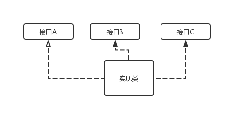
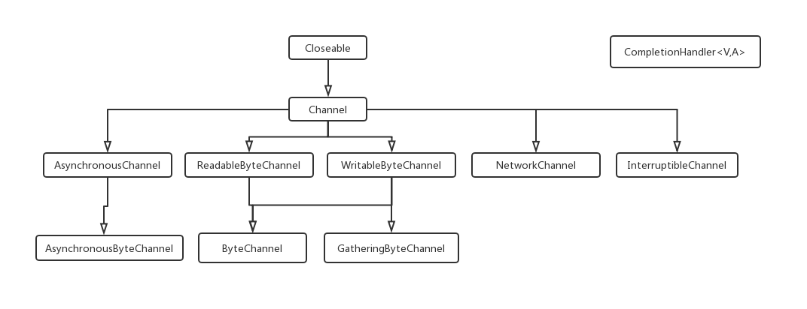

# 第二章  Java面向对象

## 2.1 面向对象及其特征

  Java 是面向对象编程语言，对象是Java程序的基本组成部分。那什么是面向对象呢？面向对象编程按照现实世界的特点来管理复杂的事物，把他们抽象为对象，使其具有自己的状态（成员变量）和行为（成员方法）。

面向对象编程具有如下的三大特征：

* 封装：通过Java 类来对数据和操作方法进行封装，外界可以将Java类当作一个黑盒子，只需要调用该黑盒子提供的方法即可以完成预期的操作。
* 继承：通过类的继承，做到通用性和个性化的分离。通用性实现集中在父类中，个性化的需求在子类中实现。这样提高代码的**重用**和可维护性，有利于灵活**扩展（变化）**。
* 多态：通过**重载**，**重写与覆盖**，实现不同类的不同形态特征。


Java的这三大特征，通过**类**、**抽象类**与**接口**来体现的。


## 2.2 类-封装

类是Java 程序的基本组成。它通过对相关的状态和方法的内聚，抽象成一个类。比如，我们会对现实世界的人进行抽象，那么人这个对象具有什么样相关的状态和方法呢？比如 年龄、姓名、走、工作、住址。

```java
class Pepole{
  private int age;
  private String name;
  private String job;
  private String address;
  private String company;
  // 默认构造函数
  public Pepole(){
    age = 0;
  }
  // 带参数的构造函数
  public Pepole(int age, String name, String job, String address, String company){
     this.age = age;
     this.name = name;
     this.job = job;
     this.address = address;
     this.company = company;
  }
  
  // 通过方法来访问类的成员变量
  public int getAge(){
    return age;
  }
}
```


**封装**的特点：

* 隐藏事物的内部实现细节。
* 对外提供**一致**的公共接口——间接操作、访问隐藏数据。
* 可维护性

### 2.2.1 对象的生产

封装的类不是对象，要使用该封装类进行操作，必须先生成该类的一个实例——对象。

对象的生成包括：声明（类型）、实例化、初始化。实例化需要对象的构造函数。

**构造函数：**

* 方法名跟**类名一样**的**非晶态**方法，该方法**没有**任何的返回类型。
* 构造函数的作用起到对类**非静态成员**进行初始化。

```java
Pepole pepole1 = new Pepole();// 采用默认构造函数
Pepole pepole2 = new Pepole(15,"Chen xiao ming", "Student", "XXX", "YYYY");//参数构造函数

```

**Tips：**

* 声明：声明某一个变量的类型，比如例子Pepole pepole1 声明了变量pepole1的类型是Pepole。
* 实例化：运算符new 为对象分配**内存空间**，new 调用对象的构造方法，返回对该对象的一个引用（即改对象所在的内存地址，该值是一个long类型的值）。
* 初始化：执行完类相应的构造函数之后，返回一个引用，并将该引用赋值给变量。

### 2.2.2 对象的引用

类对象的变量值是对象的引用（执行一块内存地址），这样可以对对象的变量、成员进行访问和操作。

```java
class Pepole{
  ;
  public static void main(String args[]){
    Pepole p1 = new Pepole();
    System.out.println("age:" + p1.getAge());
    System.out.println("age:" + new Pepole().getAge());
  }
}
```


## 2.3 继承

继承从字面上来说A类继承了另外一个类B的功能（状态、行为），换句话拥有了该类的功能。那么类A被称为**子类**，即：subclass。 类B称为**超类（父类）**，即：superclass。

**java.lang.Object** 默认是所有Java类的超类。

**类的继承**：可以在原来的基础上增加功能（新的数据和新的方法）。继承一个类的范式：

```java
class SubClass extends SuperClass{
  ;
}
```


举个例子例子，我们对Pepole 对象进行继承，增加了子类学生、教师、码农、作家。


对于这四个不同的子类：

* 教师：除了的常用方法，可以有教龄、擅长课程的功能。
* 学生：除了Pepole的常用方法，可以有做作业、成绩的功能。
* 码农：除了Pepole的常用方法，可以有擅长编程语言的功能。
* 作家：除了Pepole的常用方法，可以有擅长写什么作品的功能。

```java
class Coder extends Pepole{
   private String codeLanguage;
   public Coder(String l){
     // 调用超类的构造函数
     super();
     codeLanguage = l;
   }
  
   public String getCodeLanguage(){
      return codeLanguage;
   }
}
```


**Tips**

* Java 不支持多超类的继承。

### 2.3.1 访问限制

| 父类       | 子类可访问 |
| ---------- | ---------- |
| \private   | 不可访问   |
| \protected | 可访问     |
| \public    | 可访问     |

### 2.3.2 父类和子类的相互转换

**Tips:**

* 子类对象可以直接给父类类型变量赋值。
* 父类对象要给子类类型变量赋值，必须类型转换。
* 子类类型对象同时必然是父类类型变量，反之不一定。
* 子类拥有父类的功能，子类对象引用可以访问父类**可访问**成员。
* 父类不一定拥有子类的功能，父类对象引用不能访问子类**新增**的功能。

```java
Pepole p = new Coder();
// 必须类型转换
Coder c  = (Coder)p;
Pepole p2 = new Tearcher();
// 这个会抛异常
Coder c1 = (Coder)p2;
```


### 2.3.3 this\super

| 关键字 | 描述                                                         |
| ------ | ------------------------------------------------------------ |
| \this  | 1、引用当前类的变量或者方法，this.变量，this.成员函数(实参)<br />2、调用当前类的构造函数，this(实参) |
| \super | 1、引用当前对象的直接父类**可访问**的变量或者方法，super.变量，super.成员函数(实参)。<br />2、调用直接父类的构造函数，super(实参) |

```java
class A{
  private int b;
  protectd int a;
  public A(int b, int a){
    this.b = b;
    this.a = a;
  }
  public int getB(){
    return b;
  }
}

class B extends A{
  private int c;
  public C(){
    c = 0;
    super(10, 20);
  }
  
  public void print(){
    System.out.println("a:%d b:%d, c:%d", this.c, super.getB(), super.a);
  }
}


```


### 2.3.4 多态——重载、重写(覆盖)

| 多态 | 描述                                                         |
| ---- | ------------------------------------------------------------ |
| 重载 | 重载(overloading) 是在一个类里面，方法名字相同，而参数不同。<br />返回类型可以相同也可以不同。每个重载的方法（或者构造函数）<br />都必须有一个独一无二的参数类型列表。 |
| 重写 | 重写是子类对父类的允许访问的方法的实现过程进行重新编写, <br />返回值和形参都不能改变。**即外壳不变，核心重写！** |


**重载与重写的区别：**

| 区别点   | 重载     | 重写                                           |
| -------- | -------- | ---------------------------------------------- |
| 参数列表 | 必须修改 | 一定不能修改                                   |
| 返回类型 | 可以修改 | 一定不能修改                                   |
| 异常     | 可以修改 | 可以减少或删除，一定不能抛出新的或者更广的异常 |
| 访问     | 可以修改 | 一定不能做更严格的限制（可以降低限制）         |

```java
	class Pepole{
		public int work(String c) {
			System.out.println("Pepole do:" + c);
			return 0;
		}
	}
	
	class Coder extends Pepole{
		// 重写
		public int work(String c) {
			super.work(c);
			System.out.println("Coder do:" + c);
			return 0;
		}
		// 重载
		public int work(int c) {
			return 0;
		}
	}
```


### 2.3.5 抽象类—必须被继承

抽象类的用途是：在实际设计过程中，我们会实现一系列的类，这些类是相关的，他们有共同的状态、行为，也有的特性。从**通用** 和**特性**分离的设计理念来看，对这种设计采用抽象类，是最合适的。

```java
abstract class CommanClass{
  /**修饰符 可以public\protected**/
  public abstract void doSomething();
  public void doComman(){}
}
```


**Tips**

* 抽象类的抽象方法，其修饰符不能private。

* 抽象类必须通过继承才能使用，抽象方法只有函数定义部分，没有函数实现体。

* 抽象类的继承，用关键字**extends**

  

在现实中，比如人，不管什么人，都有其通用的状态、行为：

* 年龄
* 眼睛
* 性别
* 住址

但是不同职业的人，其工作方式、工作内容是不同的。

从**通用** 和**特性**分离的设计理念来看，用抽象类最合适的。参考代码如下：

```java
abstract class Pepole{
  public abstract void work();
  public void age(){}
  public void sex(){}
  public void home(){}
}

class Teacher extends Pepole{
  public void work(){}
}

class Coder extends Pepole{
  public void work(){}
}

/**引用**/
Pepole c = new Coder();
c.work();

// 注意：这里会错误，提示不能实例化
Pepole p = new Pepole();
```


### 2.3.6 final 关键字

| 修饰            | 作用                                                         |
| --------------- | ------------------------------------------------------------ |
| \final 类       | final 类不能被继承，没有子类，final 类的方法默认是final。    |
| \final 方法     | 1、final 方法不能被子类的方法重写，但可以被继承。<br />2、private 方法默认是final。 可以思考下为什么？ |
| \final 成员     | final 成员变量表示常量，只能被赋值一次，赋值之后不再被改变。 |
| \final 构造函数 | 这是 **绝对不行的**                                          |

```java
// 最终类
final class A{}
// 最终方法
class B{
  // final 方法
  private final int m = 10;
  // 必须在构造函数里初始化
  private final int c;
  public B(){ c = 20;}
  private void doB(){}
  public final void doC(){}
}
```


### 2.3.7 接口类

在Java 中只支持单一继承，大大地降低了复杂度，但是也可以通过接口实现多重继承，它使多个不相关的类可以具有相同的方法。



**接口的定义**

* 接口是一种类结构，有特定的语法。
* 一种逻辑抽象。

**接口声明**

```java
public interface A{
  public void func1();
  int func2();
  int func3(int arg);
}

public interface B extends A{
  public void func4();
}

public class Aimpl implements A{
  public void func1(){}
  public int func2(){ return 0; }
  public int func3(int arg) {return 0; }
}
```

**接口特性**

* 接口中的方法是一个标准的函数声明（有参数列表和返回类型），但不能有实现体。
* 接口中可以包含**字段**（成员变量），但会被隐式地声明为static 和 final。
* 接口中的成员变量只是被存储在该接口的**静态区域**，而不属于该接口。
* 接口中的可以被声明为**public** 或者不声明，但都被当作**public** 类型处理。
* 实现接口，需要将被定义的方法声明**public**，否则为默认访问类型。
* 如果没有实现所有的接口，那么创建的仍然是一个接口。
* 如果需要接口进行扩展形成新的接口，则采用**extends**，实现则用**implements**
* Java 接口的方法只能是抽象的和公开的，不能有**构造函数**。


### 2.3.8 接口和抽象类的区别

| 区别                 | 接口                          | 抽象类       |
| -------------------- | ----------------------------- | ------------ |
| 是否可以提供实现方法 | 不可以                        | 可以         |
| 多继承               | 可以实现多个接口              | 只能继承一个 |
| 成员变量             | 被隐式地声明为 static 和final | 类的成员变量 |


### 2.3.9 最佳实践

OOP面向对象的编程为了提高程序的复用率、可维护性、可扩展性，一般是面向接口的编程、面向抽象的编程，正确地使用接口、抽象类。

在Java语言中，API用了这种模式：abstract + 类名，比如buffer。

```java
public abstract class Buffer{
  public abstract Object array();
  public abstract int arrayOffset();
  ......
}

public Class IntBuffer extends Buffer implements Comparable<IntBuffer>{

}
```

通过上述的**最佳实践**：

* 接口用于无状态的抽象，如果抽象的实体具有状态（成员变量），那么用抽象类比较合适，比如对象的Comparable接口。
* 不建议用具体类去进程另一个具体类。
* 建议多阅读Java API手册。

举例子，Java中的java.nio.channels，

[异步IO]: https://docs.oracle.com/javase/8/docs/api/



* 所有的Channel 都是I/O类，所以必须**可关闭**，否则会造成资源泄漏，所以继承了Closeable。
* Channel 是I/O相关的，IO的特性：异步（同步），读、写、网络、是否可中断，所以根据这四个特性继承了第三层的类。

## 2.4 实践题目

利用面向对象的方法，对英雄联盟的英雄进行抽象和实现。

**英雄的基本属性**：

* 血量
* 等级
* 装备
* 英雄名称
* 角色列表
* 上手难度
* 移动速度
* 物理攻击
* 魔法攻击
* 防御能力
* 技能（Q\W\E\R）技能
* 召唤师技能
* 被动技能

**英雄的角色**：

* 战士
* 法师
* 刺客
* 坦克
* 射手
* 辅助

**物品**

* 防御类
* 攻击类
* 法术类
* 移动速度
* 消耗品

大家可以根据自己的理解去实现吧。


