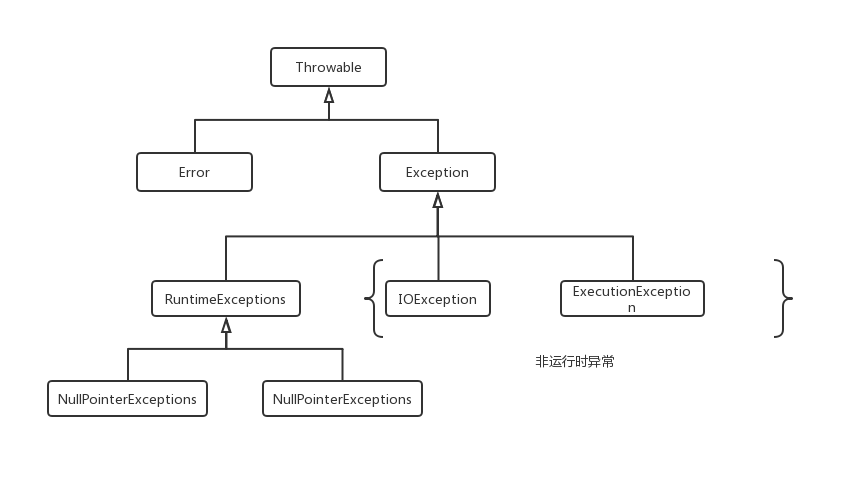

# 异常体系及处理

**异常**是程序中的一些错误，但并不是**所有的错误**都是异常，并且错误有时是可以避免的。Java 对异常的处理是按异常分类处理的，不同异常有不同的分类，每种异常都对应一个类型(class)，每个异常都对应一个异常（类的）对象。

* 异常类有两个来源：一是 **Java** 语言本身定义的一些基本异常类型；二是通过继承Exception 类或者其子类自己定义的异常。
* 异常对象的来源：一是 **Java** 运行时环境自动抛出系统生成的异常；二是程序员在处理业务逻辑遇到非预期的情况所抛出的异常。

## 5.1 异常层次结构

**异常层次说明**

* Throwable : 所有异常和错误的超类，它有两个子类 **Error** 和 **Exception** 
* Error：Error是Throwable的子类，表示合理的应用程序不应该尝试捕获的严重问题。 大多数此类错误都是异常情况。 ThreadDeath错误，虽然是“正常”条件，但也是Error的子类，因为大多数应用程序不应该尝试捕获它。一个方法不需要在其throws子句中声明在执行方法期间可能抛出但未捕获的任何Error类，因为这些错误是永远不应发生的异常情况。 也就是说，出于编译时异常检查的目的，Error及其子类被视为未经检查的异常。

* Exception: 类Exception及其子类是Throwable的一种形式，它表示合理的应用程序可能想要捕获的条件。
  类Exception和任何不是RuntimeException子类的子类都是经过检查的异常。 如果方法或构造函数的throws子句可以通过执行方法或构造函数抛出并在方法或构造函数边界外传播，则需要在方法或构造函数的throws子句中声明已检查的异常。