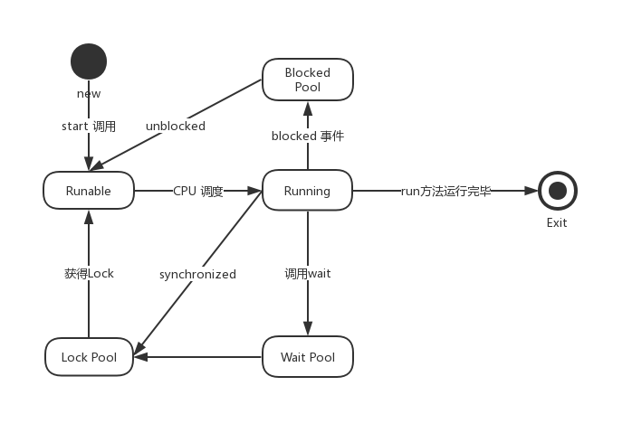

# Java 多线程

## 6.1 线程概念

多线程编程是编程的一种重要功能。多线程编程功能一般用于高性能、异步、任务分割。那么什么是线程呢？

**线程**

 线程是彼此相互独立的、能够独立运行的**子任务**，并且每个线程都有自己的调用栈。线程也称为轻量进程，线程只能在单个进程里运行。

**线程与进程的区别**

* 进程：一个可执行程序的运行状态，就是一个进程，进程可以理解为运行中的可执行程序。
* 线程：线程也称为轻量型的进程（LWP），是在进程内运行的。
* 区别：进程之间是相互独立的，相互之间不影响。线程在进程之内可能相互影响：比如共享存储、一个线程异常崩溃，可能会影响到所有的线程不可运行（线程异常奔溃，可能影响到进程异常退出，进程异常退出，则其他线程也异常退出）。

**线程的作用**

* 线程是CPU**可调度**的子任务，这样可以周期性地将CPU时间片切好到不同的子任务，这样避免了由于子任务的阻塞影响到CPU的利用率。假如进程在处理5个任务（每个任务大概要处理30分钟，在每个任务处理过程中，有可能会等待），且这几个任务彼此之间是相互独立的。在这种情况下，一种高性能的方式，就是利用5个线程，每个线程处理一个任务。这样采用多任务的方式，将阻塞的任务切换出去，处理非阻塞的任务，缩短处理时间。如果是多核的模式，这样也可以充分多核的优势，缩短处理时间。
* 异步处理：这种情况下，一般为了提高服务的吞吐量采用的机制。这种情况下，学员在参加实践的工作就会理解到。比如第三方支付，为了提高吞吐量，在用户转账、提现到情况下，常常采用异步。服务端接口先将用户的操作请求记录下来，然后返回在处理中。后台的线程异步处理这些请求，处理完成再推送结果给用户。
* 高性能：在多核的情况下，多线程是为了提高处理速度，在这种情况下，一般将任务拆分小任务，某各个线程处理每个小任务。或者采用生产者-消费者模式，生产者（线程）将请求放入队列，消费者（多线程）从队列中摘取任务进行处理。

**线程的关键概念**

* 并发：在CPU调度的情况下，并发是指多个活动(线程)交替执行。
* 原子：不被线程调度机制(CPU)打断的操作。

**例子**

```java
/**原子操作**/
int sum = 0;
/**赋值操作：原子操作**/
sum = 10;
/**非原子操作**/
sum = sum + 10;
sum ++; // <=> sum = sum + 1
```


## 6.2 运行机制



**状态说明：**

* 新建状态：使用new 创建一个线程对象之后。
* 可运行状态：调用线程对象的start方法，系统为该线程分配CPU外的所需资源，使该线程处于可运行状态。
* 运行状态：CPU调度到该线程，操作系统真正执行线程的run方法。
* 阻塞状态：遇到I/O等待事件（Blocked事件）、线程遇到某个条件自己调用Wait、或者执行到锁的代码块(lock、synchronized)。
* Exit状态：线程退出状态。

## 6.3 使用线程的方法

* 第一种方法：实现Runable 接口。
* 第二种方法：继承Thread。
* 第三种方法：采用高级方法——线程池。

```java
/**方法一：**/
/**实现Runnable 接口**/
Thread th = new Thread(new Runnable() {
			@Override
			public void run() {
				System.out.println(String.format("%s-%d running", Thread.currentThread().getName(),                                     
                           Thread.currentThread().getId()));
			}});
        
th.setName("Test thread");
th.start();
```


```java
/**方法二**/
	/**通过继承Thread类，重写run()方法**/
	class MyThread extends Thread{
		@Override
	    public void run() {
			System.out.println(String.format("%s-%d running", 
                    Thread.currentThread().getName(), Thread.currentThread().getId()));
		}
	}

  Thread th = new MyThread();
  th.setName("Mythread");
  th.start();   
```

其实Thread 类是对Runnable的一个实现，实现了线程的通用功能。

在实际过程中，为了对线程进行管理或者跟踪，建议采用线程工厂，来创建线程。其例子：

```java
 class SimpleThreadFactory implements ThreadFactory{
   /**原子变量，记录创建的线程数**/
		private AtomicInteger seq;
		public SimpleThreadFactory() {
			seq = new AtomicInteger(0);
		}
		
		@Override
		public Thread newThread(Runnable r) {
      /**这里只是个例子，用来记录目前创建了多少个线程，并给线程设置名称**/
			String name = String.format("SimpleThreadFactory:%d", seq.incrementAndGet());
			Thread th = new Thread(r, name);
			return th;
		}
	}

// 使用例子
 ThreadFactory tf = new  SimpleThreadFactory();
 Thread th = tf.newThread(new Runnable() {
			@Override
			public void run() {
				System.out.println("Thread is running ......");
			}});
 th.start();
```


在实际工作中，我们一般会创建N（一般是CPU 核数的两倍）个线程(线程池) 来处理异步任务，每个异步任务都是对Runnable的实现。

```java
    public static void main( String[] args )
    {
        System.out.println( "Hello World!" );
        ThreadPoolExecutor tpe = new ThreadPoolExecutor(2, /**corePoolSize:初始线程数**/
        		                                         Runtime.getRuntime().availableProcessors(), /**最大线程数**/
        		                                        5, /**线程最大空闲时***/
        		                                        TimeUnit.SECONDS, /***最大空闲5秒，超过5秒就被回收**/
        		                                        new LinkedBlockingDeque<Runnable>(256), /**控制任务队列大小，防止内存溢出**/
        		                                    	new ThreadPoolExecutor.DiscardOldestPolicy() /**超出队列大小，丢弃老的任务**/);
        for(int i = 0; i < 500; i++) {
        	int t = i;
        	tpe.execute(new Runnable() {
				@Override
				public void run() {
					System.out.println(t + ": is running.....");
					try {
						Thread.sleep(10);
					} catch (InterruptedException e) {
						// TODO Auto-generated catch block
						e.printStackTrace();
					}
					System.out.println(t + ": is over");
				}});
        }
        
        while((tpe.getActiveCount() > 0) || (!tpe.getQueue().isEmpty())) {
        	System.out.println("--->" + tpe.getActiveCount() + "," + tpe.getQueue().size());
        	/**等待线程池执行完毕，退出**/
        	try {
				Thread.sleep(1000);
			} catch (InterruptedException e) {
				// TODO Auto-generated catch block
				e.printStackTrace();
			}
        }
        
        System.out.println("Quit");
        tpe.shutdown();
        
    }
```


**注意**

* 为什么要用有限队列，这是为了防止在实际生产环境中，队列堆积导致内存溢出。

## 6.4 线程控制

线程创建之后，提供了一些方法进行控制：

| 控制命令                | 作用                                                         |
| ----------------------- | ------------------------------------------------------------ |
| start()、join()、stop() | 1、start：启动线程<br />2、join：等待线程停止<br />3、stop：停止线程 |
| sleep()、yield()        | 1、sleep：线程休眠，可以指定时间。<br />2、yield：线程让出CPU，不可以指定时间。<br />3、sleep 可以使其他线程获得执行的机会，不管线程优先级高低。<br />yield只能使同优先级的线程获得执行的机会。 |
| synchronized            | 1、synchronized(this)：对象内部共享数据同步。<br />2、synchronized 在非静态函数，保护整个函数块。<br />3、synchronized(xx.class)：用于静态函数内，保护类的静态成员 |
| wait、notify            | 1、在同步块内，进行wait，表示进行睡眠。<br />2、在同步块内，进行notify，表示唤醒睡眠者。 |

**具体的使用如下：**

* volatile：关键字 用于共享数据线程可见，指令有序性。共享数据如果没有用volatile，则有可能在线程A更新了，但是线程B还是读到旧的数据。这次因为线程B读取它的副本。
* synchronized：除了进行共享数据访问保护，确保线程安全，还有一个功能：更新线程同步，达到每个线程访问到更新后到数据，达到可见性。
* wait、notify 一定要在synchronized 同步块内调用。


```java
package tianqin.iedu;

import java.util.Iterator;
import java.util.LinkedList;

public class ProducerConsumer {
	private static int MAX_TIMES = 1000;
	private LinkedList<Integer> items;
	private Thread[] ths;
	/**volatile: 具有更新线程可见性、有序性，不具备原子性**/
	private volatile int times;
	
	public ProducerConsumer() {
		/**共享队列**/
		items = new LinkedList<>();
		/**保存线程对象**/
		ths = new Thread[2];
		/**共享数次**/
		times = 0;
		/**采用实现Runnable 的Lambada表达式**/
		ths[0] = new Thread(()->{ produce();}, "Name.Producer");
		/**采用start 启动**/
		ths[0].start();
		ths[1] = new Thread(()->{ consume();}, "Name.Consume");
		ths[1].start();
	}
	
	public void waitThread() {
		for(Thread th: ths) {
			try {
				/**等待线程退出**/
				th.join();
			} catch (InterruptedException e) {
				// TODO Auto-generated catch block
				e.printStackTrace();
			}
		}
	}
	
	private void produce() {
		/***生产者线程***/
		while((times < MAX_TIMES)) {
			/**模拟根据不同的速度进行产品生产**/
			int sum = (int)(Math.random() * 10);
			/**由于：items 是共享数据，并且是非线程安全，则需要进行同步保护**/
			for(int i = 0; i < sum; i++) {
				Integer v = Integer.valueOf((int)(Math.random() * 10000));
				synchronized (this) {
					/**放入队列**/
					items.add(v);
					/**唤醒消费者**/
					this.notify();
				}
			}
			try{
        /**睡眠，切换线程**/
				Thread.sleep(sum * 100 + 20);
			}catch(Throwable t) {
				
			}
			times = times + 1;
		}
	}
	
	private void consume() {
		/***消费者线程**/
		LinkedList<Integer> curList = new LinkedList<>();
		while((times < MAX_TIMES)) {
			synchronized (this) {
				if(items.isEmpty()) {
					/**队列为空，消费者进行休息**/
					try{
						this.wait();
					}catch(Throwable t) {
					}
				}
				/**如果消费 是一个耗时的过程，则建议先用队列缓存，减少同步块的时间**/
				Iterator<Integer> it = items.iterator();
				while(it.hasNext()) {
					curList.add(it.next());
					it.remove();
				}	
			}
			
			Iterator<Integer> it = curList.iterator();
			while(it.hasNext()) {
				System.out.println("Consume:" + it.next());
				it.remove();
			}
			
			try{
        /**睡眠，切换线程，其实cpu也会按照时间片进行调度**/
				Thread.sleep((int)(Math.random() * 10) * 100 + 20);
			}catch(Throwable t) {
				
			}
		}
	}
}
```


## 6.5 多线程问题及解决

**实际例子**：如下的代码段：线程A与线程B同时可以访问一个int 型的共享变量，线程A对变量从1加到10，线程B对变量从11加到20，那么变量最终的结果是是多少呢: 210， 0， 55, 77， 100?

```java
public class App 
{
	private static int sum = 0;
	public static void multhreadProblem() {
		Thread[] ths = new Thread[2];
		System.out.println("Create thread ......");
		/**线程A: 采用匿名类**/
		ths[0] = new Thread(new Runnable() {
			@Override
			public void run() {
				for(int i = 1; i <= 10; i++) {
					sum = sum + i;
				}
			}}, "A");
		
		ths[1] = new Thread(new Runnable() {
			@Override
			public void run() {
				for(int i = 11; i <= 20; i++) {
					sum = sum + i;
				}
			}}, "B");
		System.out.println("Start thread ......");
		/**启动线程**/
		ths[0].start();
		ths[1].start();
		/**等待线程退出**/
    System.out.println("Wait for thread ......");
    try{
			/**等线程过程中，会抛出检查异常**/
			ths[0].join();
			ths[1].join();
		}catch(Throwable t) {
			
		}
		System.out.println("Sum is:" + sum);
		
	}
	public static void main(String[] args ) {
		multhreadProblem();
	}
}
```

运行结果：


**原因分析**

* for 循环操作不是原则操作，在执行过程中，有可能被中断，即一会执行线程A的代码，一会执行线程B的代码。
* 最根本的原因：Sum = sum + i，不是原则操作，该操作可以分解为 sum + i，再赋值给sum。sum =0的时候，假如线程A拿到的sum = 0，sum + 1 并赋值给sum，这时sum = 1，而同时线程B拿到sum = 0，并执行sum + 11，再赋值给sum，这时sum = 11。
* 但是理想的情况下，如果线程A执行加1，线程B执行加11，这时的结果应该是12.

**那如何解决呢？**

* 解决问题的思路：就是将 **非原子**操作变成**原子**操作。
* 那么该如何将非原子操作变成原子操作，**答案**：同步代码块、锁或者(具有原子操作的变量)。

**解决方法：**

*采用 synchronized*

```java
					synchronized(App.class) {
						sum = sum + i;
					}
```

*采用lock*

```java

```

