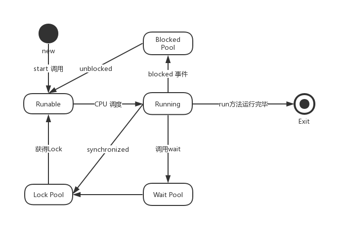
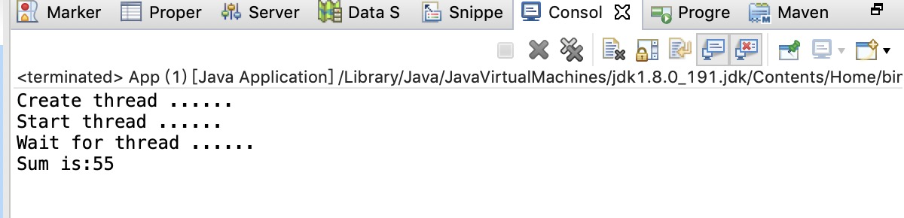

# Java 多线程

## 6.1 线程概念

多线程编程是编程的一种重要功能。多线程编程功能一般用于高性能、异步、任务分割。那么什么是线程呢？

**线程**

 线程是彼此相互独立的、能够独立运行的**子任务**，并且每个线程都有自己的调用栈。线程也称为轻量进程，线程只能在单个进程里运行。

**线程与进程的区别**

* 进程：一个可执行程序的运行状态，就是一个进程，进程可以理解为运行中的可执行程序。
* 线程：线程也称为轻量型的进程（LWP），是在进程内运行的。
* 区别：进程之间是相互独立的，相互之间不影响。线程在进程之内可能相互影响：比如共享存储、一个线程异常崩溃，可能会影响到所有的线程不可运行（线程异常奔溃，可能影响到进程异常退出，进程异常退出，则其他线程也异常退出）。

**线程的作用**

* 线程是CPU**可调度**的子任务，这样可以周期性地将CPU时间片切好到不同的子任务，这样避免了由于子任务的阻塞影响到CPU的利用率。假如进程在处理5个任务（每个任务大概要处理30分钟，在每个任务处理过程中，有可能会等待），且这几个任务彼此之间是相互独立的。在这种情况下，一种高性能的方式，就是利用5个线程，每个线程处理一个任务。这样采用多任务的方式，将阻塞的任务切换出去，处理非阻塞的任务，缩短处理时间。如果是多核的模式，这样也可以充分多核的优势，缩短处理时间。
* 异步处理：这种情况下，一般为了提高服务的吞吐量采用的机制。这种情况下，学员在参加实践的工作就会理解到。比如第三方支付，为了提高吞吐量，在用户转账、提现到情况下，常常采用异步。服务端接口先将用户的操作请求记录下来，然后返回在处理中。后台的线程异步处理这些请求，处理完成再推送结果给用户。
* 高性能：在多核的情况下，多线程是为了提高处理速度，在这种情况下，一般将任务拆分小任务，某各个线程处理每个小任务。或者采用生产者-消费者模式，生产者（线程）将请求放入队列，消费者（多线程）从队列中摘取任务进行处理。

**线程的关键概念**

* 并发：在CPU调度的情况下，并发是指多个活动(线程)交替执行。
* 原子：不被线程调度机制(CPU)打断的操作。

**例子**

```java
/**原子操作**/
int sum = 0;
/**赋值操作：原子操作**/
sum = 10;
/**非原子操作**/
sum = sum + 10;
sum ++; // <=> sum = sum + 1
```


## 6.2 运行机制



**状态说明：**

* 新建状态：使用new 创建一个线程对象之后。
* 可运行状态：调用线程对象的start方法，系统为该线程分配CPU外的所需资源，使该线程处于可运行状态。
* 运行状态：CPU调度到该线程，操作系统真正执行线程的run方法。
* 阻塞状态：遇到I/O等待事件（Blocked事件）、线程遇到某个条件自己调用Wait、或者执行到锁的代码块(lock、synchronized)。
* Exit状态：线程退出状态。

## 6.3 使用线程的方法

* 第一种方法：实现Runable 接口。
* 第二种方法：继承Thread。
* 第三种方法：采用高级方法——线程池。

```java
/**方法一：**/
/**实现Runnable 接口**/
Thread th = new Thread(new Runnable() {
			@Override
			public void run() {
				System.out.println(String.format("%s-%d running", Thread.currentThread().getName(),                                     
                           Thread.currentThread().getId()));
			}});
        
th.setName("Test thread");
th.start();
```


```java
/**方法二**/
	/**通过继承Thread类，重写run()方法**/
	class MyThread extends Thread{
		@Override
	    public void run() {
			System.out.println(String.format("%s-%d running", 
                    Thread.currentThread().getName(), Thread.currentThread().getId()));
		}
	}

  Thread th = new MyThread();
  th.setName("Mythread");
  th.start();   
```

其实Thread 类是对Runnable的一个实现，实现了线程的通用功能。

在实际过程中，为了对线程进行管理或者跟踪，建议采用线程工厂，来创建线程。其例子：

```java
 class SimpleThreadFactory implements ThreadFactory{
   /**原子变量，记录创建的线程数**/
		private AtomicInteger seq;
		public SimpleThreadFactory() {
			seq = new AtomicInteger(0);
		}
		
		@Override
		public Thread newThread(Runnable r) {
      /**这里只是个例子，用来记录目前创建了多少个线程，并给线程设置名称**/
			String name = String.format("SimpleThreadFactory:%d", seq.incrementAndGet());
			Thread th = new Thread(r, name);
			return th;
		}
	}

// 使用例子
 ThreadFactory tf = new  SimpleThreadFactory();
 Thread th = tf.newThread(new Runnable() {
			@Override
			public void run() {
				System.out.println("Thread is running ......");
			}});
 th.start();
```


在实际工作中，我们一般会创建N（一般是CPU 核数的两倍）个线程(线程池) 来处理异步任务，每个异步任务都是对Runnable的实现。

```java
    public static void main( String[] args )
    {
        System.out.println( "Hello World!" );
        ThreadPoolExecutor tpe = new ThreadPoolExecutor(2, /**corePoolSize:初始线程数**/
        		                                         Runtime.getRuntime().availableProcessors(), /**最大线程数**/
        		                                        5, /**线程最大空闲时***/
        		                                        TimeUnit.SECONDS, /***最大空闲5秒，超过5秒就被回收**/
        		                                        new LinkedBlockingDeque<Runnable>(256), /**控制任务队列大小，防止内存溢出**/
        		                                    	new ThreadPoolExecutor.DiscardOldestPolicy() /**超出队列大小，丢弃老的任务**/);
        for(int i = 0; i < 500; i++) {
        	int t = i;
        	tpe.execute(new Runnable() {
				@Override
				public void run() {
					System.out.println(t + ": is running.....");
					try {
						Thread.sleep(10);
					} catch (InterruptedException e) {
						// TODO Auto-generated catch block
						e.printStackTrace();
					}
					System.out.println(t + ": is over");
				}});
        }
        
        while((tpe.getActiveCount() > 0) || (!tpe.getQueue().isEmpty())) {
        	System.out.println("--->" + tpe.getActiveCount() + "," + tpe.getQueue().size());
        	/**等待线程池执行完毕，退出**/
        	try {
				Thread.sleep(1000);
			} catch (InterruptedException e) {
				// TODO Auto-generated catch block
				e.printStackTrace();
			}
        }
        
        System.out.println("Quit");
        tpe.shutdown();
        
    }
```


**注意**

* 为什么要用有限队列，这是为了防止在实际生产环境中，队列堆积导致内存溢出。

## 6.4 线程控制

线程创建之后，提供了一些方法进行控制：

| 控制命令                | 作用                                                         |
| ----------------------- | ------------------------------------------------------------ |
| start()、join()、stop() | 1、start：启动线程<br />2、join：等待线程停止<br />3、stop：停止线程 |
| sleep()、yield()        | 1、sleep：线程休眠，可以指定时间。<br />2、yield：线程让出CPU，不可以指定时间。<br />3、sleep 可以使其他线程获得执行的机会，不管线程优先级高低。<br />yield只能使同优先级的线程获得执行的机会。 |
| synchronized            | 1、synchronized(this)：对象内部共享数据同步。<br />2、synchronized 在非静态函数，保护整个函数块。<br />3、synchronized(xx.class)：用于静态函数内，保护类的静态成员 |
| wait、notify            | 1、在同步块内，进行wait，表示进行睡眠。<br />2、在同步块内，进行notify，表示唤醒睡眠者。 |

**具体的使用如下：**

* volatile：关键字 用于共享数据线程可见，指令有序性。共享数据如果没有用volatile，则有可能在线程A更新了，但是线程B还是读到旧的数据。这次因为线程B读取它的副本。
* synchronized：除了进行共享数据访问保护，确保线程安全，还有一个功能：更新线程同步，达到每个线程访问到更新后到数据，达到可见性。
* wait、notify 一定要在synchronized 同步块内调用。


**synchronized、wait、notify的使用方式**

```java
// A 线程：
synchronized(this){
   // do some thing
   // 唤醒等待者
   notify();
   // notifyAll();
}

// 线程B
synchronized(this){
  if(!condition){
    //条件不满足，进行等待
    wait(); // 等待notify
  }
}
```


```java
package tianqin.iedu;

import java.util.Iterator;
import java.util.LinkedList;

public class ProducerConsumer {
	private static int MAX_TIMES = 1000;
	private LinkedList<Integer> items;
	private Thread[] ths;
	/**volatile: 具有更新线程可见性、有序性，不具备原子性**/
	private volatile int times;
	
	public ProducerConsumer() {
		/**共享队列**/
		items = new LinkedList<>();
		/**保存线程对象**/
		ths = new Thread[2];
		/**共享数次**/
		times = 0;
		/**采用实现Runnable 的Lambada表达式**/
		ths[0] = new Thread(()->{ produce();}, "Name.Producer");
		/**采用start 启动**/
		ths[0].start();
		ths[1] = new Thread(()->{ consume();}, "Name.Consume");
		ths[1].start();
	}
	
	public void waitThread() {
		for(Thread th: ths) {
			try {
				/**等待线程退出**/
				th.join();
			} catch (InterruptedException e) {
				// TODO Auto-generated catch block
				e.printStackTrace();
			}
		}
	}
	
	private void produce() {
		/***生产者线程***/
		while((times < MAX_TIMES)) {
			/**模拟根据不同的速度进行产品生产**/
			int sum = (int)(Math.random() * 10);
			/**由于：items 是共享数据，并且是非线程安全，则需要进行同步保护**/
			for(int i = 0; i < sum; i++) {
				Integer v = Integer.valueOf((int)(Math.random() * 10000));
				synchronized (this) {
					/**放入队列**/
					items.add(v);
					/**唤醒消费者**/
					this.notify();
				}
			}
			try{
        /**睡眠，切换线程**/
				Thread.sleep(sum * 100 + 20);
			}catch(Throwable t) {
				
			}
			times = times + 1;
		}
	}
	
	private void consume() {
		/***消费者线程**/
		LinkedList<Integer> curList = new LinkedList<>();
		while((times < MAX_TIMES)) {
			synchronized (this) {
				if(items.isEmpty()) {
					/**队列为空，消费者进行休息**/
					try{
						this.wait();
					}catch(Throwable t) {
					}
				}
				/**如果消费 是一个耗时的过程，则建议先用队列缓存，减少同步块的时间**/
				Iterator<Integer> it = items.iterator();
				while(it.hasNext()) {
					curList.add(it.next());
					it.remove();
				}	
			}
			
			Iterator<Integer> it = curList.iterator();
			while(it.hasNext()) {
				System.out.println("Consume:" + it.next());
				it.remove();
			}
			
			try{
        /**睡眠，切换线程，其实cpu也会按照时间片进行调度**/
				Thread.sleep((int)(Math.random() * 10) * 100 + 20);
			}catch(Throwable t) {
				
			}
		}
	}
}
```


## 6.5 多线程问题及解决

**实际例子**：如下的代码段：线程A与线程B同时可以访问一个int 型的共享变量，线程A对变量从1加到10，线程B对变量从11加到20，那么变量最终的结果是是多少呢: 210， 0， 55, 77， 100?

```java
public class App 
{
	private static int sum = 0;
	public static void multhreadProblem() {
		Thread[] ths = new Thread[2];
		System.out.println("Create thread ......");
		/**线程A: 采用匿名类**/
		ths[0] = new Thread(new Runnable() {
			@Override
			public void run() {
				for(int i = 1; i <= 10; i++) {
					sum = sum + i;
				}
			}}, "A");
		
		ths[1] = new Thread(new Runnable() {
			@Override
			public void run() {
				for(int i = 11; i <= 20; i++) {
					sum = sum + i;
				}
			}}, "B");
		System.out.println("Start thread ......");
		/**启动线程**/
		ths[0].start();
		ths[1].start();
		/**等待线程退出**/
    System.out.println("Wait for thread ......");
    try{
			/**等线程过程中，会抛出检查异常**/
			ths[0].join();
			ths[1].join();
		}catch(Throwable t) {
			
		}
		System.out.println("Sum is:" + sum);
		
	}
	public static void main(String[] args ) {
		multhreadProblem();
	}
}
```

运行结果：



**原因分析**

* for 循环操作不是原则操作，在执行过程中，有可能被中断，即一会执行线程A的代码，一会执行线程B的代码。
* 最根本的原因：Sum = sum + i，不是原则操作，该操作可以分解为 sum + i，再赋值给sum。sum =0的时候，假如线程A拿到的sum = 0，sum + 1 并赋值给sum，这时sum = 1，而同时线程B拿到sum = 0，并执行sum + 11，再赋值给sum，这时sum = 11。
* 但是理想的情况下，如果线程A执行加1，线程B执行加11，这时的结果应该是12.

**那如何解决呢？**

* 解决问题的思路：就是将 **非原子**操作变成**原子**操作。
* 那么该如何将非原子操作变成原子操作，**答案**：同步代码块、锁或者(具有原子操作的变量)。

**解决方法：**

*采用 synchronized*

```java
					synchronized(App.class) {
						sum = sum + i;
					}
```

*采用lock*

```java
	/**volatile 是为了线程可见性**/
  private static volatile int sum = 0;
  /**创建全局锁变量**/
	private static Lock lock = new ReentrantLock(); 

  /**在进行累加的代码进行加锁操作**/
  lock.lock();
	sum = sum + i;
	lock.unlock();
```


*不采用锁，采用原子变量*

```java
// 声明为：java.util.concurrent.atomic.AtomicInteger 变量
private static AtomicInteger sum = new AtomicInteger(0);

/**累加操作**/
sum.addAndGet(i);
```

具体的方法，可以参考：https://docs.oracle.com/javase/8/docs/api/ 下的java.util.concurrent.atomic 包。

**原子变量的原理**：

* 声明一个 线程可见的 int value。
* 累加操作采用 sun.misc.Unsafe 的相关方法进行操作，这些方法基本上JNI方法。

**安全锁的原则**

*synchronized*的使用方法：

```java
class A{
  /**方法一：对象：锁住对象的函数**/
  // private static Object obj = new Object();
  public synchronized void doSomething{
      // 整个方法需要同步，被锁住
      // 同时两个线程A、B调用同一个对象的doSomething，会串行执行。
     ;
  }
  /**方法二：对象：锁住对象的某段代码**/
  public void doAnother(){
    synchronized(this){
        // 需要同步的代码块
        // 同时两个线程A、B调用同一个对象的doAnother，执行到这个代码段，会串行执行。
       ;
    }
  }
  
  /**方法三：类上：静态成员函数**/
  public static void doHH(){
    // 在这里，也可以利用静态成员变量
    // synchronized(obj)
    synchronized(A.class){
      // 需要同步的代码块
        // 同时两个线程A、B调用同一个对象的doHH，执行到这个代码段，会串行执行。
    }
  }
}
```


*synchronized的特性说明*

* synchronized 是用于保护共享数据（类的静态成员变量，或者对象的成员变量，这些变量在多线程环境下是可访问的），当**语句体**执行完毕（无论正常或者异常），解锁操作自动完成。
* 对象上synchronized语句体，只会影响访问同一对象synchronized语句体的线程，不同对象的synchronized语句体不相干的。同一类上的synchronized语句体会影响到访问类上的synchronized语句体的线程。
* synchronized，是可递归的，即同一线程嵌套获取锁，但不建议。


*Lock 对象的使用方法*

```java
/**声明对象，锁必须是共享数据，即在多线程环境，相关线程是可见的**/
Lock lock = new ReentrantLock(); 

/**多线程访问的方法**/
public void func(){
  /*....*/
  try{
    /**获取锁**/
    lock.lock();
    //do something，有可能抛异常
  }finally{
    // finally 语句，在方法体执行完毕，无论正常或者异常返回，都会执行
    // 为了防止死锁，最佳实践是在finally 语句块中释放
    lock.unlock();
  }
}

```


*Lock对象的特性说明*

* Lock类锁之后，必须释放，否则会死锁。
* Lock类锁有可递归的锁，有不可递归的锁。
* Lock类锁，有分读写锁（读锁，只互斥写，写锁互斥所有）、有排他锁。

## 6.6 多线程最佳实践

### 6.6.1 锁的最佳实践

**最佳原则：**

1、控制锁的范围，从高性能的角度来看，尽量缩小锁的访问。

​     假如共享变量sum，用来统计多线程操作的数次，其最佳锁的范围。

```java
  /**共享变量**/
  volatile int sum = 0;

  /**多线程代码**/
  public void funcA(){
    while((sum < 1000)){
      /**业务处理**/
      /**锁：**/
      lock.lock();
      sum = sum + 1;
      lock.unlock();
    }
  }
```

2、在锁的范围内，建议**不要睡眠**、或者**等待**。

​    如下的例子不建议：

```java
/**多线程执行代码块**/ 
public void funcA(){
    synchronized(this){
      /**互斥业务处理**/
      /**不建议的处理**/
      Thread.sleep(1000);
    }
 }
```

3、保证锁的顺序，避免死锁。

```java
/**声明全局锁**/
Lock a =  new ReentrantLock(); 
Lock b =  new ReentrantLock(); 

/**线程A方法：**/
public void funcA(){
  a.lock();
  b.lock();
  /**业务处理**/
  b.unlock();
  a.unlock();
}


/**线程B方法：**/
public void funcB(){
  b.lock();
  a.lock();
  /**业务处理**/
  a.unlock();
  b.unlock();
}

```

  该例子会发生什么问题？死锁。各位可以分析下。 解决方法funcA和funcB获取锁的顺序要一样，要么a、b顺序或者b、a顺序。

4、建议分离锁

​      不相关的共享数据，建议采用不同的锁，不建议采用同一把锁来保护不同的共享数据。

5、建议分拆锁

​      同一共享数据，可以根据数据的分拆，采用多个锁。比如共享数据是一个数组，如果数组的大小是固定的，多线程只是访问、修改数组的元素、不会发生数组移动等操作，这时可以采用分拆锁。比如数组下标% 5，0 采用 lock0、1采用lock1、…，4采用lock4。减少多线程的竞争，提高性能。


### 6.6.2 线程最佳实践

**最佳原则**

1、executor 和 task 优先于**线程**

​     在实际编程过程中，我们经常采用后台线程异步处理工作，当处理完，优雅地终止。这是很常见的玩具代码，我们可以从头到尾通过多线程的知识去编写，也可以利用java.util.concurrent包中的相关代码。比如，我们可以：

```java
/**创建一个ExecutorService方法**/
ExecutorService executor = Executors.newSingleThreadExecutor();

/**提交一个runnable**/
executor.execute(runnable);

/**优雅地终止**/
executor.shutdown();
```

2、要多线程来执行，需要用到线程池来执行，我们不必造轮子，可以直接用如下：

```java
 ExecutorService executor = Executors.newCachedThreadPool(new ThreadFactory(){
   public Thread newThread(Runnable r) {
     return new Thread(r, "thread name");
   }
 });

/**提交多线程任务:runnalbe**/
executor.execute(runnable);
executor.execute(runnable);
executor.execute(runnable);
executor.execute(runnable);
```

可缓存线程池常用于线程大小比较难预估的环境，是比较灵活，但是比较容易出问题。有可能导致线程池中线程的大小不可预估，导致JVM虚拟机内存溢出。

一般建议采用：Executors.**newFixedThreadPool**(int nThreads, [ThreadFactory](https://docs.oracle.com/javase/8/docs/api/java/util/concurrent/ThreadFactory.html) threadFactory)。

3、定时任务 优先选择[ScheduledExecutorService](https://docs.oracle.com/javase/8/docs/api/java/util/concurrent/ScheduledExecutorService.html)   

```java
ScheduledExecutorService scheduler = Executors.newScheduledThreadPool(1);
/**如果只是执行一个定时任务，只需要一个线程，这个也可以用：newSingleThreadScheduledExecutor()**/
/**如果定时任务，不只一个，则建议采用多线程，比如有N个定时任务，最大限度有N个线程**/

/**提交执行一次定时任务: 延迟delay**/
scheduler.schedule(Runnable command, long delay, TimeUnit unit);
/**提交永久定时任务：initialDelay + N * period，N执行数次**/
scheduler.scheduleAtFixedRate(Runnable command,long initialDelay,long period,TimeUnit unit)；
/**提交永久定时任务：第一次执行时间间隔initialDelay，下次执行时间延迟delay**/
scheduler.scheduleWithFixedDelay(Runnable command, long initialDelay, long delay, TimeUnit unit)
```

 4、建议优先ThreadPoolExecutor取代 ExecutorService。因为ExecutorService 隐含使用无限队列，存在JVM OOM 的风险。

```java
ThreadPoolExecutor executor = new ThreadPoolExecutor(1, /*最小线程数*/			                                                      Runtime.getRuntime().availableProcessors(), /*最大线程数*/
				                               10, /*线程包活时长*/  
				                               TimeUnit.SECONDS,
				                               new LinkedBlockingDeque<>(1024),  /*最大队列*/
				                               new ThreadPoolExecutor.DiscardOldestPolicy() /* 超过最大队列数，的除了*/);
executor.execute(()->{ System.out.println("Hello");});
```

ThreadPoolExecutor 适合生存者-消费者的模型，通过execute提交的任务，只执行一次。如果队列中，堆积超过最大队列数，则会采取相应的拒绝策略，例子中的拒绝策略是丢弃老的队列。ThreadPoolExecutor 适合用于不断新来的异步任务。

5、并发工具优先与wait 和 notify

​    遇到并发问题，优先采用java.util.concurrent 中更高级的工具。

* Executor Framework：多线程框架，优先与多线程。正如前文提到的1、2、3、4。

* 并发集合，Concurrent Collection 在多线程环境中为List、Queue 和Map 提供了高性能的并发实现。

  比如：[ConcurrentHashMap](https://docs.oracle.com/javase/8/docs/api/java/util/concurrent/ConcurrentHashMap.html) 是线程安全的Map，[ConcurrentLinkedQueue](https://docs.oracle.com/javase/8/docs/api/java/util/concurrent/ConcurrentLinkedQueue.html) 是线程安全的Queue，[LinkedBlockingDeque](https://docs.oracle.com/javase/8/docs/api/java/util/concurrent/LinkedBlockingDeque.html) 是线程安全的Queue。

* 同步器：[Semaphore](https://docs.oracle.com/javase/8/docs/api/java/util/concurrent/Semaphore.html)（用于限流、限制执行数） 和 [CountDownLatch](https://docs.oracle.com/javase/8/docs/api/java/util/concurrent/CountDownLatch.html) （用于计数）。

* 原子变量解决多线程中变量的线程安全，比如：[AtomicInteger](https://docs.oracle.com/javase/8/docs/api/java/util/concurrent/atomic/AtomicInteger.html)、[AtomicIntegerArray](https://docs.oracle.com/javase/8/docs/api/java/util/concurrent/atomic/AtomicIntegerArray.html)，具体可以参考java.util.concurrent.atomic。

### 6.6.3 慎用延迟初始化

 延迟初始化，是延迟到需要域的值时才将它初始化的这种行为。如果永远不需要这个值时，这个域永远不会被初始化。这种方法既适用于静态域，也适用实例域。在多线程访问这个域的时候，延迟初始化需要技巧。

```java
/**方法一：在大多数情况下，正常的初始化优先与延迟初始化**/
private final FieldType field = computeFieldValue(); //正常初始化

/**方法二：如果采用延迟初始化，最简单、最清楚的方法**/
private FieldType field;
synchronized FieldType getField(){
  if(field == null){
     field = computeFieldValue(); 
  }
  return field;
}
/***方法三：方法二，存在的问题，每次获取这个对象的时候都需要锁，但是如果解决了首次初始化
  ，以后每次获取的时候，就不需要锁***/
/**方法三：initialize-on-demand holder class idiom**/
private static class FieldHolder{
  static final FieldType field = computeFieldValue();
}
static FieldType getField(){ return FieldHolder.field;}

/**方法四：采用Double-check idiom模式**/
private volatile FieldType field;
/**volatile 线程可见性、防指令重排***/
FieldType getField(){
  FieldType result = field;
  if(result == null){
    /**first check**/
    synchronized(this){
      result = field;
      if(result == null){
        /**double-check**/
        field = computeFieldValue();
        result = field;
      }
    }
  }
  return result;
} 

```

方法四 双重检查机制 在Java 1.5发行版本之前，有时由于volatile修饰符的语义不够强，导致难于支持。在Java 1.5 发行版中引入的内存模式解决了这个问题。

### 6.6.4 不要依赖线程调度器

任何依赖于线程调度器来达到正确性或者性能要求的程序，很有可能是不可以移植的。

1、线程忙-等状态，即反复检查一个共享对象，以等待某些事情发生。比如：下面的例子实现类似同步器 CountDownLatch的功能，但是性能慢了很多。

```java
public class SimpleCountDownLatch{
  private int count;
  public SimpleCountDownLatch(int count){
    if(count < 0){
       throw new IllegalArgumentException(count + " < 0");
    }
    this.count = count;
  }
  public void await(){
    while(true){
      /**忙-等：不断地检测共享变量**/
      synchronized(this){
         if(count == 0){
           return ;
         }//
      }//
    }//
  }//
  
  public synchronized void countDown(){
     if(count > 0){
       count --;
     }
  }
}
```

2、不要依赖Thread.yield 来修正线程，最佳的是优化代码，以减少并发运行的线程数量。

3、不要依赖线程优先级，线程优先级是Java 平台上最不可移植的特征了。

4、不要依赖线程的调度时间，假如一个定时任务设计上是每秒调度一次，但是千万不要太依赖这个特性，做了强依赖该特点的业务逻辑。因为线程调度会存在一点点的时间误差。

## 6.7 多线程编程规范

1. 【强制】获取单例对象需要保证线程安全，其中的方法也要保证线程安全。
     说明:资源驱动类、工具类、单例工厂类都需要注意。

  例子参考 6.6.3

  单例：一般设计模式的单例模式，例子：

  ```java
  package tianqin.iedu.facatory;
  
  /***
   * Singleton
   * @author simon
   * @date 2019/07/26
   */
  public class Singleton {
  	/**lazy-load**/
  	private static class LazyHolder{
  		private final static Singleton INSTANCE = new Singleton();
  	}
  	
  	private Singleton() {
  		/**单例：将构造函数设置为私有，确保单利**/
  	}
  	
  	/***
  	 * 
  	 * @return Singleton
  	 */
  	public static Singleton instance() {
  	    /**通过lazy-load-holder方式 解决线程安全**/
  		return LazyHolder.INSTANCE;
  	}
  }
  ```

  

2. 【强制】创建线程或线程池时请指定有意义的线程名称，方便出错时回溯。

  正例:自定义线程工厂，并且根据外部特征进行分组，比如机房信息。

  ```java
     public class UserThreadFactory implements ThreadFactory { 
          private final String namePrefix;
          private final AtomicInteger nextId = new AtomicInteger(1);
          // 定义线程组名称，在 jstack 问题排查时，非常有帮助 
          public UserThreadFactory(String whatFeaturOfGroup) {
               namePrefix = "From UserThreadFactory's " + whatFeaturOfGroup + "-Worker-"; 
          }
          @Override
          public Thread newThread(Runnable task) {
              String name = namePrefix + nextId.getAndIncrement(); 
              Thread thread = new Thread(null, task, name, 0, false);
              return thread;
      }
  }
  ```

  

3. 【强制】线程资源必须通过线程池提供，不允许在应用中自行显式创建线程。

    说明:线程池的好处是减少在创建和销毁线程上所消耗的时间以及系统资源的开销，解决资源不足的问 题。如   果不使用线程池，有可能造成系统创建大量同类线程而导致消耗完内存或者“过度切换”的问题。 

4. 【强制】线程池不允许使用Executors去创建，而是通过ThreadPoolExecutor的方式，这 样的处理方式让写的同学更加明确线程池的运行规则，规避资源耗尽的风险。 

   说明:Executors 返回的线程池对象的弊端如下: 

   FixedThreadPool 和 SingleThreadPool:

   允许的请求队列长度为 Integer.MAX_VALUE，可能会堆积大量的请求，从而导致 OOM。 

   CachedThreadPool:
   允许创建的线程数为 Integer.MAX_VALUE，可能会创建大量的线程，从而导致 OOM。 

   具体可以参考 6.6.3 线程最佳实践。

5. 【强制】对多个资源、数据库表、对象同时加锁时，需要保持一致的加锁顺序，否则可能会 造成死锁。  	
  
     说明:线程一需要对表 A、B、C 依次全部加锁后才可以进行更新操作，那么线程二的加锁顺序也必须是 A、B、C，否则可能出现死锁。 (可以参考锁的最佳实践) 				
    
6. 【强制】在使用阻塞等待获取锁的方式中，必须在try代码块之外，并且在加锁方法与try代
    码块之间没有任何可能抛出异常的方法调用，避免加锁成功后，在 finally 中无法解锁。

    参考 6.6.1 锁的最佳实践

    ```java
        //正例:
        Lock lock = new XxxLock();
        // ...
        lock.lock(); 
        try {
            doSomething();
            doOthers(); 
        } finally {
            // 无论如何都会执行到
            lock.unlock(); 
        }
    
       //反例:
       // ...
       try {
         // 如果此处抛出异常，则直接执行 finally 代码块
         doSomething();
         // 无论加锁是否成功，finally 代码块都会执行
         lock.lock();
         doOthers(); 
       } finally {
         // 有可能存在误释放锁
         lock.unlock(); 
       }
    ```
    
7. 【强制】在使用尝试机制来获取锁的方式中，进入业务代码块之前，必须先判断当前线程是
                  否持有锁。锁的释放规则与锁的阻塞等待方式相同。
    说明:Lock 对象的 unlock 方法在执行时，它会调用 AQS 的 tryRelease 方法(取决于具体实现类)，如果
    当前线程不持有锁，则抛出 IllegalMonitorStateException 异常。
  ```java
   Lock lock = new XxxLock();
   // ...
   boolean isLocked = lock.tryLock(); 
   if (!isLocked) {
      return ;
   }
   try { 
        doSomething();
        doOthers(); 
   }finally {
        lock.unlock(); 
   }
  ```

  

8. 【推荐】资金相关的金融敏感信息，使用悲观锁策略。
    说明:乐观锁在获得锁的同时已经完成了更新操作，校验逻辑容易出现漏洞，另外，乐观锁对冲突的解决
    策略有较复杂的要求，处理不当容易造成系统压力或数据异常，所以资金相关的金融敏感信息不建议使用
    乐观锁更新。
